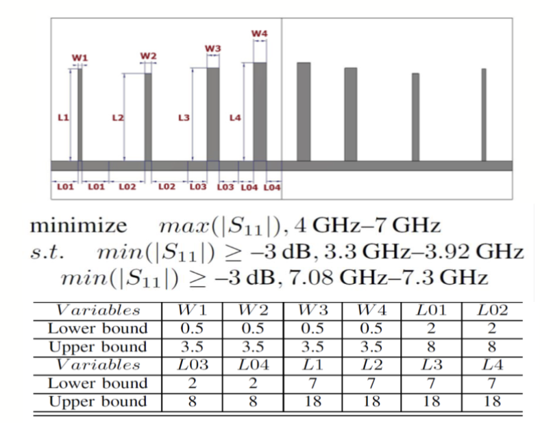

# Lecture 02 - Fundamental Concepts in Optimization

## 1. Exam Focus（真题对齐）

### High-frequency (A 档)

- **Engineering problem formulation (6-step procedure)**
  - 2022-2023 Q2(a): formulate antenna design into an optimization problem
  - 2023-2024 Q1(a): list objectives (if any) and constraints (if any) for filter design
  - 2024-2025 Q2(a): define decision variables (how many? type? range?) for a defense optimization tool
- **Objectives vs constraints; feasible/infeasible; comparing solutions (constraint violations)**
  - 2022-2023 Q1(d): concepts of objectives/constraints/feasible solutions
  - 2023-2024 Q1(a)(b): objectives/constraints + integrate them (integration handled later, but classification is from this lecture)
  - 2024-2025 Q1(a)(b): number of objectives/constraints; integrate constraints into a single function
- **Multi-objective optimization: domination, non-dominated, PF/PS (PF = F(PS)); compare Pareto fronts**
  - 2022-2023 Q1(e): Pareto optimal / PS vs PF / non-dominated
  - 2023-2024 Q2(a)(b): choose multiobjective vs constrained single objective; compare two PFs
  - 2024-2025 Q2(b): compare PFs (minimization)
- **Decision-variable representation (continuous / binary / permutation) + search space**
  - 2024-2025 Q2(a): “m or n variables?”, “continuous/binary/permutation?”, “range?”
  - 2023-2024 Q2(c): delivery plan solutions are permutations (representation is prerequisite)

### Medium (B 档)

- **Global vs local optimum; local vs global optimization; neighborhood**
  - 2022-2023 Q1(b): hill climbing is local search (ties to local optimum & neighborhood)
- **Unimodal vs multimodal**
  - 2022-2023 Q1(h): multimodal means >1 local optimum

### Low (C 档)

- Engineering case study details (antenna array, network slicing, etc.)
  - Usually not directly examined; used as modeling examples.

### Scoring checklist（本节课拿分点清单，可直接背）

- Can write the generic optimization form: variables + objective(s) + constraint(s) + search space
- Can apply the **6-step procedure** to translate text specs → math model
- Can correctly distinguish **objective vs constraint**
- Can rank solutions: feasible（可行解） > infeasible（不可行解）; infeasible vs infeasible uses violation
- Can define domination (min/max), identify non-dominated set, and explain PF/PS (+ PF=F(PS))
- Can compare two Pareto fronts using **convergence + diversity/coverage**
- Can state decision-variable representation (continuous/binary/permutation) and ranges

---

## 2. Key Concepts（知识点）

### A 档（必会）

#### (A1) 6-step procedure: formulate engineering problems into optimization problems

1. Identify requirements
2. Classify requirements to objectives and constraints
3. Identify decision variables and their properties (type: continuous（连续）/binary（二项分布）/permutation（排列）/...)
4. Identify search space (ranges / feasible domain)
5. Identify if there is a starting point
6. Identify how to obtain objective and constraint values (simulation/measurement)

#### (A2) Objectives vs constraints; feasible space; comparing solutions

- **Decision variables**: (X)
- **Objective**: optimize (min/max)
- **Constraints**: must satisfy (feasible/infeasible)
- **Feasible space**: set of all solutions satisfying constraints
- **Comparing solutions (PPT rule)**
  1. Two feasible: compare objective
  2. Feasible vs infeasible: feasible is better
  3. Two infeasible: compare constraint violations (smaller violation is better)

#### (A3) Multi-objective optimization; domination; Pareto front / Pareto set

- Multiobjective form:
  $$
  \max/\min\ f_1(\mathbf{x}),\ \max/\min\ f_2(\mathbf{x}),\quad \mathbf{x}\in D
  $$
- Domination (example for maximization; for minimization flip the inequalities):

$$
\mathbf{x}\prec \mathbf{y}\iff (\forall k,\ f_k(\mathbf{x})\ge f_k(\mathbf{y}))\ \land\ (\exists k,\ f_k(\mathbf{x})> f_k(\mathbf{y}))
$$

- Pareto-optimal (non-dominated): not dominated by any other solution
- Pareto set (PS): Pareto-optimal solutions in decision space
- Pareto front (PF): objective vectors of PS in objective space
  $$
  PF = F(PS)
  $$

#### (A4) Decision-variable representation + search space

- **Binary**: $x_i\in\{0,1\}$ (feature selection / knapsack selection)
- **Permutation**: $\mathbf{p}$ is a permutation of $\{1,\dots,n\}$ (TSP/QAP)
- **Continuous**: $\mathbf{x}\in\mathbb{R}^n$, each with bounds $[l_i,u_i]$

---

### B 档（可能考）

#### (B1) Global vs local optimum; neighborhood

- Global optimum (max case):
  $$
  x^* \text{ is global optimal }\iff \forall x\in\Omega,\ f(x^*)\ge f(x)
  $$
- Neighborhood $\mathcal{N}(x)$: points considered "close" (definition depends on problem: Euclidean/Hamming/swap)
- Local optimum: best within \(\mathcal{N}(x)\)

(Old-note image preserved)

#### (B2) Unimodal vs multimodal

- Unimodal: single optimum basin
- Multimodal: multiple local optima (local search can get stuck)

---

### C 档（低频）

- Case-study-specific domain details (antenna/network slicing/radar features): know they are _examples of modeling_, not memorization targets.

---

## 3. Must-know Formulas / Algorithms（公式/算法模板）

### 3.1 Constrained optimization template（可抄）

$$
\begin{aligned}
  \min /\max \quad & f(\mathbf{x}) \\
  \mathrm{s.t.}\quad & g_i(\mathbf{x})\ge 0, \quad i=1,\dots m;\\
  & \quad h_j(\mathbf{x})=0, \quad j=1,\dots,r \\
  & \mathbf{x}\in\Omega
\end{aligned}
$$

### 3.2 Comparing solutions in constrained optimization（PPT rule）

1. Feasible vs feasible: compare objective value
2. Feasible vs infeasible: feasible is always better
3. Infeasible vs infeasible: compare constraint violation (smaller is better)

(Optional violation scalar you can write if needed)

$$
v(\mathbf{x})=\sum_i \max(0,-g_i(\mathbf{x}))
$$

### 3.3 Domination & Pareto (2-objective)

- (Max case) domination:
  $$
  \mathbf{x}\prec \mathbf{y}\iff (\forall k,\ f_k(\mathbf{x})\ge f_k(\mathbf{y}))\land(\exists k,\ f_k(\mathbf{x})> f_k(\mathbf{y}))
  $$
- PF/PS relation:
  $$
  PF = F(PS)
  $$

### 3.4 6-step procedure（流程编号，答题直接写）

1. Requirements list
2. Objective(s) + constraint(s)
3. Decision variables + type
4. Search space/ranges
5. Starting point?
6. How to compute objective/constraints (simulation/measurement)

---

## 4. Worked Examples（例题与解答）

> Note: These are “exam-style” and aligned to past papers’ wording.

### A1 Example 1 — Filter design (formulation)

**Problem**  
Given passband and two stopbands specs with S11(dB), formulate min problem with objective & constraints, define $\mathbf{x}\in\mathbb{R}^{12}$, search space $\Omega$, and evaluation method.

**Solution**:

- Variables: $\mathbf{x}=(x_1,\dots,x_{12})\in\mathbb{R}^{12}$
- Objective:
  $$
  \min f(\mathbf{x})=\max_{f\in[4,7]}|S11(\mathbf{x},f)|
  $$
- Constraints:
  $$
  \begin{aligned}
    & \min_{f\in[3.3,3.92]}|S11(\mathbf{x},f)|\ge -3,\\
    & \min_{f\in[7.08,7.3]}|S11(\mathbf{x},f)|\ge -3
  \end{aligned}
  $$
- Search space:
  $$
  \mathbf{x}\in\Omega=\prod_{i=1}^{12}[l_i,u_i]
  $$
- Evaluation: EM simulation → extract S-parameters → take max/min over bands

**Final Answer**  
Write the above min/s.t. + $\mathbf{x}\in\Omega$ + simulation-based evaluation.

---

### A1 Example 2 — Antenna design (formulation)

**Problem**  
Band 1.1–1.7 GHz: require $\max|S11|\le -14$ and $\max AR\le 3$. Minimize size $S(\mathbf{x})$.

**Solution**:

$$
\begin{aligned}
  \min \quad & S(\mathbf{x})\\
  \text{s.t. } \quad & \max_{band}|S11(\mathbf{x})|\le -14,\\ & \max_{band}AR(\mathbf{x})\le 3,\ \mathbf{x}\in\Omega
\end{aligned}
$$

**Final Answer**  
Objective = size; constraints = two band-max specs; $\mathbf{x}$ continuous with bounds; simulation gives curves then max over band.

---

### A2 Example 1 — Compare solutions (feasible > infeasible)

**Problem**  
$\min f(x)=-(x-1)^2$, s.t. $g(x)=x-1.5\ge 0$. Candidates: 0.5, 1, 1.5, 2.

**Solution**  
Compute $g(x)$: only 1.5 and 2 are feasible. Compare feasible by objective:  
$f(1.5)=-0.25,\ f(2)=-1\Rightarrow 2$ is best.

**Final Answer**  
Best solution: $x=2$.

---

### A2 Example 2 — Rank by constraint violations

**Problem**  
Min problem with $g_1,g_2\ge0$.  
A: $g_2<0$, B: feasible, C: both <0. Rank.

**Solution**  
Feasible beats infeasible ⇒ B best.  
Among infeasible, compare violation sum $v(\mathbf{x})=\sum\max(0,-g_i)$: smaller $v$ is better ⇒ A better than C.

**Final Answer**  
B > A > C.

---

### A3 Example 1 — Find PF (minimization)

**Problem**  
Given several (f1,f2) points, find non-dominated set.

**Solution**  
Use min-domination: $x\prec y$ if $f_1(x)\le f_1(y)$ and $f_2(x)\le f_2(y)$ and one strict. Remove dominated points.

**Final Answer**  
Remaining points are PF.

---

### A3 Example 2 — Compare two PFs (8-mark style)

**Problem**  
Two algorithms produce two PFs (min). Compare.

**Solution**:

- Convergence: closer to left-bottom is better
- Diversity: wider coverage + more uniform spacing is better  
  Write 3–5 sentences using these keywords.

**Final Answer**  
A complete comment must mention both convergence and diversity/coverage.

---

### A4 Example 1 — Representation & ranges

**Problem**  
Feature selection / TSP / network slicing: specify variable type and range.

**Solution**:

- Feature selection: $x_i\in\{0,1\}$
- TSP: permutation of $\{1,\dots,n\}$
- Network slicing: continuous $\beta\in[0,1]$

**Final Answer**  
State variable count (n), type, and range.

---

### A4 Example 2 — Swap neighborhood (permutation)

**Problem**  
For $x=(2,3,4,1)$, list neighbors by one swap.

**Solution**  
There are $\binom{4}{2}=6$ swaps; list all 6 resulting permutations.

**Final Answer**  
(3,2,4,1), (4,3,2,1), (1,3,4,2), (2,4,3,1), (2,1,4,3), (2,3,1,4)

---

## 5. Common Mistakes（易错点，扣分点 ≥10，按重要性排序）

1. 把“必须满足的规格”误写成目标（却不说明多目标/不写处理方式）
2. 忘写搜索空间 $\mathbf{x}\in\Omega$ 或变量范围（缺“可优化的域”）
3. 频段指标是向量却没写“max/min over band”（缺“向量 → 标量聚合”）
4. 可行/不可行比较规则写反（应：feasible > infeasible）
5. 两个不可行解不比违约程度，反而比目标值（规则错）
6. Domination 忘了“至少一项严格更好”
7. min/max 方向搞反，导致 PF 全错
8. 把 Pareto set 当 Pareto front（PS 在决策空间，PF 在目标空间）
9. PF 比较只写“算法 2 更好”不给依据（必须写 convergence + diversity/coverage）
10. TSP/QAP 误用二进制/实数表示且不加可行性约束（表示法错误）
11. 邻域定义混乱（swap vs adjacent swap；欧氏 vs Hamming）
12. 把 multimodal 误解成“多变量/多目标”，而不是“多个局部最优”

---

## 6. Quick Review（考前 10 分钟速记）

### 6.1 必背模板（3 行写完建模）

$$
\begin{aligned}
  \min/\max \quad & f(\mathbf{x}) \\
  \text{s.t.} \quad & g_i(\mathbf{x})\ge0,\ \mathbf{x}\in\Omega
\end{aligned}
$$

- 先写：变量（个数/类型/范围）
- 再写：目标（越大越好 or 越小越好 + 频段用 max/min 聚合）
- 最后写：约束（必须满足的规格）

### 6.2 6-step procedure（背到能默写）

1. Requirements
2. Objective(s) + constraint(s)
3. Variables + type
4. Search space/ranges
5. Starting point?
6. Evaluation method (simulation/measurement)

### 6.3 Constrained ranking（PPT 原规则一句话）

- feasible > infeasible；feasible 之间比目标；infeasible 之间比违约

### 6.4 Pareto（两句拿满分）

- domination：所有目标不差 + 至少一个更好
- PF：所有非支配点集合；PS 在决策空间，PF 在目标空间，且 $PF=F(PS)$

### 6.5 PF 对比（8 分关键词）

- **Convergence**（更靠近理想点） + **Diversity/Coverage**（覆盖更宽、更均匀、不扎堆）
