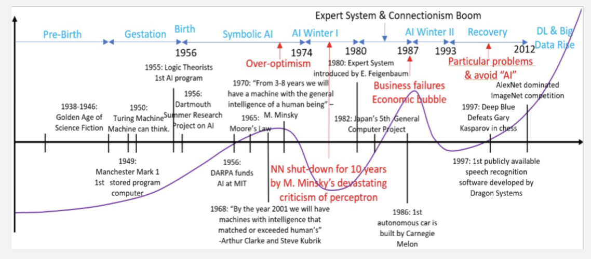
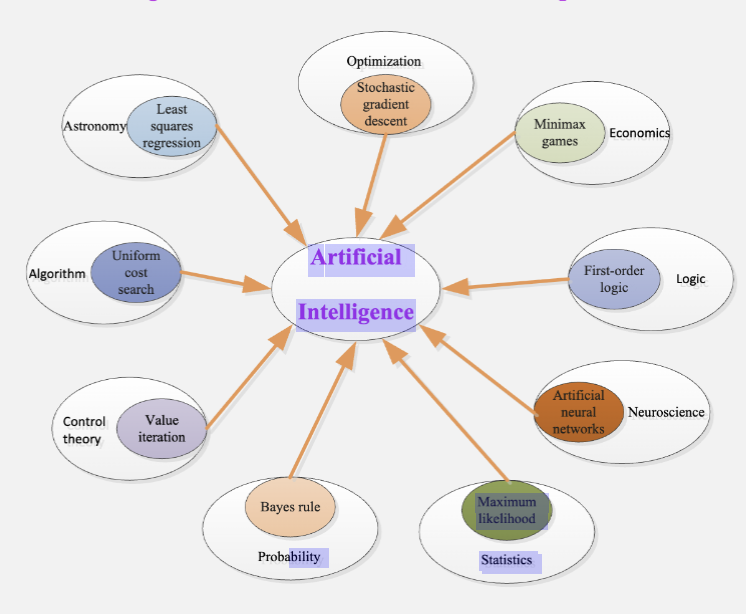
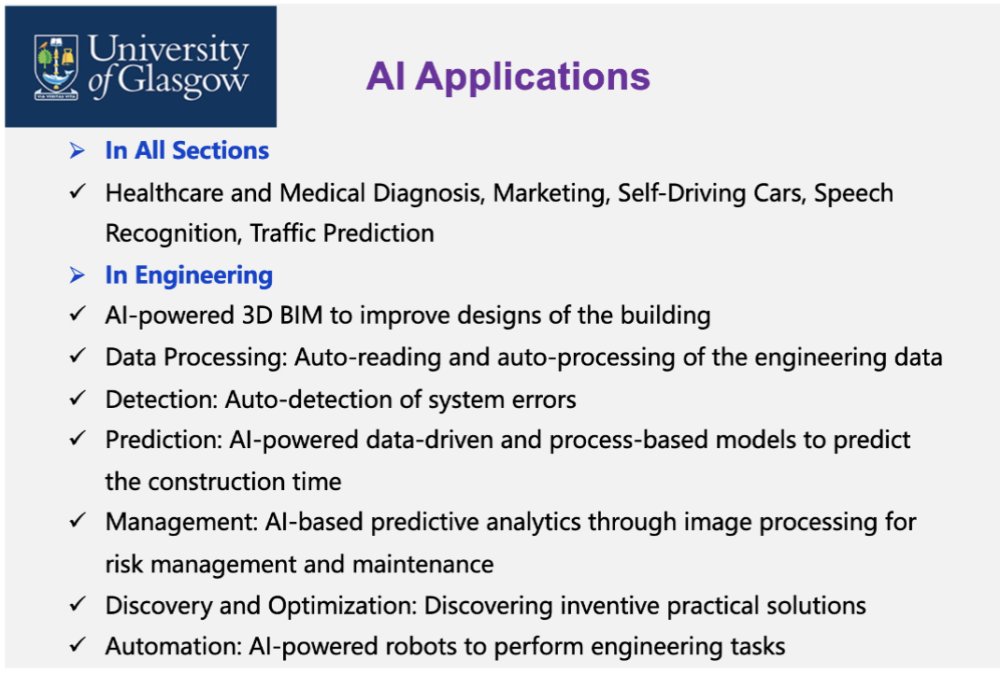
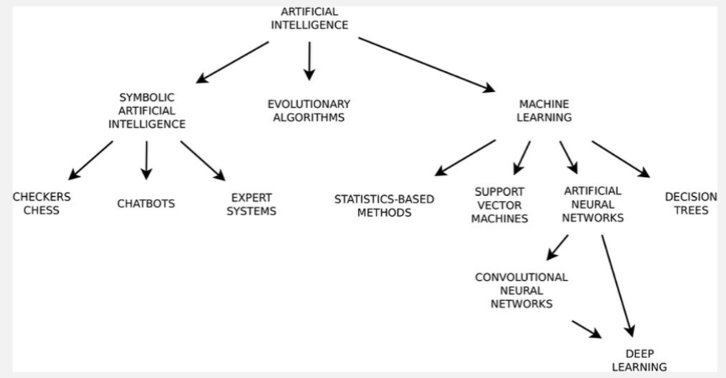

# AI 介绍

## AI 的定义

智能 (Intelligence) 在韦氏词典里的解释是学习或理解或英语新的情况的能力；推理，或者熟练地使用推理。也就是说，我们如果要说一个东西是有智能的，它需要有这么几种能力

- 认知能力： 处理信息，从经验中学习，在新的情况中运用知识
- 适应能力： 根据环境的变化调整自己的行为
- 解决问题能力： 分析情况，然后生成解决方案并评估最优方案

而人工智能 (Artificial Intelligence, AI) 则是一门新兴的技术科学，研究并开发用于模拟、延伸和增强人类智能以及其他自然的智能的理论、方法、技术和应用系统。

## AI 的历史

### 1950 年代

AI 最早诞生于 1956 年，达特茅斯会议 (Dartmouth Conference) 上，约翰·麦卡锡 (John McCarthy) 提出了“人工智能”这个术语，并与其他研究人员一起探讨了如何让机器模拟人类智能的可能性。

之后，1952 年，Arthur Samuel 开发了一个可以学习下棋的程序，这被认为是机器学习的早期实例。

1955 年，Allen Newell 和 Herbert A. Simon 开发了逻辑理论家 (Logic Theorist)，这是第一个能够证明数学定理的计算机程序。

1957 年，Allen Newell 和 Herbert A. Simon 开发了通用问题求解器 (General Problem Solver, GPS)，这是一个能够解决各种问题的程序。

在当时，AI 发展极其迅速，人们对 AI 的未来有了极度乐观的想法

- Herbert Simon 预测：“在二十年内，机器将能够做任何人类能做的工作。”
- Marvin Minsky 预测：“在十年内，人工智能的问题将被解决。”
- Claude Shannon 预测：“我设想这样一个时代：我们将成为机器人的狗，而我支持机器”

> 预测：我要给机器当狗
>
> 实际:【“我是狗？”邪恶科学家 Vedal 和他的走狗牛肉】 <https://www.bilibili.com/video/BV1Cv42117hV/?share_source=copy_web>

然而，过了比预料还久的时间后，在 1997 年，IBM 的深蓝 (Deep Blue) 击败了当时的国际象棋世界冠军加里·卡斯帕罗夫 (Garry Kasparov)，这标志着 AI 在特定领域取得了重大突破。

在 1966 年，ALPAC (Automatic Language Processing Advisory Committee, 自动语言处理咨询委员会) 报告发布后，美国政府大幅削减了对自然语言处理 (NLP) 研究的资助，导致了第一次 AI 冬天 (AI Winter)。

---

在早期，AI 研究确实有过很多困难，比如当时算力不足，数据和存储资源有限，算法和理论有限，当时的计算机成本也很高，同时信息也有限。这些时代的局限性都限制了 AI 的发展。

但是，早起的发展也为后来的 AI 研究奠定了基础。其贡献了基础算法的发展，开创了自然语言处理，同时引入了机器学习的概念。

### 1970 年代 - 1980 年代

这一年代的 AI 发展主要有两个特征

1. 基于知识的系统的发展
2. 基于规则的专家系统的成功

在 1970 年代，DENDRAL 系统被开发出来，用于化学分子结构的自动推理和识别。这是首个基于规则的专家系统。

MYCIN 系统在 1970 年代后期被开发出来，用于诊断血液感染并推荐合适的抗生素治疗。MYCIN 系统展示了基于规则的专家系统在医疗领域的潜力。

XCON 系统在 1980 年代被开发出来，用于将客户订单转化为详细的零件规格，每年为数字设备公司节省四千万美元。

这一年代创造出了首个对行业产生重大影响的实际应用，其中知识发挥了关键作用。但是，知识并非基于确定性规则，需要考虑不确定性；创建和维护这些规则需要大量人工劳力，难以持续。

在 1987 年底，Lisp 机器市场崩溃，导致了第二次 AI 冬天 (AI Winter)。

### 人工神经网络

人工神经网络 (Artificial Neural Networks, ANN) 的概念最早可以追溯到 1943 年，当时 Warren McCulloch 和 Walter Pitts 提出了一个数学模型，模拟了神经元的工作原理。这被认为是人工神经网络的早期基础。

感知机 (Perceptron) 是由 Marvin Minsky 和 Seymour Papert 在 1958 年提出的，这是一个简单的神经网络模型，能够进行二分类任务。然而，他们在 1969 年的著作《感知机》中指出，单层感知机无法解决非线性可分的问题（如 XOR 问题），这导致了对神经网络研究的兴趣下降。

多层感知机 (Multi-Layer Perceptron, MLP) 和反向传播 (Backpropagation) 是 Geoffrey Hinton、David Rumelhart 和 Ronald Williams 在 1986 年提出的，这使得训练多层神经网络成为可能，重新点燃了对神经网络的兴趣。神经网络理论上可以逼近任意函数，反向传播算法在多层网络训练中发挥了关键作用。

卷积神经网络 (Convolutional Neural Networks, CNN) 是由 Yann LeCun 在 1990 年代初提出的，最著名的应用是手写数字识别（如 LeNet）。这项工作是卷积神经网络实际应用中的一个重要里程碑。

---

之后，进入到了深度学习 (Deep Learning) 的时代。

AlexNet 在 2012 年被 Alex Krizhevsky、Ilya Sutskever 和 Geoffrey Hinton 提出，并在 ImageNet 图像分类竞赛中取得了显著的成功，标志着深度学习在计算机视觉领域的突破。

AlphaGo 在 2016 年由 Google DeepMind 开发，击败了围棋世界冠军李世石，展示了深度强化学习在复杂策略游戏中的潜力。

ChatGPT 在 2022 年由 OpenAI 发布，其推进了自然语言理解与生成，变革了人机交互，在各个领域展现出了重要应用。

---

现在，人工智能已经成为了一门多学科交叉的领域，涵盖了计算机科学、数学、统计学、认知科学等多个学科。AI 技术已经广泛应用于各个领域，如医疗、金融、交通、娱乐等，极大地改变了我们的生活方式。

但是，现在的人工智能仍然没有发展成人类那样的通用智能 (Artificial General Intelligence, AGI)，它们通常只能在特定任务上表现出色，而在其他任务上则表现不佳。机器需要依赖大量的数据而完成简单的任务，而人类只需要少量的示例就能学会新的技能。

## 现在的 AI 研究以及应用

现在的 AI 已经广泛的应用到了各个领域，如

- 电脑游戏
  - 有的角色会内置 AI
- 语音合成、识别和理解
  - 在有限词汇量的情况下表现良好
  - 无约束的语音理解问题尚未完全理解，但是 ChatGPT 和 Bard 等大语言模型已经在这方面取得了显著的进展
- 银行
  - 自动支票阅读机、签名验证
  - 自动化贷款申请分类
- 数码相机
  - 人脸识别对焦
- 邮局
  - 自动地址识别和邮件分类
- 客户服务
  - 自动语音识别
- 网络服务
  - 自动风险识别
  - 智能广告推送

在科学和工程领域，AI 也有广泛的应用

- 预测性维护
- 故障检测和诊断
- 集成电路设计自动化
- 信号处理
- 人工智能驱动的天线设计

## 课程总览

AI 的分支如下

- 符号主义人工智能 (Symbolic AI)
  - 棋类
  - 聊天机器人
  - 专家系统
- 进化算法 (Evolutionary Algorithms)
- 机器学习 (Machine Learning)
  - 基于统计的方法
  - 支持向量机
  - 人工神经网络
    - 卷积神经网络
    - 深度学习
  - 决策树

这门课主要教后两部分的其中一部分内容。
