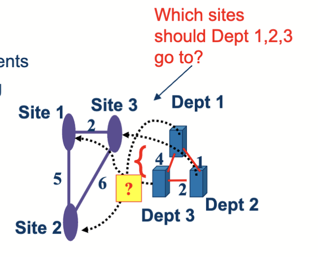
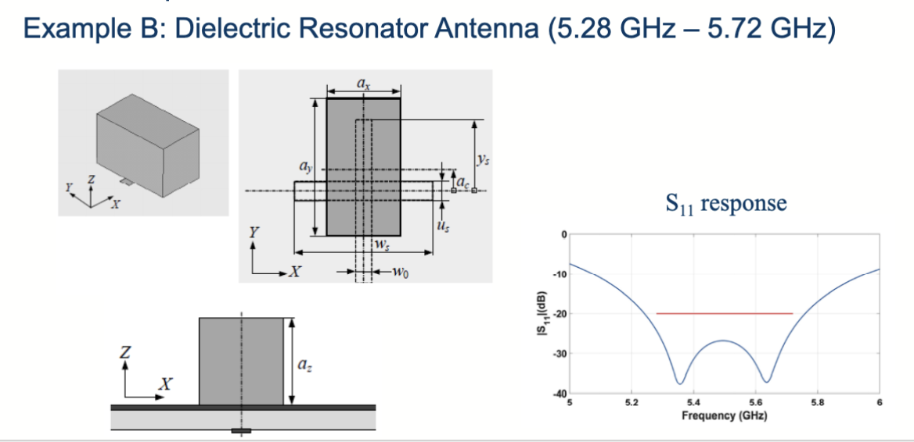
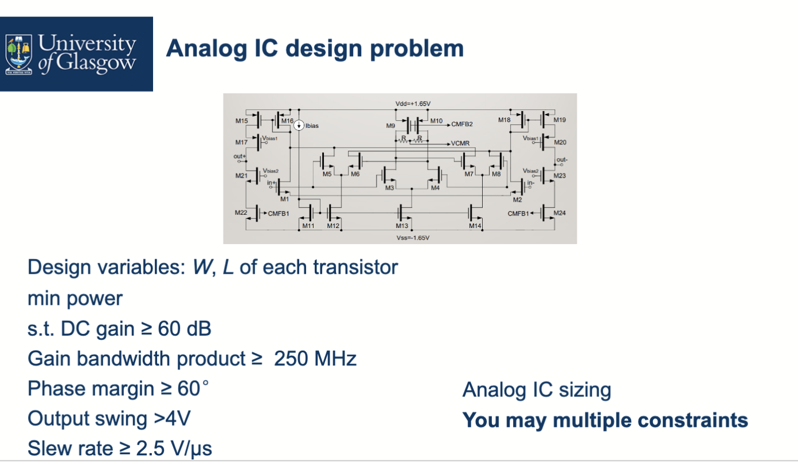
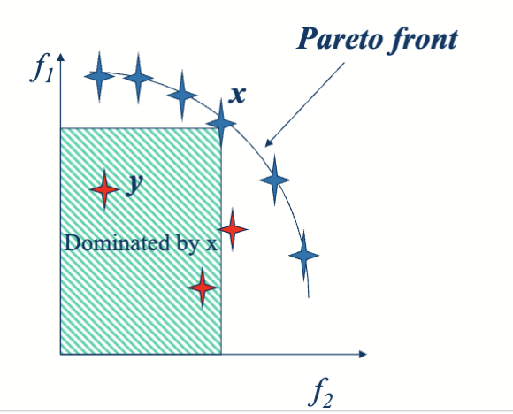
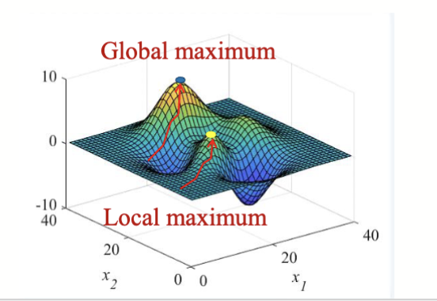
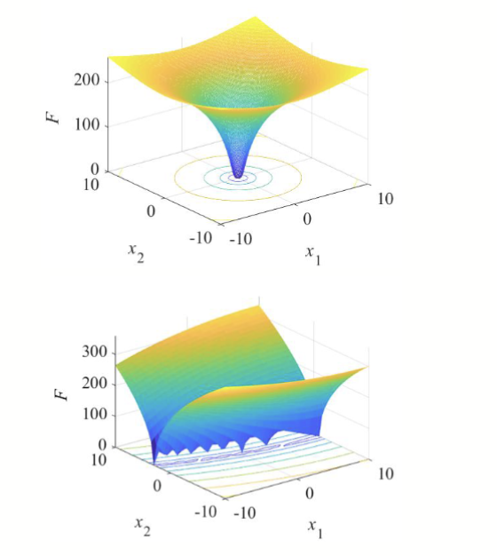
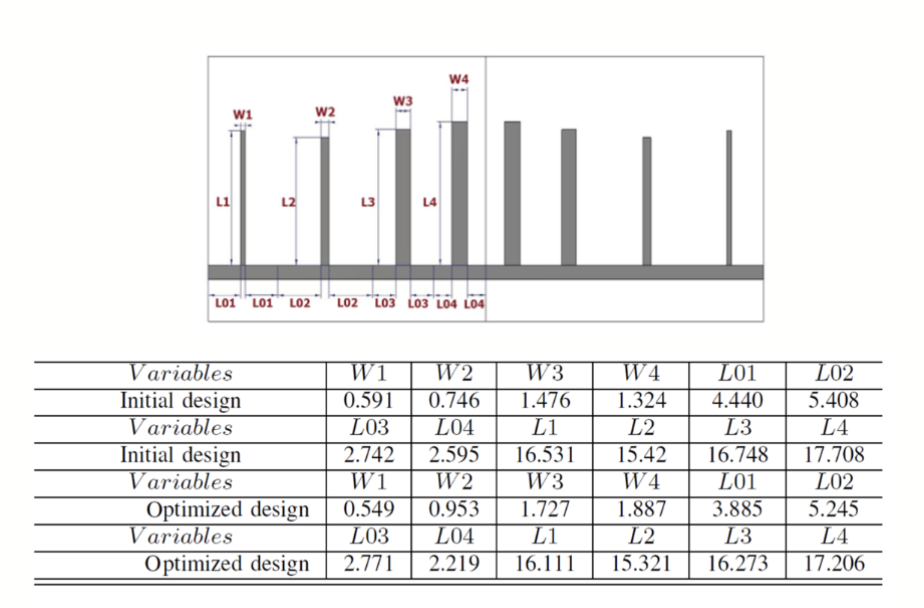

# 优化的基本概念

> 虽然说是基本概念，但是其实是后续几章内容的概述。

## 定义

优化 (Optimization) 指的是寻找一个最好的解的过程。对于求解问题，可以使用普通的优化方法或者基于 AI 的优化方法——在大多数情况下基于 AI 的优化算法更易于使用。

### 引入 1: 旅行商问题

一个典型的优化问题是旅行商问题 (Traveling Salesman Problem, TSP)， 即一个旅行商需要访问若干个城市，并且每个城市只能访问一次，最后回到出发点。目标是找到一条路径，使得总的旅行距离最短。

我们先用这种方式表示走过的路径： $p=\{p(1), p(2), \ldots, p(n), p(1)\}$ ，其中 $p(i)$ 表示第 $i$ 个城市。这条路径就指的是从 1 到 2，到 3，直到最后回到 1 的路径。

这个问题可以换一种方式进行表达：如果我们把旅行家的总距离用函数 $L(p)$ 来表示，其中 $p$ 是一个城市的排列，那么我们需要找到一个 $p$ 使得 $L(p)$ 最小。也就是：

$$
\begin{aligned}
& \min_p L(p) \\
&p \in \Omega \quad
\Omega: \text{所有城市的排列}
\end{aligned}
$$

这就是一个优化问题，其中目标函数是 $L(p)$ ，解空间是所有城市的排列 $\Omega$ 。

旅行商问题在很多场景下都有应用，比如一个机械臂的路径规划问题，或者一个送货员需要规划送货路线的问题。一个机械臂有多个目标点需要访问，如何规划路径使得机械臂的运动距离最短？这就是一个典型的优化问题。

### 引入 2: 二次函数优化 (Quadratic Function Optimization)

一个场景是，有 n 个站点，需要派遣 n 个专家去访问这些站点，每个专家访问一个站点，目标是最小化总的访问成本。

给定了不同站点之间的距离以及专家访问不同站点的成本，如途中 Site 1 和 2 之间的距离是 $d_{12} = 5$ ，专家的成本系数如 $f_{12} = 1$ 。我们认为每种部署方式就是这个优化问题的一个解，用 $p=(p(1), p(2), p(3)) = (2,3,1)$ 表示，即专家 1 访问站点 2，专家 2 访问站点 3，专家 3 访问站点 1。最终可以写成这样：

$$
\begin{aligned}
& \min_p \sum^{n-1}_{i=1} \sum^{n}_{j=i+1} f_{ij} \cdot d_{p(i)p(j)} \\
p \in \Omega: \text{所有站点的排列}
\end{aligned}
$$

### 引入 3: K 背包问题

K 背包问题是一个经典的组合优化问题，假设有 n 个物品和 K 个背包，每个物品有一个重量和一个价值，每个背包有一个容量限制。目标是将物品分配到背包中，使得总价值最大，同时每个背包的重量不超过其容量。

在这个情况中，解是一串二进制变量，表示每个物品是否被放入某个背包。目标函数是总价值，约束条件是每个背包的重量不能超过其容量。

### 引入 4: 连续优化问题

图中是一个典型的双变量优化问题，目标是找到 $(x, y)$ 使得函数 $f(x, y)$ 最小。这个问题的解空间是连续的二维平面。

这个是与实际工程相结合的优化问题，需要找到一个 Resonator（谐振腔）的最佳设计参数，使得其性能指标达到最优。设计参数可以是谐振腔的长度、宽度等，目标是找到最小化和最大化的 $|S11|$ 性能指标。

## 目标和约束

对于普通的优化问题，一共有三个部分需要关注：决策变量，目标函数和约束条件。

对于一个标准的优化问题，如下所示：

$$
\begin{aligned}
& \min f(x) = -(x-1)^2\\
& \mathrm{s.t.} \ g(x) = x-1.5 \geq 0
\end{aligned}
$$

这里，需要求最小值的函数 $f(x)$ 称为目标函数 (Objective Function)，而 $g(x) \geq 0$ 称为约束条件 (Constraint Condition)。目标变量 $x$ 称为决策变量 (Decision Variable)。

其中，可行的解指的是满足约束条件的解，称为可行解 (Feasible Solution)；否则称为不可行解 (Infeasible Solution)。所有的可行解组成的集合称为可行域 (Feasible Space)。

不同的解之间通常会有优劣之分，一般会比较其目标函数值，目标函数值更优的解称为更优解 (Better Solution)。在所有可行解中，目标函数值最优的解称为最优解 (Optimal Solution)。可行解和不可行解之间，认为可行解是更优的。两个不可行解之间，则比较其违反约束的程度，违反约束较少的解更优。

有些问题会有更加复杂的约束条件，比如这个例子：

目标是最小化功率，有多个目标变量（每个晶体管的 W 和 L），而约束条件很多，如 DC 增益、频率响应等。最终根据这些约束条件，找到一个可行解，使得功率最小。

## 多目标优化

之前提到的优化函数都只有一个目标函数，但在实际应用中，往往会有多个目标需要同时优化，这就是多目标优化 (Multi-objective Optimization)。如：

$$
\begin{aligned}
& \max f_1(x_1, x_2, \ldots, x_n)\\
& \max f_2(x_1, x_2, \ldots, x_n)\\
& x = (x_1, x_2, \ldots, x_n) \in D, D\subseteq R^n
\end{aligned}
$$

这种情况下，决策变量是 $x$ ，目标函数有两个，分别是 $f_1$ 和 $f_2$ 。在多目标优化中，通常不存在一个解能够同时使得所有目标函数达到最优，因此需要引入帕累托最优 (Pareto Optimal) 的概念。

帕拉特最优，指的是没有其他解在所有目标上都优于该解。换句话说，如果一个解在某个目标上更优，但在另一个目标上更差，那么它就是帕累托最优的。对于任意两个解，一共有三种关系：

1. 一个解在所有目标上都优于另一个解；
2. 一个解在所有目标上都劣于另一个解；
3. 一个解在某些目标上优于另一个解，在其他目标上劣于另一个解；

对于前两个情况，我们说较好的解支配 (dominates) 较差的解；对于第三种情况，我们说这两个解互不支配 (non-dominated)。

最终，帕累托最优解组成的集合称为帕累托前沿 (Pareto Front)。

在帕累托前沿上，每个解都是帕累托最优的，无法再通过优化某一个目标而不损害其他目标来改进。帕累托前沿是对最终的目标函数值来说的，这些函数值对应的决策变量的集合称为帕累托集 (Pareto Set)。

换句话说，Pareto Front 和 Pareto Set 的关系是:

$$
PF = F(PS)
$$

## 全局和局部优化

### 全局最优解

对于一个优化问题

$$
\begin{aligned}
& \max f(x) \\
& x \in \Omega
\end{aligned}
$$

最终得到一个全局最优解 $x^*$ ，满足对于所有 $x \in \Omega$ ，都有 $f(x^*) \geq f(x)$ 。

### 邻域

一个解 $x$ 的邻域 (Neighborhood) 指的是在某个距离范围内的解集合，比如在连续优化问题中，我们认为距离小于 $0.1$ 的解都属于 $x$ 的邻域，就有 $\Omega = \{x_1 x_2\} | (x_1- x)^2 + (x_2 - y)^2 \leq 0.1^2$ 。

对于其他的问题有不同的定义方式，如如果决策变量是一个排列 $p = (p(1), p(2), \ldots, p(n))$ ，那么可以定义邻域为通过交换两个位置得到的所有排列组成的集合。

### 局部最优解

如果一个解在它的邻域内有着最好的目标函数值，那么它就是一个局部最优解 (Local Optimal Solution)。也就是说，对于一个解 $x^_$ ，如果对于所有 $x$ 属于 $x^_$ 的邻域 $\mathcal{N}(x^*)$ ，都有 $f(x^*) \geq f(x)$ ，那么 $x^*$ 就是一个局部最优解。

全局最优解一定是局部最优解，但局部最优解不一定是全局最优解。换句话说，全局最优解在整个解空间中是最好的，而局部最优解只是在其邻域内是最好的。

通常，寻找局部最优解会制定一个起始点，然后在其邻域内搜索更优的解，直到找不到更优的解为止。而全局优化可以不需要起始点，直接在整个解空间中搜索最优解。

目标函数可以分为单模台 (Unimodal) 和多模态 (Multimodal) 两种类型。单模态函数只有一个全局最优解，而多模态函数有多个局部最优解和一个全局最优解。

## 将工程问题建模成优化问题

这一部分注重的是实际的数学建模过程。通常，工程问题可以通过以下步骤建模成优化问题：

1. 确定要求
2. 分析要求中的目标和约束
3. 定义决策变量和参数
4. 确定搜索空间
5. 确定是否有起始点
6. 确定怎么获得期望函数值和约束

以这个项目为例子，这几个过程分别是这样的：

1. 确定要求
   - 操作频率范围：3.3 GHz ~ 7.3 GHz；通带：4 GHz ~ 7 GHz
   - 两个阻带：3.3 GHz ~ 3.92 GHz 和 7.08 GHz ~ 7.3 GHz
   - 通带性能要求（例如）：通带内最大 |S11| 要尽可能小（常用阈值示例：|S11| ≤ -10 dB）
   - 阻带性能要求（例如）：阻带内抑制应达到设计要求（常用阈值示例：阻带衰减 ≥ 20 dB）
   - 其它工程约束：器件尺寸、制造公差、插损及带内群延迟等
2. 分析要求中的目标和约束
   - 目标：最小化通带内的最大 |S11|（即提高匹配/降低反射）
   - 约束：满足两个阻带的抑制要求、物理和制造约束（如尺寸、最小线宽、间距）
   - 说明问题类型：这是一个单目标（受约束）优化问题，若同时考虑插损/尺寸可转成多目标问题
3. 定义决策变量和参数
   - 决策变量：12 个几何参数（如每段的长度、宽度、耦合间距等）
   - 固定参数/环境参数：基板介电常数、厚度、金属厚度、馈入位置、制造公差等
4. 确定搜索空间
   - 为每个几何变量给出上下界（由制造能力或电磁学可行性限定），例如 li ∈ [l_min, l_max], wi ∈ [w_min, w_max]
   - 决定连续还是离散（本例通常采用连续实值搜索空间）
5. 确定是否有起始点
   - 有：可用等效电路或经验设计给出初始解，加速局部优化收敛
   - 若无：采用随机/拉丁超立方/均匀采样等策略生成初始种群
6. 确定怎么获得期望函数值和约束
   - 使用电磁仿真软件（提取 S-parameters）计算目标函数（如通带最大 |S11|）和约束（阻带抑制、插损等）
   - 可结合快速等效电路或 surrogate 模型（代理模型）降低仿真开销
   - 最终结果需用高精度 EM 仿真或实验测量验证

在完成上述步骤后，可以使用 MATLAB 的 Toolbox 或 Python 的 SciPy 等工具来实现优化算法，求解该优化问题。在这个问题上，最终得到了这样的结果：

## 案例分析 1 ~ 4

> 这一块具体是使用四个工程案例来说明如何将工程问题建模成优化问题，略过不表。
>
> 这四个案例分别是：
>
> 1. 微波偶极子天线设计
> 2. 天线阵列设计
> 3. 人体动作识别
> 4. 网络切片资源分配
>
> 每个案例都按照前面提到的六个步骤进行建模，并给出了具体的数学表达式和优化目标。有些在 Lab 中已经提及。
