# Lec.3 遗传算法

## 介绍

遗传算法 (Genetic Algorithm, GA) 是一种模拟自然选择和遗传机制的优化算法。它通过模拟生物进化过程中的选择、交叉和变异等操作，逐步改进解的质量，以找到问题的最优解或近似最优解。GA 用户用于优化问题，通常易于实施，能够求解复杂的优化问题，在计算机算力逐渐上升的趋势中，GA 的应用越来越广泛。

这种算法属于计算智能 (Computational Intelligence) 的范畴（如神经网络、进化计算），从自然界中获取解决问题的方案的思路。从自然界中的生物进化，我们可以提取出这样的特征

- 个体 (Individual)
  - 问题的一个解
  - 用染色体 (Chromosome) 来表示
- 种群 (Population)
  - 一些个体的集合
- 选择 (Selection)：适者生存
  - 一个个体的性能越好，就更可能成为亲代，产生下一代
- 交叉 (Crossover)：基因重组
  - 子代的染色体由它的两个亲代的染色体组合而成
- 变异 (Mutation)：基因突变
  - 个体的染色体在某些位置上发生随机变化

## 算法流程

进行遗传算法的过程，就是模拟生物进化的过程。

- 首先，有一个种群
- 经过选择之后形成交配池 (Mating Pool)
- 亲代发生交叉和变异后形成新的种群
- 用新的种群替代原本的种群，重复以上操作
- 如果到达了停止条件，则结束优化过程，输出结果

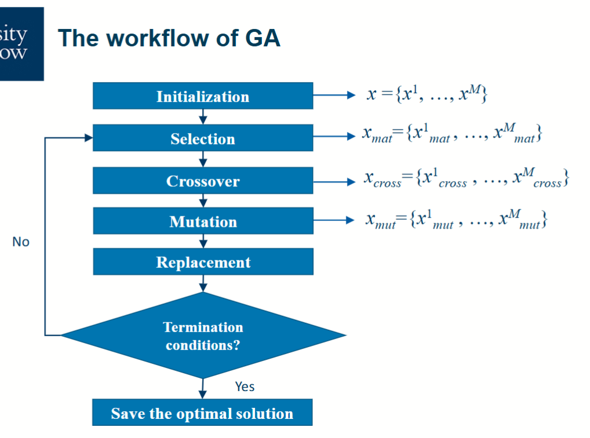

首先需要考虑的是如何表示一个个体或者一组解，以满足我们需要后续操作的特质，如交换、变异等。常见的编码方式有以下几种

- 二进制字符串 (Binary String)
  - 整个字符串相当于个体，每一位相当于基因
  - 可以通过二进制和十进制的转换来表示整数
- 实数编码 (Real-valued Encoding)
  - 每个基因是一个实数，适合实值优化问题
- 排列编码 (Permutation Encoding)
  - 每个个体是一个给定元素的某种排列
  - 适合表示排列问题，如旅行商问题
- 整数编码 (Integer Encoding)
  - 每个基因是一个整数，适合整数规划问题

### 初始化种群

初始化种群是遗传算法的第一步，通常是随机生成一组个体。需要关注的重要参数主要有两个：种群数量 (Population Size) 和初始化方法 (Initialization Method)。

种群数量影响算法的多样性和收敛速度，通常需要根据具体问题进行调整。初始化方法可以是完全随机生成，也可以结合一些启发式方法，以提高初始解的质量。

### 选择操作决定哪些个体可以进入交配池

选择操作模拟自然界中“适者生存”的过程。选择操作决定哪些个体可以进入交配池，同时更优秀的个体有更高的概率被选择。判定优秀与否的标准是适应度函数 (Fitness Function)，它衡量个体的质量。

常见的选择操作有：

- 比例选择 (Proportional Selection)

  根据个体的适应度值按比例选择

  比如，对于优化问题 $\max G(x) = -(x-8)^2 + 65, x \in [0,15] \& x \in \mathbb{N}$，一个个体进入交配池的概率正比于它的适应度 (Fitness)

  $$
  \mathrm{prob}(x_i) = \frac{G(x_i)}{\sum_{j=1}^{N} G(x_j)} = \frac{ 它的适应度 }{ 全部个体的适应度之和 }
  $$

  

- 轮盘赌选择 (Roulette Wheel Selection)

  将个体的适应度值映射到一个轮盘上，适应度越高的个体占据的区域越大，随机旋转轮盘选择个体

  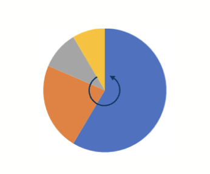

  具体实现方法可以是生成一个随机数，根据随机数落在的区间选择对应的个体

- 锦标赛选择 (Tournament Selection)

  随机选择若干个体，选出其中最优秀的个体

- 截断选择 (Truncation Selection)

  选择适应度最高的一部分个体

|            | 最优性 (Optimality)      | 多样性 (Diversity) |
| ---------- | ------------------------ | ------------------ |
| 交配池数量 | 多于前代种群数量         | 少于前代种群数量   |
| 选择的作用 | 将搜索导向更有前途的部分 | 减少不同种类的数量 |

### 交叉 (Crossover) 和变异 (Mutation)

交叉和变异是生成新的种类的个体/解的方法。它们直接作用在个体上，通常在选择过程之后进行操作。在大多数情况下，交叉和变异的过程是和个体的适应度相互独立的。

交叉操作指的是两个解的基因重组，交换各自染色体的一部分。其可以分为单点交叉 (Simple Crossover / One-Point Crossover)、K 点交叉 (K-Point Crossover) 等

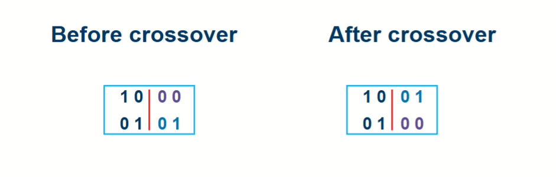

- 单点交叉
  - 从交配池中随机选择两个亲代
  - 在染色体上随机选择一个交换位点
  - 交换两个亲代在该位点之后的基因，生成两个子代
- K 点交叉
  - 同理选择两个亲代
  - 在染色体上随机选择 k 个交换位点
  - 交叉这些位点之间的基因，生成两个子代

同样重要的是发生交叉的改率，成为交叉率 (Crossover Rate)，其表示任意从交配池中选择的两个亲代发生交叉的改率，表示为 $P_c$。如果两个亲代没有发生交叉，则直接复制到下一代。典型的交叉率在 $0.6$ 到 $0.9$ 之间。

在程序实现上，通常是每个个体生成一个随机数 $R_c$，当满足 $R_c \le P_c$ 时，才进行交叉操作。

交叉操作可能会增加或者减小子代的平均适应度，但是会增加种群的多样性。在某些情况下，交叉操作不会生成新的个体，比如两个亲代完全相同，或者交换的位点在染色体的末尾，这种情况下选择和交叉操作无法解决问题。可以引入变异 (Mutation) 来增加种群的多样性。

对于每一个子代个体，有一个概率可以发生变异，记作 $P_m$，典型值为 $0.001$ 到 $0.01$ 之间。发生变异时会改变个体的某些基因值，进而产生新的个体。

### 停止条件

如果停止条件没有满足，则持续进行选择、交叉和变异，生成新的种群，替代原本的种群，直到满足停止条件为止。常见的停止条件有：

- 达到最大迭代次数
- 种群收敛
- 达到预期的适应度水平

## 优缺点

- 优点
  - GA 是一个通用的优化算法，和应用的领域无关
  - 多种情况可以并行计算，提高计算效率
  - 可以获得多种最优解，适合多目标优化问题
  - 易于实现
- 缺点
  - 可能不能获得全局最优解
  - 参数选择对结果影响较大
  - 计算资源消耗较大，计算不够快

## 使用遗传算法

要使用 GA 算法，需要先明确需要求解的问题和 GA 的各个参数的对应

- 求解的是什么问题
  - 搜索空间是什么？有什么约束？
  - 如何设计适应度函数？
- [如何表示一个解](#如何表示一个解)
- [如何初始化种群](#怎么样初始化种群)
- [如何合适的交叉和变异](#如何合适的交叉或变异)
- [如何选择作为亲代的个体](#如何选择作为亲代的个体)
- [怎么用新的种群替代原本的种群](#怎么用新的种群替代原本的种群)
- [选择什么样的停止条件](#选择什么样的停止条件)

### 如何表示一个解

表示一个解的方式有很多种，通常根据求解问题的特性来选择合适的编码方式，如搜索空间是连续的还是离散的，解的维度是多少等。

[常见的编码方式](#算法流程)有二进制编码、实数编码、排列编码和整数编码等。选择合适的编码方式可以影响算法的效率和效果。

### 怎么样初始化种群

[初始化种群](#初始化种群)的目标是从搜索空间中均匀地采样，确保种群的多样性。常见的方法有随机生成和启发式生成。

- 对于二进制编码，可以随机生成二进制字符串，每一位是 0 或 1 的概率都是 0.5
- 对于实数编码，可以在每个维度上的取值范围内均匀随机采样
- 有一些其他的更试验性的方法

基于这样的采样方法，产生 N 个个体，组成初始种群。

### 如何合适的交叉或变异

#### 变异

合适的变异操作需要保证

1. 可以访问到搜索空间中的所有区域
2. 变异的频率需要合适
3. 变异后的结果应该是可行的解
4. 如果对于特定问题有更合适的变异操作，可以优先使用

对于不同的编码方式，变异的操作也不同，常见的有

- 对于二进制编码，可以随机选择某一位进行翻转
  - 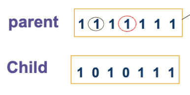
- 对于实数编码，可以是对某一位加一个正态分布的随机数
  - $y_i = x_i + N(0,\sigma_i)$
- 对于排列，可以选择两个不同的位置进行交换
  - 

#### 交叉

对于交叉，合适的交叉操作需要保证：

1. 生成的子代同时继承两个亲代的特征
2. 交叉后的结果应该是可行的解
3. 如果对于特定问题有更合适的交叉操作，可以优先使用

对于不同的编码方式，交叉的操作也不同，常见的有

- [单点交叉](#交叉-crossover-和变异-mutation)
  - 在染色体上随机选择一个交换位点
  - 交换两个亲代在该位点之后的基因，生成两个子代
  - 适用于二进制编码和实数编码
- [K 点交叉](#交叉-crossover-和变异-mutation)
  - 在染色体上随机选择 k 个交换位点
  - 交叉这些位点之间的基因，生成两个子代
  - 适用于二进制编码和实数编码
- m 亲本交叉
  - 从 m 个亲本中选择基因，生成两个子代
  - 适用于二进制编码和实数编码
  - 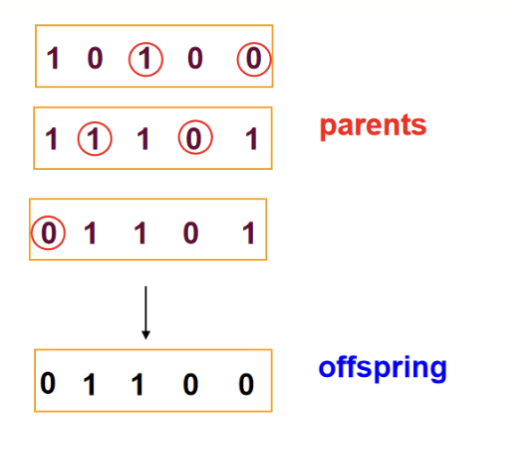
- 均匀交叉 (Uniform Crossover)
  - 每个基因随机选择来自两个亲代中的一个
  - 适用于二进制编码和实数编码
- 算术交叉 (Intermediate Crossover / Arithmetic Crossover)
  - 对实数编码，生成子代为两个亲代的加权平均
    $$
    \begin{align*}
    \text{Child}_1 & = \alpha \cdot \text{Parent}_1 + (1 - \alpha) \cdot \text{Parent}_2 \\
    \text{Child}_2 & = (1 - \alpha) \cdot \text{Parent}_1 + \alpha \cdot \text{Parent}_2
    \end{align*}
    $$
  - $\alpha$ 是一个在 $[0,1]$ 之间的随机数
  - $\alpha$ 取 0.5 时即为取平均值
  - 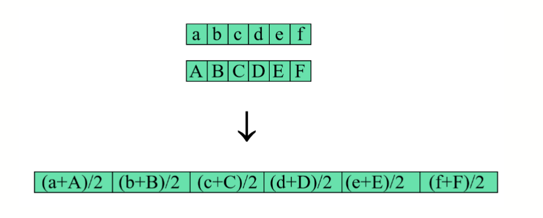
- 部分匹配交叉 (Partially Matched Crossover)
  - 
  - 适用于排列编码
  - 从一个亲本中选择一部分排列，复制到它的第一个子代中
  - 把剩余的元素按照另一个亲本的顺序排序
  - 从已有排列之后开始填充剩余的数字，遇到染色体尾时回绕
  - 交换两个亲本角色，产生第二个子代

### 如何选择作为亲代的个体

更优秀的个体有更高的概率被选择作为亲代，但是弱小的个体也应该有一定的概率被选择，因为他们可能会产生更优秀的后代。

#### 比例选择 (Proportional Selection)

使用[比例选择](#选择操作决定哪些个体可以进入交配池)的情况，用 $N$ 表示交配池的容量 $\mathrm{Pop\_Size}$，有这样的公式：

$$
\frac{f_i}{\sum_{j=1}^{N} f_j} \cdot N = \frac{f_i \cdot N}{\sum_{j=1}^{N} f_j} = \frac{f_i}{\overline{f}}
$$

- $f_i$ 指的是个体 $i$ 的适应度
- $\overline{f} = \frac{\sum_{j=1}^{N} f_j}{N}$ 是种群的平均适应度
- $N$ 是交配池的容量 $\mathrm{Pop\_Size}$

使用比例选择可能会引入一些问题

- **过早收敛 (Premature Convergence)**
  - 如果某个个体的适应度远高于其他个体，它可能会主导种群，导致多样性降低
- 在适应度相近时，选择压力较小，可能导致收敛速度变慢

为了解决这些问题，可以选择对适应度函数进行一些调整，但是仍要满足适应函数的要求：调整前后不会造成个体之间的相对顺序变化，同时，调整后的适应度值都为正数。一个典型的方法是使用线性映射 $f_{\mathrm{new}} = a \cdot f_{\mathrm{old}} + b$，其中 $a$ 和 $b$ 是常数。因为适应度一般只在意相对大小而不是绝对大小，此处的系数 $a$ 一般不会调整，保持为 $1$。

$$
f_{\mathrm{new}} = f_{\mathrm{old}} + b
$$

这样调整后就可以解决上述提到的问题：

- 出现一个个体的适应度远胜于其他个体时，取合适的 $b (b>0)$，可以增大其他个体的适应度，减小选择压力
- 出现所有个体的适应度都很接近时，取合适的 $b (b<0)$，可以增大选择压力，增大不同个体之间的相对差异

#### 基于排名的选择 (Rank-Based Selection)

首先先计算出每个个体的适应度，根据适应度对每个个体进行排序，分配一个排名 (Rank)，然后根据排名来决定个体被选择的概率。本质上也是一个对适应度函数的映射。

根据排名得到新的适应度值 $f_{\mathrm{new}}$ 后使用比例选择进行后续操作。

#### 锦标赛选择 (Tournament Selection)

随机选择 $k$ 个个体，选出其中适应度最高的个体作为亲代。$k$ 是一个预先设定的参数，称为锦标赛大小 (Tournament Size)。增大 $k$ 会增加选择压力，减小 $k$ 会增加种群的多样性。

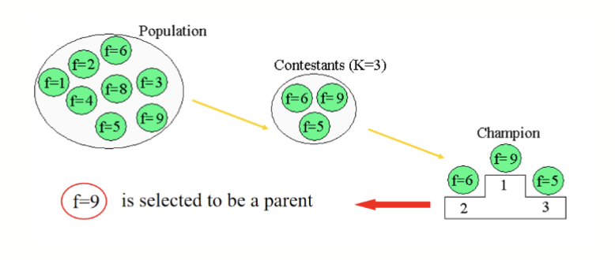

### 怎么用新的种群替代原本的种群

- 完全替代 (Full Replacement)
  - 用新生成的种群完全替代原本的种群
  - 简单易行，但可能会丢失一些优秀的个体
- 部分替代 (Partial Replacement)
  - 幼崽和父母一起竞争进入下一代，更优秀的个体保留

### 选择什么样的停止条件

- 获得问题的最优解
- 根据 CPU 资源决定
  - 最大迭代次数
- 根据用户耐心决定
  - 达到预期的适应度水平
  - 若干代内最优解没有变化

---

- **Exploration** vs. **Exploitation**
  - Exploration：探索，寻找新的解空间
    - 更多的探索会带来更多的多样性
    - 不容易收敛
    - 交叉主要起探索的作用
  - Exploitation：利用，优化当前的解
    - 更多的利用可能会陷入局部最优解
    - 选择主要起利用的作用
  - 需要在两者之间找到平衡

## 在 MATLAB 中使用遗传算法

### 性能测试

在正式使用一个算法解决问题之前，常常需要通过性能测试 (benchmark) 来评估一个算法的性能。为了评估算法的性能，我们会通常会使用已知答案的测试函数进行测试

- 测试函数包括许多不同特点
  - 如可以是单模型、多模型、多变量等
  - 用于评估算法在不同情况下的表现
- 已知测试函数的全局最优解
  - 可以验证算法是否能够找到全局最优解
- 通常易于计算
  - 便于快速评估算法的性能
- 有在已知的算法下的表现
  - 可以与其他算法进行比较

通过性能测试，我们可以评估算法的收敛速度、稳定性和鲁棒性等性能指标，帮助我们选择合适的算法来解决实际问题。

一个常见的测试函数是 `Rastrigin` 函数:

$$
f(\bold{x}) = 10d + \sum_{i=1}^d (x_i^2 - 10\cos(2\pi x_i)),\quad \bold{x} \in \R^d
$$

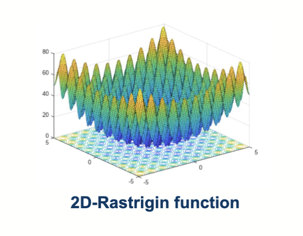

这个函数的特点是有多个局部最优解，但只有一个全局最优解，适合用来测试优化算法的性能。其全局最优解为 $f([0,...,0]) = 0$。

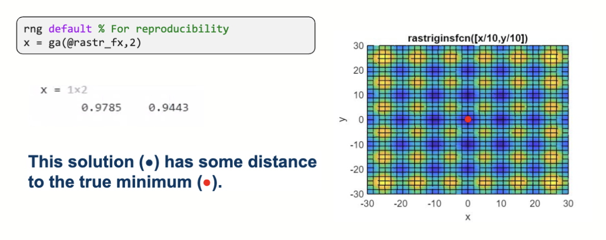

在只限定维度是 2 的情况下，得到的解和全局的最优解有一定距离。

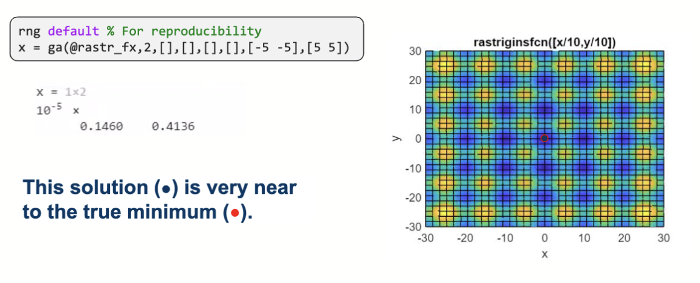

给每个维度添加了取值范围 $[-5,5]$ 的限制后，得到的解接近于全局最优解。

这里设置了 `intcon` 参数为 `[1]`，表示第一个维度是整数类型。得到的解满足约束，且在全局最优解附近。

在获得局部最优解的变量取值时可以同时获得目标函数值。

### 偶极天线问题

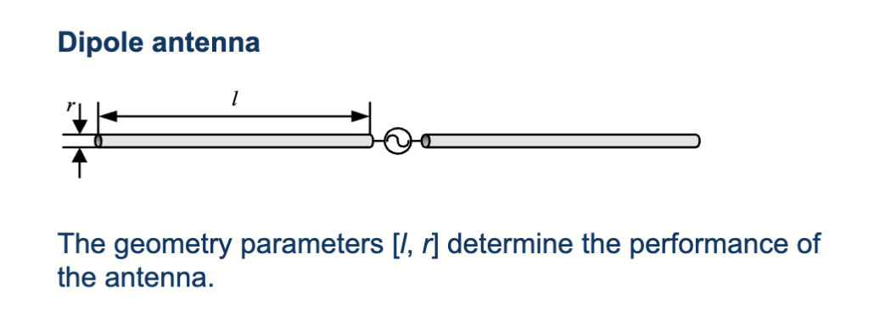

需要设计一个偶极天线，它的幅度 $S_{11}$ 在 1.8 GHz 到 2.2 GHz 之间小于 -10 dB。天线长度 $l$ 在 60 mm 到 80 mm 之间，天线半径 $r$ 在 0.1 mm 到 0.5 mm 之间。用数学形式写出来即：

$$
\min \sum_{i=1}^K||S_{11}(x, f_i)|_{\mathrm{dB}}+10|^* \\
\quad f_i \in [1.8, 2.2] \mathrm{GHz}, i=1,2,...,K \\

s.t. \begin{cases}
  x = [l, r] \\
  l \in [60, 80] \mathrm{mm} \\
  r \in [0.1, 0.5] \mathrm{mm} \\
  |...|^* \text{表示计数大于0的个数}
\end{cases}
$$

转换成 matlab 代码

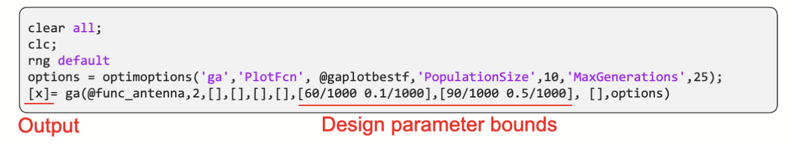

经过 GA 算法优化后得到结果

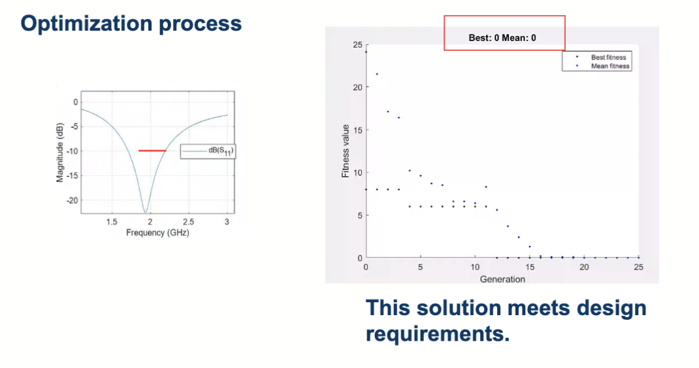

于是，得到了 $l = 0.0725 \mathrm{m}, r = 0.0005 \mathrm{m}$ 的天线设计方案。在这个方案下，采样范围内一共有 $0$ 个频率点的 $S_{11}$ 大于 -10 dB。
