# Lec.4 约束和多目标优化

## 约束优化 (Constrained Optimization)

这里以一个优化问题为例子：

$$
\min f(x) = (x-1)^2 - 1\\
s.t. g(x) = x - 1.5 \ge 0
$$

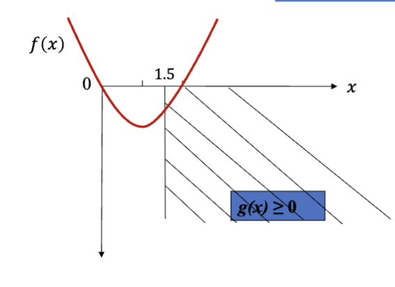

这就是一个典型的约束优化问题，其中 $f(x)$ 是目标函数，$g(x) \ge 0$ 是约束条件。很明显，此处的约束条件和目标函数有着不同的作用

- **目标函数**
  - 用来衡量解的优劣
  - 目标是最小化 (或最大化) 目标函数的值
- **约束条件**
  - 用来限制解的范围
  - 只关心解是否满足约束条件，可行 (feasible) 或不可行
  - 可行的解被认为是一样的
  - 不可行的解被认为有不同的优劣

由此，一个很明显的问题就出来了：在有约束的情况下，要选择哪个解？————也就是如何比较不同解之间的优劣关系。一般有这么样的原则：

- **可行优于不可行**
  - 所有可行解都比任何不可行解要好
- 可行解之间，比较目标函数
  - 目标函数值更小的解更好（如果是最小化问题）
- 不可行解直接，比较违反的约束
  - 违反约束更少的解更好

这个标准下，我们就需要对 “违反约束的程度” 进行量化以便于比较，但是不同约束之间的程度可能不能直接比较，同时不同约束可能有不同的优先度————有的约束比其他的更重要。为了解决这个问题，可以用 **加权和** 的方式计算总的违反程度。

$$
\min f(x) \\
\mathrm{s.t.}\quad g(x) \le c
$$

这是原本的约束优化问题，它被转换成了下面的形式

$$
\min f(x) + k\cdot h(g(x), c) \\
\mathrm{where}\quad h(g(x), c) = \max \{0, g(x) -c\}
$$

其中，$k$ 是惩罚系数 (penalty coefficient)，是一个标量，用于控制违反约束时乘法的强度。 $h(g(x), c)$ 是乘法函数，其量化了违反约束的程度。一个解越违反约束，$h(g(x), c)$ 的值就越大，从而使得目标函数的值增大，降低该解被选择的概率。

一种执行上述方法的经验过程是

1. 选择一个可以接受的违规程度 $\epsilon$
2. 设计一个最优函数值 $\tilde{f}$，这个值预期可以得到，但不一定是最优值
3. 设计一个惩罚系数 $k$，使得 $k \cdot \epsilon$ 大约是 50 倍的 $\tilde{f}$
   $$
   k \cdot\epsilon = 50 \tilde{f} \Rightarrow k = \frac{50\tilde{f}}{\epsilon}
   $$

对于我们最开始提到的问题，使用类似的方法：

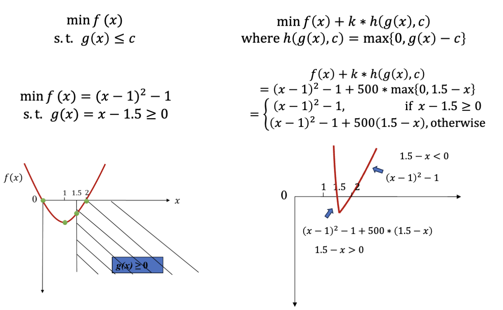

可以看到，违反了约束的解会被惩罚，进而旧的不符合约束的最优解 $x=1$ 不再是最优解。

---

如果一个约束优化问题有多个约束，应该怎么做？

$$
\min f(x) \\
\mathrm{s.t.}\begin{cases}
  g_1(x) \ge c_1 \\
  g_2(x) \le c_2 \\
  g_3(x) \le c_3 \\
  ...
\end{cases}
$$

首先，先把所有的约束化成相同的形式，也就是一个小于等于符号连接的不等式：

$$
\min f(x) \\
\mathrm{s.t.}\begin{cases}
  -g_1(x) \le -c_1 \\
  g_2(x) \le c_2 \\
  g_3(x) \le c_3 \\
  ...
\end{cases}
$$

之后，把所有的约束按照单约束情况下的方法独立处理————也就是每个约束都有一个自己的惩罚系数 $k_i$

$$
\begin{aligned}
  \min \ f(x) & + k_1 h(-g_1(x), -c_1) \\
  & + k_2 h(g_2(x), c_2) \\
  & + k_3 h(g_3(x), c_3) \\
  & + ...
\end{aligned} \\
$$

之后，按照类似的方式 $k_i = \frac{50 \tilde{f}}{\epsilon_i}$ 计算出每个惩罚系数 $k_i$ 的值，其中 $\epsilon_i$ 是每个约束可以接受的违规程度。

---

如果求解的问题是最大化问题而不是最小化问题呢？

很明显 $\max f(x)$ 等价于 $\min -f(x)$，所以可以把最大化问题转换成最小化问题来处理。之后的操作就跟之前提到的是一样的了。

---

在进行这样的转换之后，原本的约束优化问题被转换成了无约束优化问题，并且每个解都可以被比较，符合之前提到的原则：

- 可行优于不可行
- 可行解之间，比较目标函数
- 不可行解之间，比较违反的约束

## 背包问题 (Knapsack Problem)

背包问题是一个经典的约束优化问题。假设有一个背包，它有一个容量限制 $C$，并且有 $n$ 个物品，每个物品有一个重量 $w_i$ 和一个价值 $v_i$。目标是选择一些物品放入背包，使得总重量不超过容量限制，并且总价值最大化。

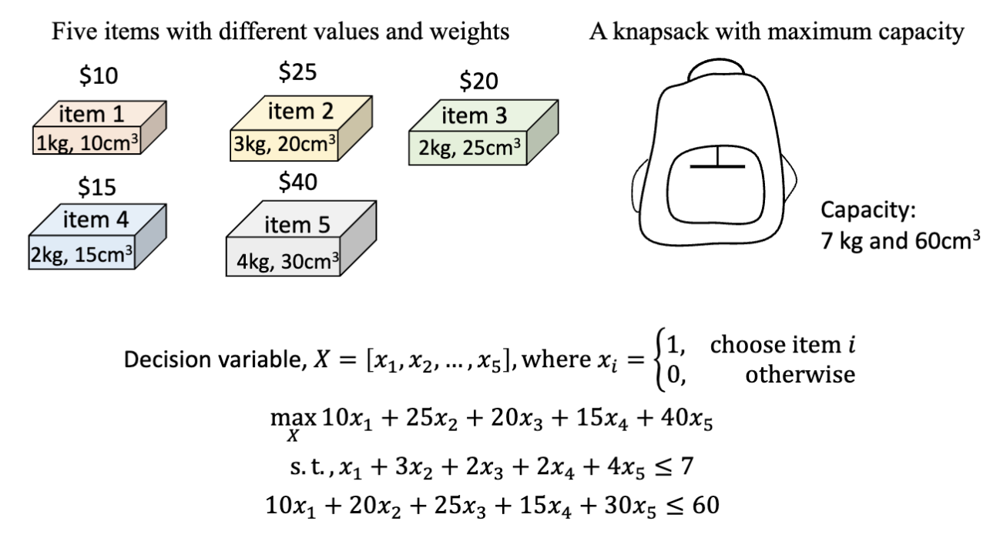

按照之前提到的方式，我们可以把这个问题表示为一个约束优化问题：

1. 首先，把这个最大化问题改成最小化问题
   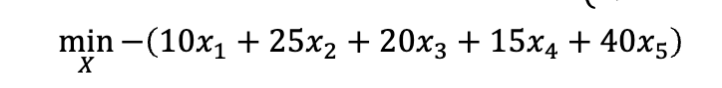
2. 然后把每个约束改成相同的小于等于的形式
   
3. 之后，把每个约束独立处理，乘上惩罚系数，加到目标函数上
   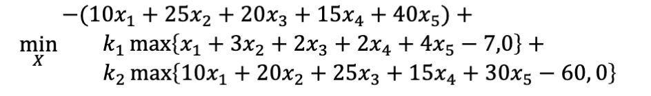
   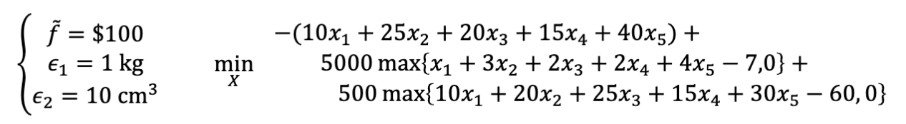
4. 之后对这个无约束优化问题进行求解

```matlab
function fitness = knapsack_pfm(values, weights, maxWeight, w_penalty, volumes, maxVolume, v_penalty, population)
   % fitness evaluator for the knapsack problem, where the constraints are processed by the penalty function method
   fitness = -values*population.'; % convert the problem to minimization
   w_const= weights*population.'; % compute the weight constraint
   v_const= volumes*population.'; % compute the volume constraint
   fitness = fitness + w_penalty* max(maxWeight-w_const, 0);
   fitness = fitness + v_penalty* max(maxVolume-v_const, 0);
end
```

## 多目标优化 (Multi-objective Optimization)

多目标优化是指在一个优化问题中，有多个目标函数需要同时优化。

$$
\min f_1(x_1, x_2, ..., x_n) \\
\min f_2(x_1, x_2, ..., x_n) \\
... \\
\min f_m(x_1, x_2, ..., x_n) \\
x = (x_1, x_2, ..., x_n)^T \in D \subseteq \R^n
$$

- $x$ 是决策变量 (decision variable)
- $D$ 是决策空间 (decision space)
- $f_i(x)$ 是第 $i$ 个目标函数
- $n$ 是决策变量的维度
- 目标函数也可能是包含 $\max$ 的最大化问题

通常，这些目标函数之间可能存在冲突，也就是说，优化一个目标函数可能会导致另一个目标函数的性能下降。我们需要找到一个平衡点，使得所有目标函数都能得到较好的优化。

这种情况下，不同的解很难相互比较。我们先定义可以比较的情况：

**优势 (Dominance)**: 对于两个解 $x$ 和 $y$，如果 $x$ 在所有目标函数上都不比 $y$ 差，并且在至少一个目标函数上比 $y$ 好，那么我们说 $x$ 优势于 $y$

那么，对于任意两个解 $x$ 和 $y$，可能存在三种情况：

- $x$ 优势于 $y$
- $y$ 优势于 $x$
- $x$ 和 $y$ 无法比较

根据这样的不完全可比性，我们可以定义 **帕累托最优 (Pareto Optimality)**:

**帕累托最优 (Pareto Optimality)**: 无法被任何其他解优势的解被称为帕累托最优解 (Pareto Optimal Solution)，它们组成的集合叫做帕累托集 (Pareto Set)。所有帕累托最优解的目标函数值组成的集合称为帕累托前沿 (Pareto Front)。

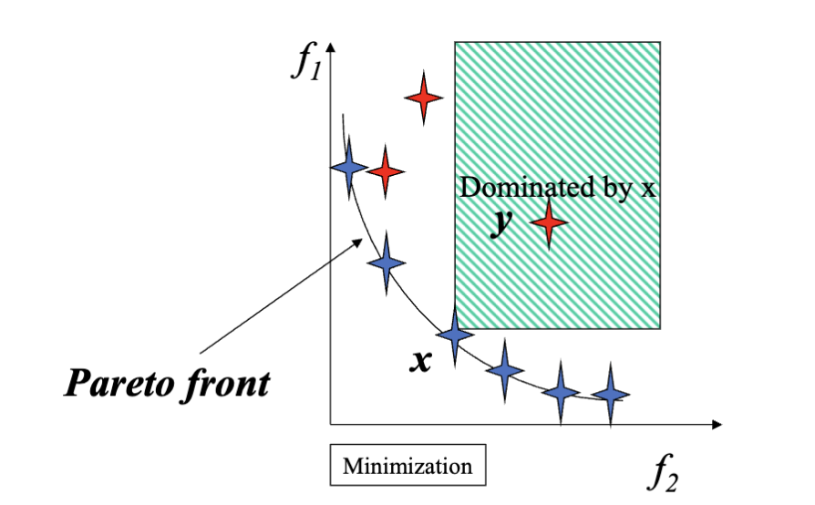

帕累托前沿可能有不同的形状或者有不同的分布：

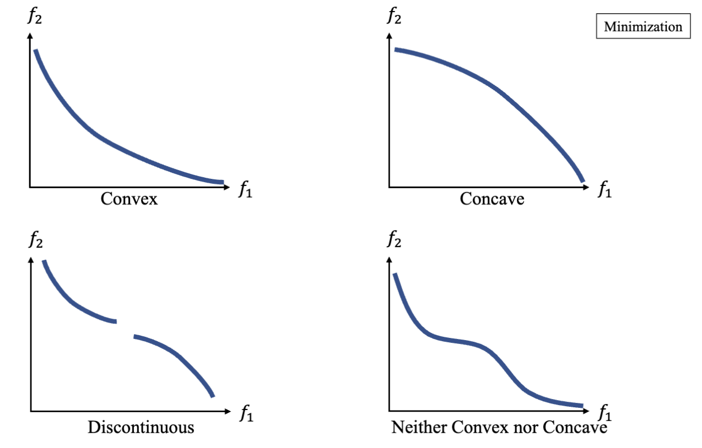

求解多目标优化问题的目标是找到帕累托前沿上的解。而最终优化的结果是一个解的集合，而不是单一的解。

## MOEA 算法 (Multi-objective Evolutionary Algorithm)

MOEA 是一种用于求解多目标优化问题的进化算法。它通过模拟自然选择和遗传变异的过程，逐步改进解的质量，最终得到一组近似的帕累托最优解。

### MOEA 算法的基本流程

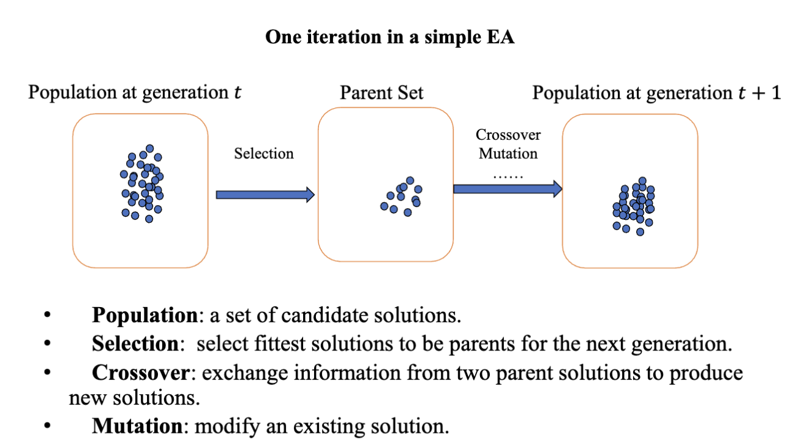

这是一个在 [Lec.3](./lecture3.md) 中提到的基本进化算法的过程，包含种群、选择、交叉、变异等。对于 MOEA 算法， 它生成一系列的解去估计帕累托前沿，为决策者提供一些其他有用的信息，比如不同目标如何相互妥协。这是一种在多标准决策分析 (Multi-Criteria Decision Analysis, MCDA) 中常用的方法。

经过 MOEA 算法后，我们希望得到有限个等距排列的卫浴帕累托前沿上的解，进而可以根据这些解描绘出帕累托前沿的形状。

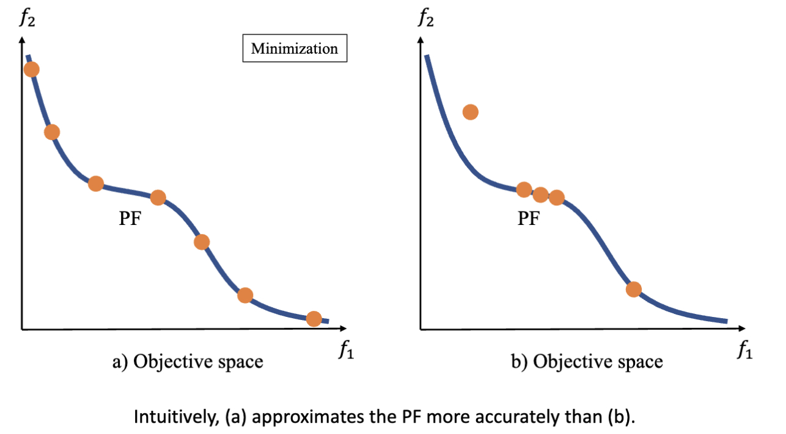

得到的解集也可以获得更多样的信息

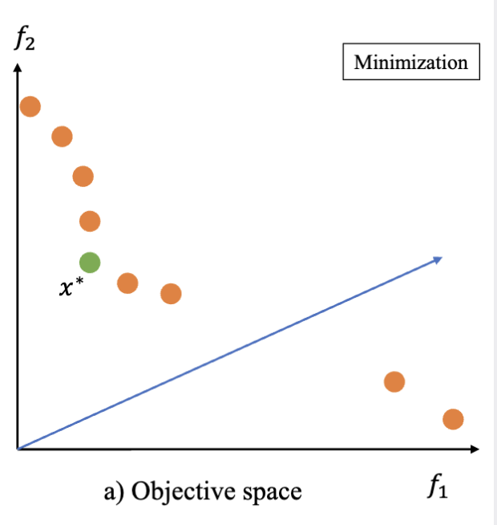

根据这张图，我们可以知道：

- 目标函数 $f_1$ 比 $f_2$ 更容易优化
- 在蓝色箭头附近可能不存在帕累托最优解
- 绿色的解 $x^*$ 可能是一个“关键 (key)”解，因为它在两个目标函数上都有较好的性能

### 常见的 MOEA 算法

- **MOEA/D**: Decomposition-based MOEA
  - 将多目标优化问题分解为多个单目标优化子问题
  - 通过求解这些子问题来近似帕累托前沿
- **NSGA-II**: Dominance-based MOEA
  - 基于支配关系进行选择
  - 使用非支配排序和拥挤距离来维护种群的多样性
- **IBEA**: Indicator-based MOEA
  - 基于对性能指标的贡献来选择
  - 通过指标来评估解的质量

### MOEA/D 算法

对于 MOEA/D ，它在种群数量较小的情况下可以得到更好的分布以及更高的优化质量。分解的思想让它有了更加均匀的分布，最终在较小的种群数量下得到了比 **NSGA-II** 更好的结果。

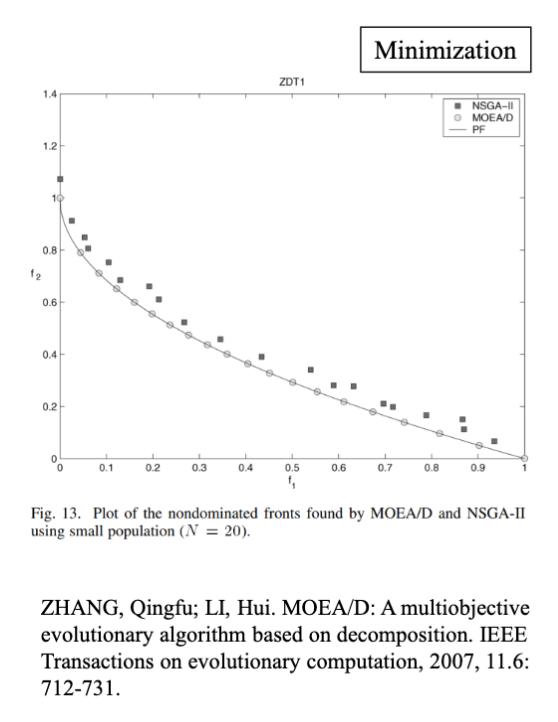

这一结果是由于 MOEA/D 的两个核心思想：

- 分解 (Decomposition)
  - 从传统优化算法中借鉴
  - 将多目标优化问题分解为多个子问题
  - 每个子问题通常是单目标优化问题
- 合作 (Collaboration)
  - 从进化算法中借鉴
  - 使用了多个智能体，每个智能体负责求解一个子问题
  - 这些 N 个子问题是相互关联的，N 个智能体可以以协作的方式解决这些子问题

要进行 MOEA/D 算法，首先要把多目标优化问题分解成多个子问题，而一个子问题的常见结构是：

$$
\min g(x) \\
\mathrm{Inputs:}\begin{cases}
  分解问题 g(x) \\
  偏好向量 \lambda \\
  可能的参照点 z^* \\
  搜索空间 D \\
  目前最好的解 x^* \\
\end{cases}
$$

对于分解，常用的有两种方法：

- **加权和 (Weighted Sum)**: 通过给每个目标函数分配一个权重，将多个目标函数合并成一个单一的目标函数
- **Tchebycheff 方法**: 通过最小化目标函数与一个理想点之间的最大距离来处理多个目标函数

以加权和为例。比如，原本有两个目标函数 $f_1(x)$ 和 $f_2(x)$，我们可以把它们分解成一个加权和的形式：

$$
g(x) = \lambda_1 f_1(x) + \lambda_2 f_2(x) = \lambda \cdot F(x) \\
s.t.\quad \lambda_1 + \lambda_2 = 1,\quad \lambda_1, \lambda_2 \ge 0
$$

这样，一个子问题就变成了一个单目标优化问题，可以使用之前提到的进化算法来求解。

使用不同的权重，可以得到不同的子问题，从而覆盖整个帕累托前沿。

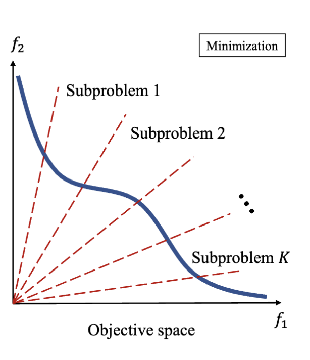

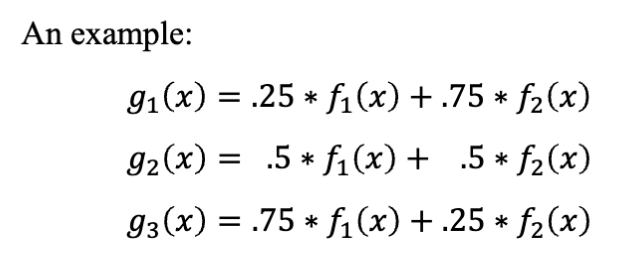

使用加权和时，可以发现 $g(x)$ 的值对应着 $f_1(x)$ 和 $f_2(x)$ 的线性组合，其在二维上是一条直线，找到的最优解对应着这条直线与帕累托前沿的切点。不同的权重对应着不同的直线斜率，从而找到不同的最优解。

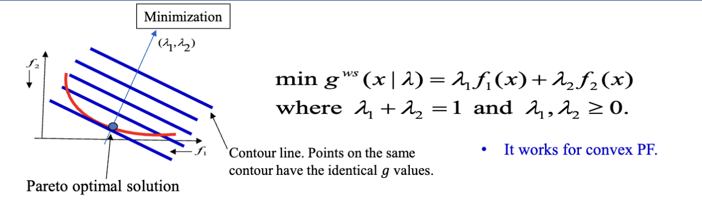

---

**近邻 (Neighborhood)** 定义的是子问题之间的关系。如果两个子问题的权重向量相近，则它们被认为是近邻子问题。近邻子问题大概率有着相似的目标函数和相似的最优解。

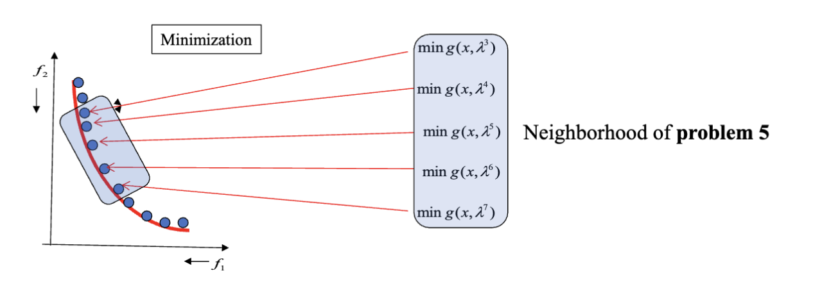

可以在近邻问题之间进行交换来得到更好的解。比如这张图，上面两个染色体是两个子问题的目前的最优解，使用交换产生了新的解，进而可能得到更好的解。

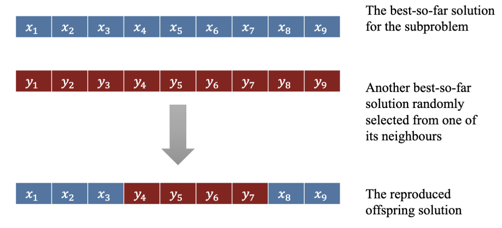

对于每一代，MOEA/D 算法的主要步骤是：

- **选择交配池**
  - 选择目前问题的最优解和目前问题的近邻问题的最优解作为交配池
- **繁殖 (Reproduction)**
  - 使用交叉和变异操作生成新的解
- **替换 (Replacement)**
  - 将旧的解和新的解进行比较，选择更好的解作为新的最优解
  - 把新的解给予近邻问题，替换成更好的解

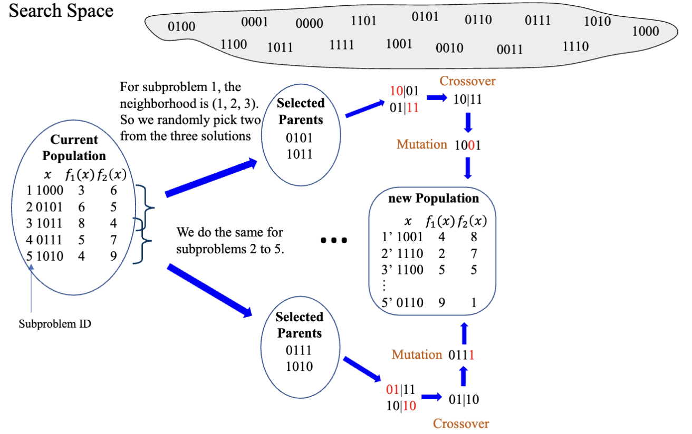

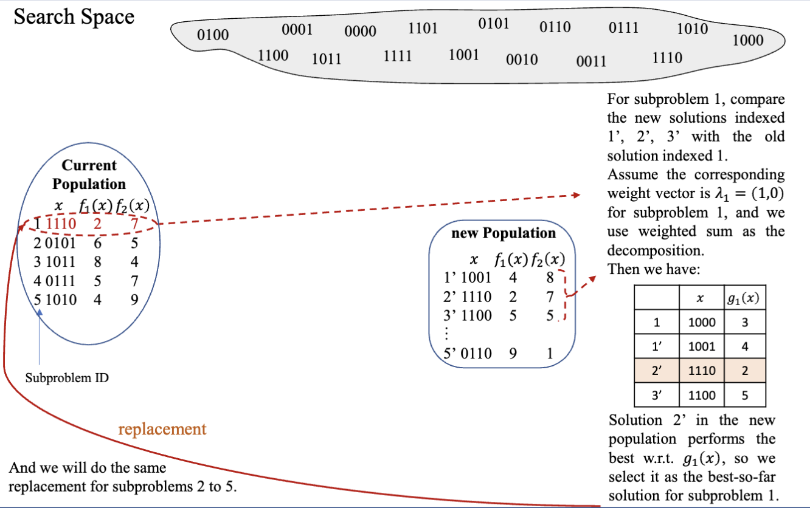

> [!NOTE]
>
> MATLAB 代码实现见 Moodle 上的附件
>
> 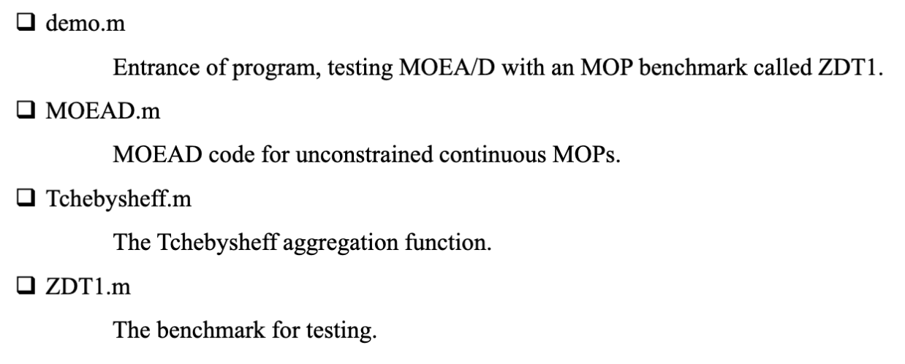
