# Lec.5: Combinatorial Optimization (组合优化)

## 定义

组合优化指的是从一个有限的对象集中寻找最优解的问题。通常，这些对象集是离散的，并且问题通常涉及选择、排列或分配这些对象以最大化或最小化某个目标函数。

|        | 组合优化 (CO)                    | 实值优化 (RO) |
| ------ | -------------------------------- | ------------- |
| 目标   | 离散                             | 连续          |
| 解空间 | 有限                             | 无限          |
| 目标   | 在有限集合里寻找最好的组合或排列 | 寻找最好的解  |

常见的组合优化问题包括

- **背包问题 (Knapsack Problem)**
- **旅行商问题 (Traveling Salesman Problem)**

## 背包问题 (KP)

背包问题 (Knapsack Problem, KP) 指的是如何在一个给定了承载重量上限的背包中，选择物品以最大化总价值的问题。每个物品都有一个重量和一个价值，目标是选择一组物品，使得它们的总重量不超过背包的承载能力，同时总价值最大。

一个表示求解变量的方式是使用二进制编码，即对于 n 个物品，解是一个 n 维的二进制向量，其中每个元素表示对应物品是否被选择（1 表示选择，0 表示不选择）。

这里的情况，一共有 5 个物品可以选择，故使用一个五位的二进制数代表所有的选择情况，每一个二进制位对应一个物品，1 代表选择该物品，0 代表不选择该物品。

### 修复法 (Repairment Method)

为了方便求解，我们先计算出每个物品对应的单位重量价值，记作 $v2w$

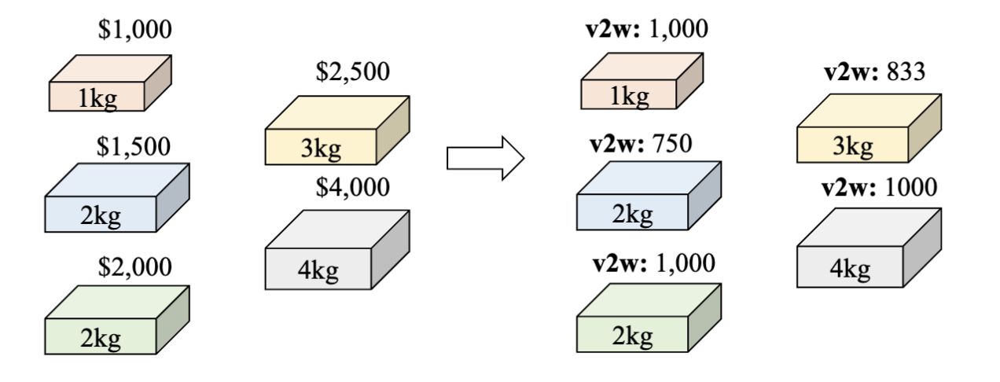

然后，我们使用单位重量价值而不是总价值对每个物品进行排序。比如

- 如果我们目前的二进制解是 01011， 总重量是 9 kg， 超过了 7 kg 的限制
- 通过单位重量价值排序，扔掉单位重量价值最低的物品，直到重量不超过限制

这样，在每一次迭代后都能产生新的保证可行的解。

### 惩罚函数法 (Penalty Function Method)

和 [Lec.4](lecture4.md#约束优化-constrained-optimization) 里提到的方法类似，我们把约束条件转化成惩罚项，加入到目标函数中，数学形式如下：

$$
f_{new}(x) = f(x) - p \cdot h(x) \\
\mathrm{where}\ h(x) = \begin{cases}
  w(x) - c , \mathrm{if}\ w(x) > c \\
  0, \mathrm{otherwise}
\end{cases}
$$

- $f(x)$ 是原始的目标函数（总价值）
- $w(x)$ 是当前选择的物品的总重量
- $c$ 是背包的最大承载重量
- $p$ 是一个大的正数，表示惩罚的强度

确定 $p$ 的值的过程和 [Lec.4](lecture4.md#约束优化-constrained-optimization) 里提到的方法类似，都是按照 $p = \frac{50 \tilde{f}}{\epsilon}$ 的计算方法计算，这里 $\tilde{f}$ 是一个对原始目标函数 $f(x)$ 的估计，取. \$ 10000，$\epsilon$ 能够容忍的最大违反约束，这里取 1kg，计算出 $p = 500000$。

使用上述方法，我们可以将背包问题转化为一个无约束优化问题，然后使用遗传算法或其他优化方法来求解。使用遗传算法求解得到这个问题的解是 10101，对应的最优目标函数是 \$7k。

### 在 MATLAB 中求解背包问题

> [!NOTE]
>
> 在 MATLAB 中的对应实现在 Moodle 上的附加文件中，此处略过
>
> 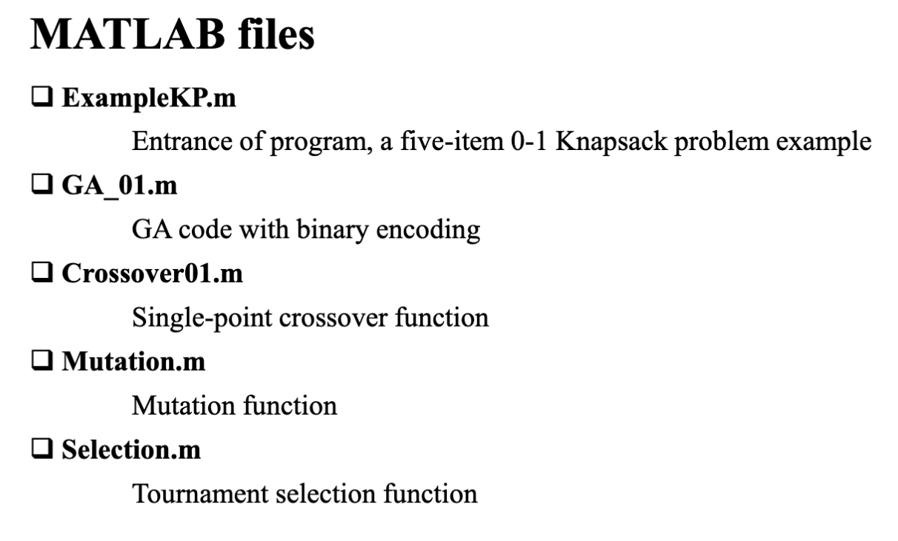
>
> 
>
> 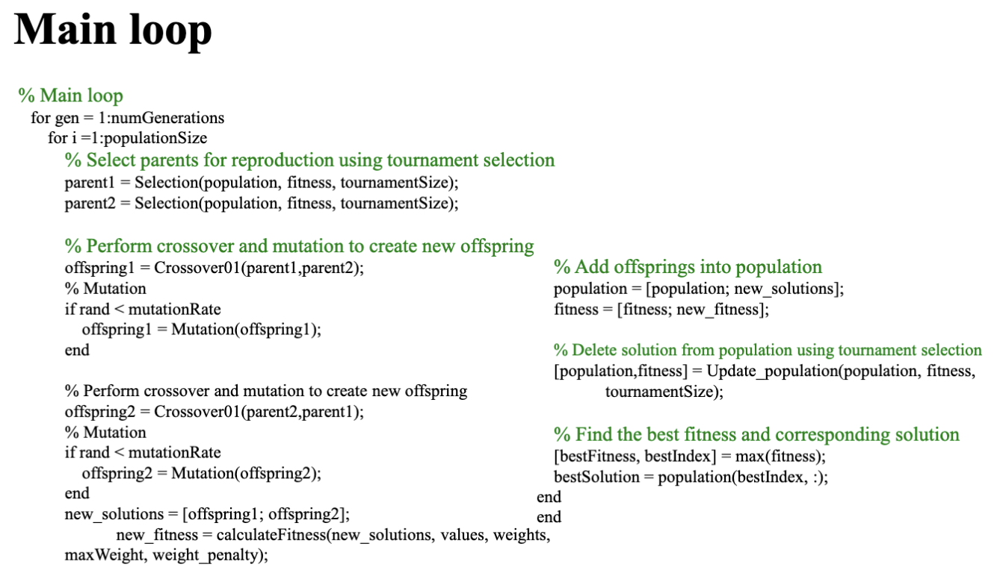
>
> 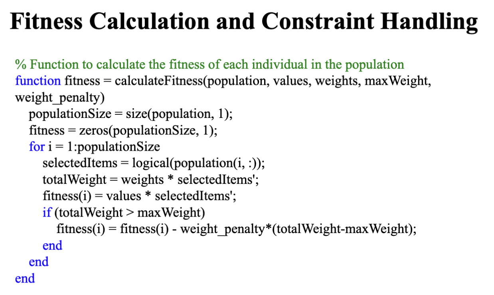
>
> 
>
> 
>
> 这里使用了[锦标赛选择 (Tournament Selection)](lecture3.md#锦标赛选择-tournament-selection) 方法来选择交配池，在 Lec.3 里有介绍
>
> 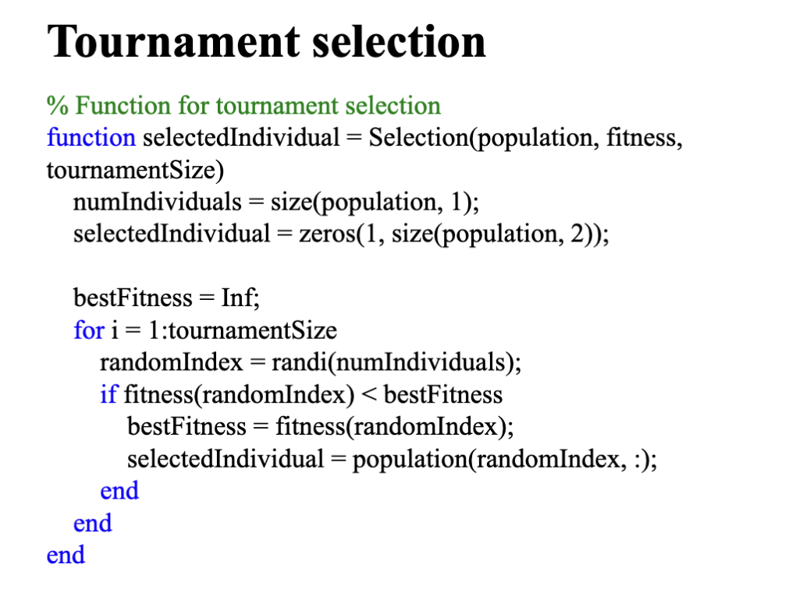

## 旅行商问题 (TSP)

旅行商问题 (Traveling Salesman Problem, TSP) 是一个经典的组合优化问题，目标是在给定的一组城市中找到一条最短的巡回路径，使得每个城市恰好访问一次，并且最终返回到起始城市。

根据问题的性质，我们知道每个解应该是给定城市的排列————每个城市出现一次，不同的顺序代表访问城市的顺序。

按照这个编码，我们就像在 [Lec.3](lecture3.md#交叉) 里提到的一样，我们不太可能使用普通的单点交叉进行交叉操作————它可能会破坏排列的性质，导致某些城市被访问多次，而其他城市则未被访问。

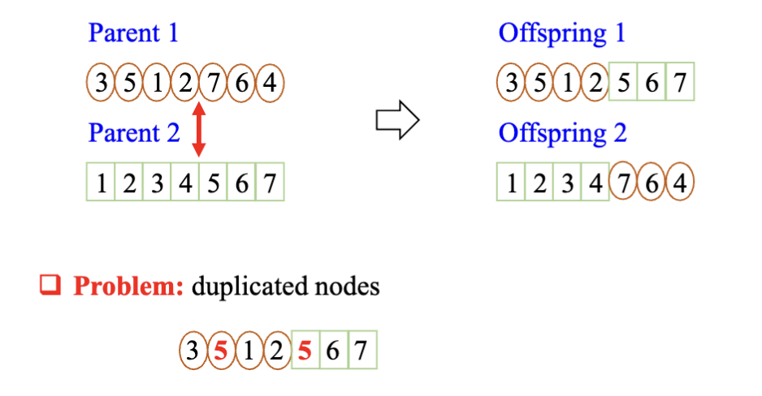

所以，这里使用[部分匹配交叉](lecture3.md#交叉)进行对应的交叉操作。

对于变异，则使用交换变异 (Swap Mutation)，即随机选择两个位置的城市并交换它们的位置。

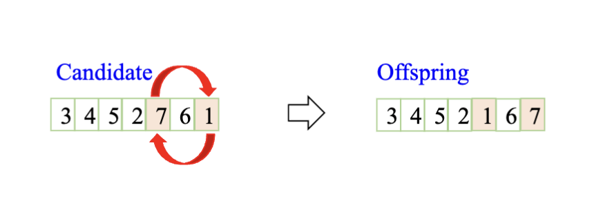

接下来就是典型的遗传算法流程了。

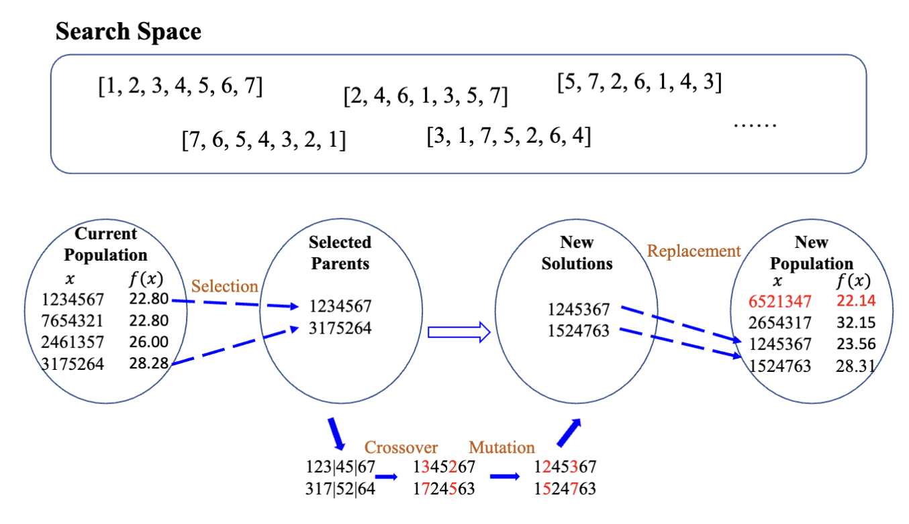

### 在 MATLAB 中求解旅行商问题

> [!NOTE]
>
> 在 MATLAB 中的对应实现在 Moodle 上的附加文件中，此处略过
>
> 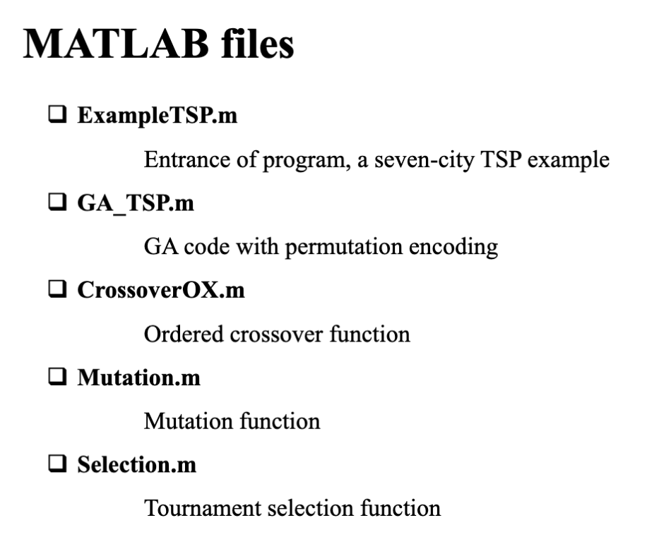
>
> 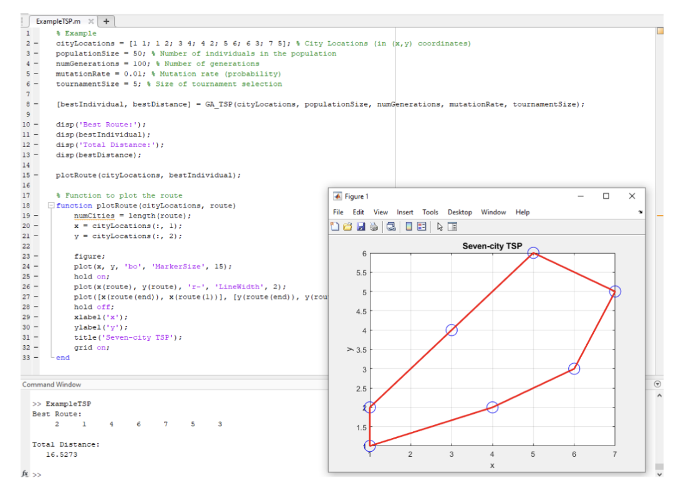
>
> 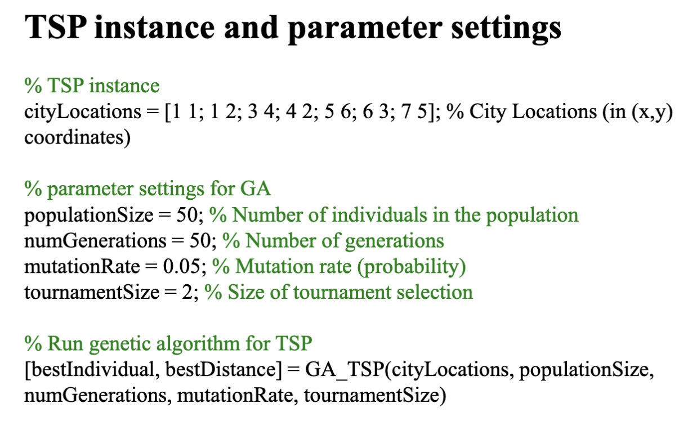
>
> 
>
> 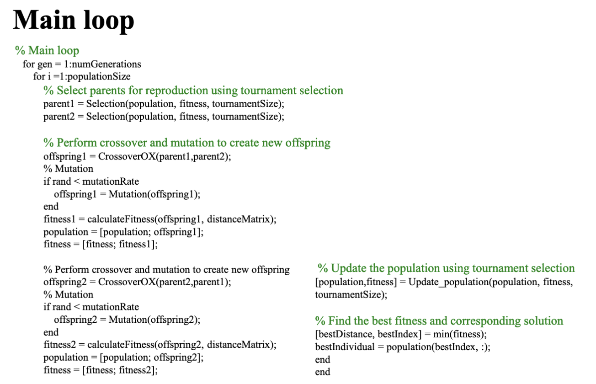
>
> 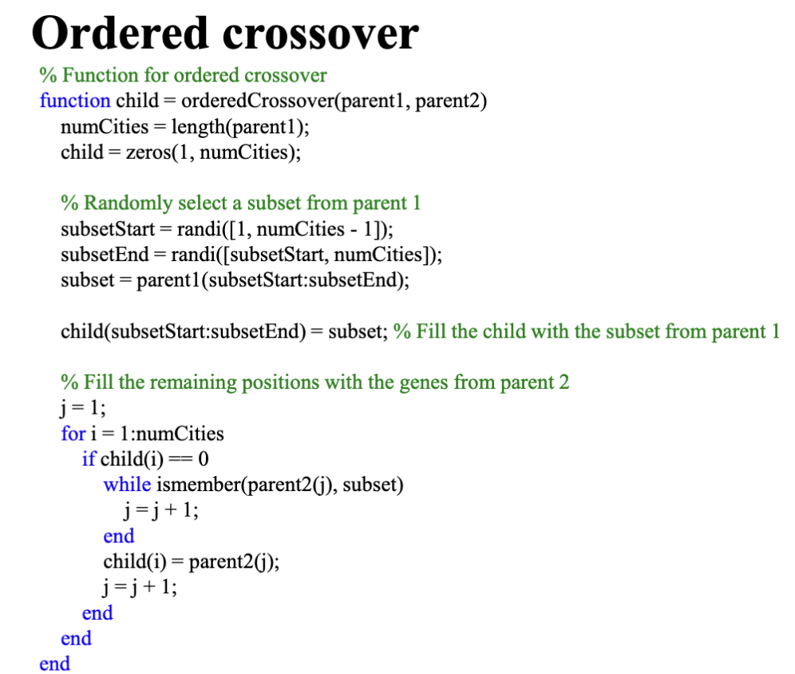
>
> 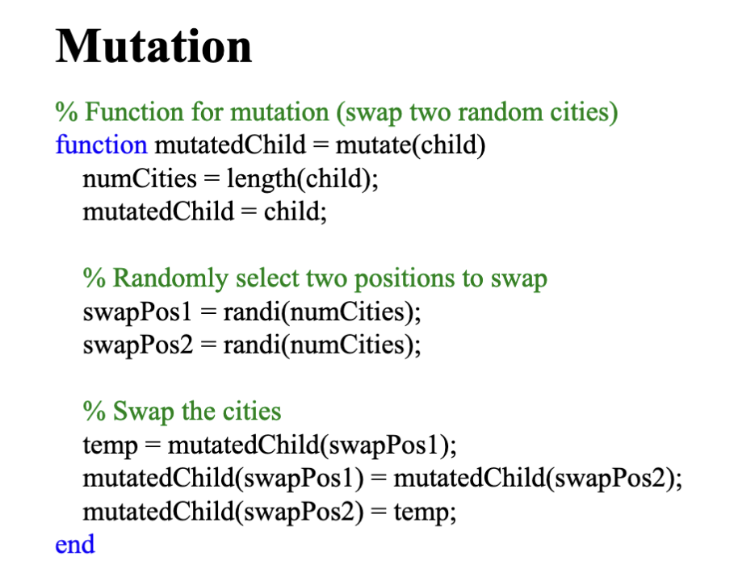
>
> 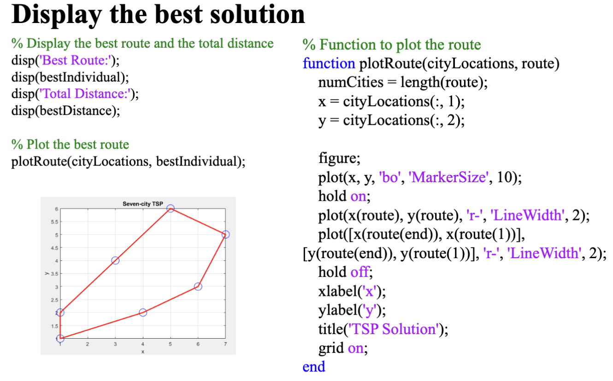
