# 支持向量机 (Support Vector Machine, SVM)

## 基本概念

分类 (Classification) 是机器学习中的一个重要任务，旨在将数据点分配到预定义的类别中。比如这个图，一个模型有了不同的水果的图片和标签，然后训练出一个分类器，来区分苹果和橘子。

支持向量机 (SVM) 是一种强大的监督学习算法，广泛应用于分类和回归任务。SVM 的核心思想是找到一个最佳的超平面 (hyperplane)，将不同类别的数据点分开，同时最大化类别之间的间隔 (margin)。

图上是不同的划分两种类的方式，其中，不能正确的分离两个种类的点的线是错误的，能够正确的分离两种类型的点的线是可以接受的，而我们期望找到的是所有的点距离这条线都尽量远的线，这样的线就是最佳超平面。

SVM 的用途很广，如

| 应用场景 | 输入               | 标签           |
| -------- | ------------------ | -------------- |
| 推荐系统 | 评分, 点击, 或喜欢 | 偏好评分       |
| 欺诈检测 | 账户交易历史       | 是否为洗钱账户 |
| 肿瘤诊断 | 医疗图片           | 是否存在肿瘤   |
| 手写识别 | 手写图像           | 数字           |
| …        | …                  | …              |

## SVM 概览

支持向量机 (Support Vector Machine, SVM) 指一种常用并且有效的分类算法。它有坚实的理论基础，是通过超平面来划分不同类别的数据点。

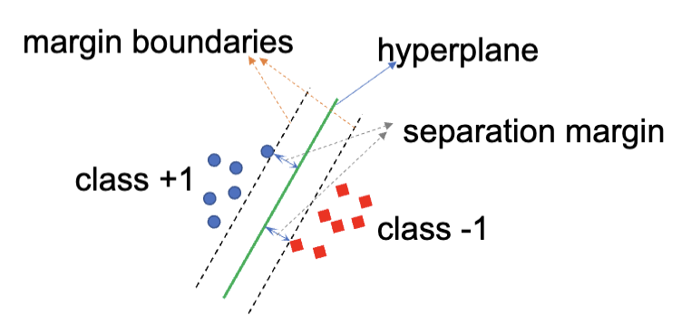

超平面 (Hyperplane) 是一个决策边界，分开了两个不同种类的数据点，并以此数据分为两类。它是一个一系列的点的集合，这些点满足一个线性方程:

$$
h(x) = w^T x + b = 0
$$

其中，$w$ 是这个超平面的法向量，决定了超平面的方向；$b$ 是偏置项，决定了超平面与原点的距离。

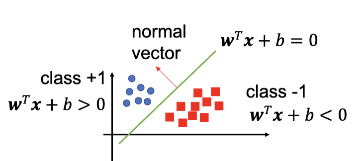

对于任意的一个数据点，可以带入 $h(x)$ 来判断它属于哪一类。如果结果是 $h(x) = 0$，那么这个点就在超平面上；如果 $h(x) > 0$，那么这个点属于一类；如果 $h(x) < 0$，那么这个点属于另一类。

---

在 SVM 中，一个超平面可以把整个样本空间划分成两个部分，也就是说这个超平面的维度比样本空间的维度少一维。例如，在二维空间中，超平面是一个直线；在三维空间中，超平面是一个平面。

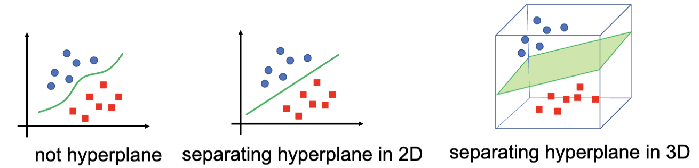

训练 SVM 的目的是找到最好的超平面，其满足：能把不同类别的数据点正确分类，并且最大化类别之间的间隔 (margin)。 通常来讲，间隔越大，模型的泛化能力越强，在测试集上的表现也会更好，最终得到的分类器的置信度也会更高。

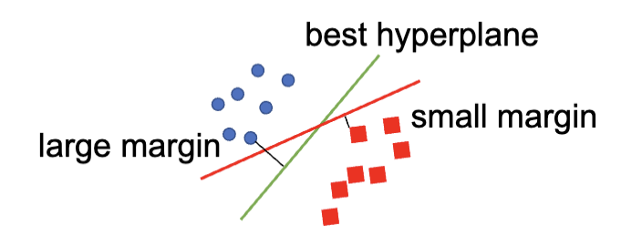

支持向量 (Support Vectors) 指的是哪些距离超平面最近的数据点。在 SVM 中，分类器只与这些支持向量有关，而与其他数据点无关。换句话说，支持向量决定了超平面的最终位置和方向。这也是 SVM 名称的由来。

## SVM 分类

SVM 主要分为这么几类：

- 线性 SVM (Linear SVM)
  - 硬间隔分类器 (Hard Margin Classifier)
  - 软间隔分类器 (Soft Margin Classifier)
- 非线性 SVM (Non-linear SVM)
- 多类型 SVM (Multi-class SVM)

其中，硬间隔分类器适用于数据集是完全线性可分的，可以通过一个超平面完全把两种数据分开来。但是这种方法也有很明显的局限性：只适用于很完美的数据集，无法处理极端值、非线性分布、多类型问题。

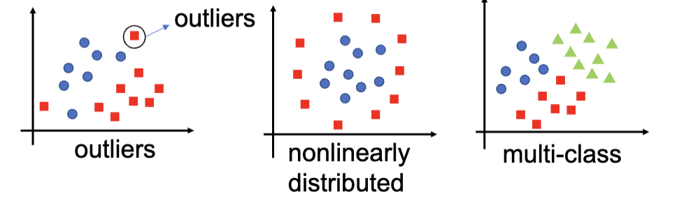

软间隔分类器解决的是极端值的问题。它适用于数据集接近线性可分的情况，但是允许一定的错误分类，通过引入惩罚项来平衡分类的准确性和间隔的大小。

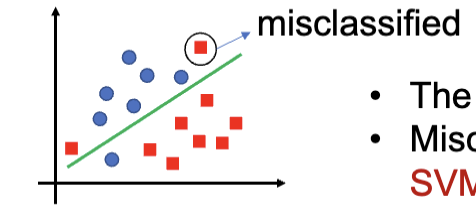

非线性 SVM 适用于数据并不是线性可分的数据集，通常是将低维度的不线性可分的数据映射到高维度的空间中，使其在高维空间中线性可分。这个过程通常通过核函数 (Kernel Function) 来实现。

最后，上述的所有 SVM 都只适用于二分类问题 (Binary Classification)，而多类型 SVM 则是将二分类 SVM 扩展到多分类问题中。

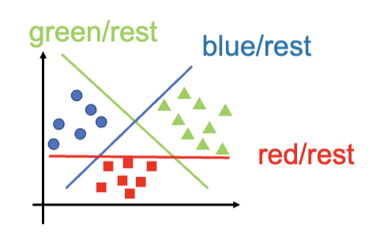

### 线性 SVM

#### 硬间隔分类器

对于线性的 SVM，优化目标是最大化间隔 (margin)，同时确保所有的数据点都被正确分类。基于这个目的，我们需要先定义一下一个数据点到超平面的距离

现有一个数据 $x^i$。如果它在超平面上，则很明显，距离是 $\mathrm{dis}^i=0$。

如果这个点不在超平面上，则距离的计算公式为：

$$
\begin{aligned}
  \mathrm{dis}^i &= \frac{\max(0, |w^T x^i+b|)}{||w||}\\
  ||w|| &= \sqrt{w_1^2 + \dots + w_d^2}
\end{aligned}
$$

> 喜报：这个公式是 Optional 的，不用背

---

对于一个数据集 $D=\{(x^1,y^1),\dots,(x^n,y^n)\}$，其中每个数据点是 $(x^i,y^i)$，$x^i$ 是特征向量，$y^i \in \{-1,1\}$ 是对应的标签。那么，SVM 的间隔的大小就是这个数据集中所有的数据点到超平面的距离的最小值：

$$
m(w,b) = \min_{1\leq i \leq n} \mathrm{dis}^i
$$

这就把 SVM 的训练过程转化成了一个优化问题，找到一个 $(w,b)$，使得间隔 $m(w,b)$ 最大化，同时满足所有的数据点都被正确分类。

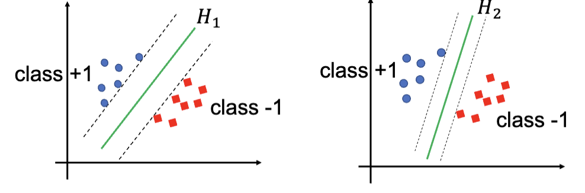

---

通常，进行 SVM 训练的过程是：

1. 定义直线 $wx+b=0$, 认为有 $wx^i + b \leq -1$ 时，$x^i$ 属于类别 A；有 $wx^i + b \geq 1$ 时，$x^i$ 属于类别 B。

2. 找到直线 $wx+b=-1$，这条直线经过某个类别 A 的数据点，同时正确分类的所有样本。之后，找到和它平行的直线 $wx+b=1$，这条直线经过某个类别 B 的数据点，同时正确分类的所有样本。

   这两条直线之间的间隔是 $d = \frac{2}{||w||}$。

   

   然后，这个训练过程就等效于这个优化问题，接下来的训练就等同于求解这个优化问题：

   $$
   \begin{aligned}
    \min_{w,b} \quad & \frac{1}{2} ||w||^2 \\
    \text{s.t.} \quad & y^i (w^T x^i + b) \geq 1, \quad i=1,2,\dots,n
   \end{aligned}
   $$

3. 寻找不同的 $w$ 和 $b$，使得间隔 $d$ 最大化，同时满足所有的数据点都被正确分类。通常的方法有二次规划和梯度下降等方法

4. 最终找到一条最佳直线 $wx+b=0$，作为分类的决策边界。

   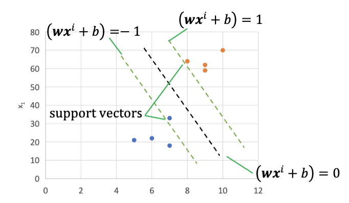

因为这个训练过程是依赖于数据点的标签的，所以 SVM 属于监督学习算法。

> 一个常见的数据集是 Iris 数据集，它包含了三种不同类型的鸢尾花 (Iris flower) 的数据。这是用这个数据集训练的通过 Sepal Length 和 Sepal Width 来区分 Iris Setosa 和 Iris Versicolor 的 SVM 分类器的例子：
>
> 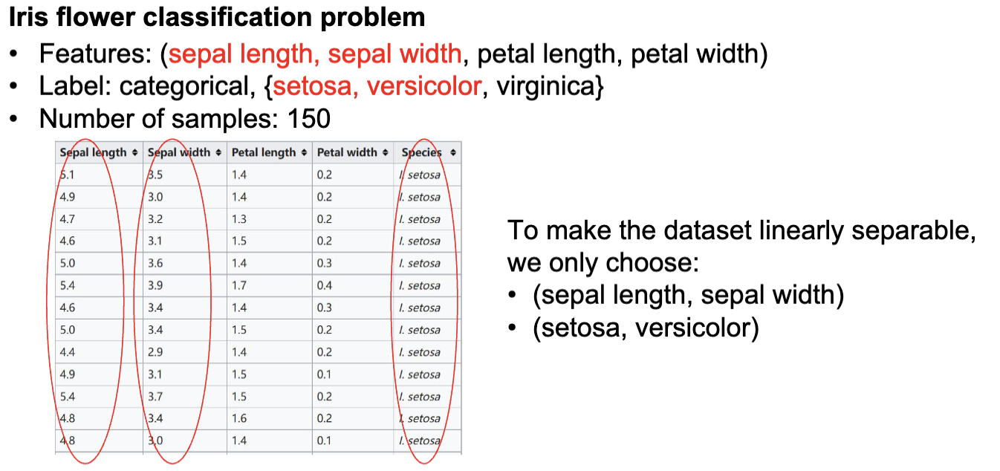
>
> 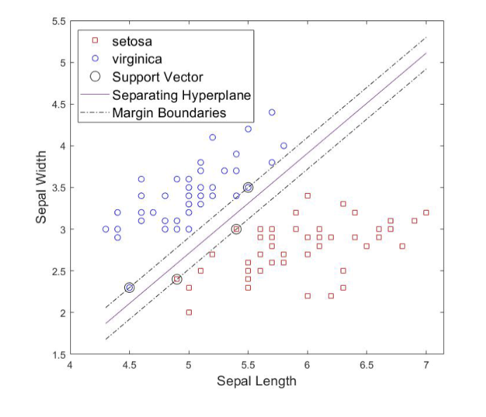

#### 软间隔分类器

通常大多数数据集并没有那么完美的数据，会有几个极端值 (Outliers)，这些极端值会影响到超平面的选择，导致分类器的性能下降。软间隔分类器就是来解决这个问题的。它允许错误分类，用给予惩罚来处理错误分类的数据点。它的目标是在最大化间隔和最小化错误分类之间找到一个平衡。

对于可以完全分离的数据集，只有一种支持向量，位于间隔边界上；但是对于无法完全分离的数据集，一共有三种可能的支持向量：

1. 在间隔边界上
2. 在间隔边界里，但是是在正确的一边
3. 在错误的一边

软间隔分类器的解决方法是引入一个松弛变量 (Slack Variable)，在优化问题内允许违反间隔边界和错误分类。其原本的训练过程的优化问题是

$$
\begin{aligned}
\min_{w,b} \quad & \frac{1}{2} ||w||^2 \\
\text{s.t.} \quad & y^i (w^T x^i + b) \geq 1, \\
& i=1,2,\dots,n
\end{aligned}
$$

在引入后变成了

$$
\begin{aligned}
  \min_{w,b,\zeta}\quad & \frac{1}{2} ||w||^2 + C\sum_{i=1}^n \zeta^i \\
  \mathrm{s.t.} \quad & y^i(w^Tx^i+b)\geq 1-\zeta^i, \\
  & \zeta^i \geq 0 \\
  & i = 1, \dots, n
\end{aligned}
$$

其中， $C$ 是惩罚参数，控制着间隔的大小和错误分类的权衡。$\zeta^i$ 是松弛变量，表示第 $i$ 个数据点违反间隔边界的程度。整个 $C\sum_{i=1}^n \zeta^i$ 项表示所有违反间隔边界的数据点的总惩罚。

$C$ 是一个超参数，用来控制是更关注于得到一个更大的间隔，还是更少的错误分类。较大的 $C$ 值会导致模型更关注于减少错误分类，而较小的 $C$ 值则会导致模型更关注于最大化间隔。

---

> **喜报：以下内容为 Optional**
>
> 上面和下面的更详细的得出过程：
>
> <http://www.adeveloperdiary.com/data-science/machine-learning/support-vector-machines-for-beginners-linear-svm/>

之前提到的带松弛变量的优化问题可以通过解决它的对偶问题来解决，原问题和对偶问题是等价的:

$$
\begin{aligned}
  \min_\alpha \quad &\frac{1}{2}\sum_{i=1}^n\sum_{j=1}^n a^i a^j y^i y^j (x^i \cdot x^j) - \sum_{i=1}^n a^i \\
  \text{s.t.} \quad & \sum_{i=1}^n a^i y^i = 0 \\
  & 0 \leq a^i \leq C \\
  & i = 1, \dots, n
\end{aligned}
$$

这里的 $a$ 是对偶变量 (dual variable)。这个优化问题有 n 个变量，而原来的优化问题有 $n + d + 1$ 个变量 (其中 $d$ 是特征的维度，$n$ 是样本数量)。因此，对偶问题通常更易于求解。

对于对偶问题，每个变量的范围都是一个固定的区间 (box constraint)，这使得使用诸如序列最小优化 (Sequential Minimal Optimization, SMO) 之类的算法来求解对偶问题变得更加容易。

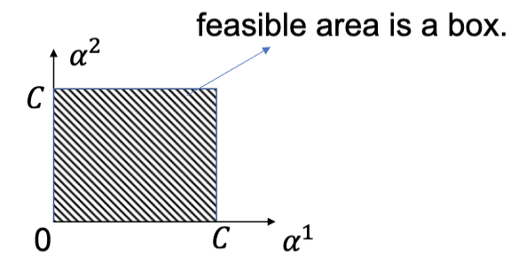

> 这里略过点乘的定义，这个不是 optional：
>
> $(x^i \cdot x^j) = (x^i)^T x^j = \sum_{k=1}^d x_k^i x_k^j$

---

类似的，用老熟人 Iris 数据集来演示软间隔分类器的效果：

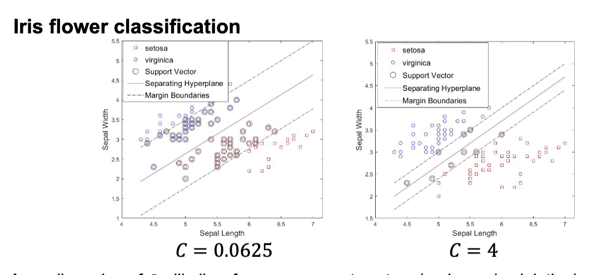

更小的 $C$ 值允许更多的错误分类，从而得到一个更宽的间隔。更大的 $C$ 值则会减少错误分类，但可能会导致间隔变窄。当 $C\to \infty$，则回归到硬间隔分类器。

### 非线性 SVM

#### 核方法

线性 SVM 的限制是只能处理可以或者近似可以线性分割的数据集，但是对于非线性分布的数据分类就很难解决了，比如下图

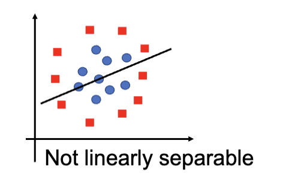

这个时候，需要用到核方法 (kernel trick)。核方法的核心是核 (kernel)，或者说核函数。核函数是一类将数据映射成需要的形式的函数，通常是把数据映射到更高维度的空间中，让数据呈现出线性可分的形式，之后数据就可以使用线性 SVM 来进行分类了。

核函数将输入空间 (input space) 映射到特征空间 (feature space)。输入空间指的是原始的数据空间，而特征空间则是通过核函数映射后的高维空间。比如下图，一维线上的点的分布经过了核函数后变成了二维平面上的点的分布，同时出现了线性可分的特征：

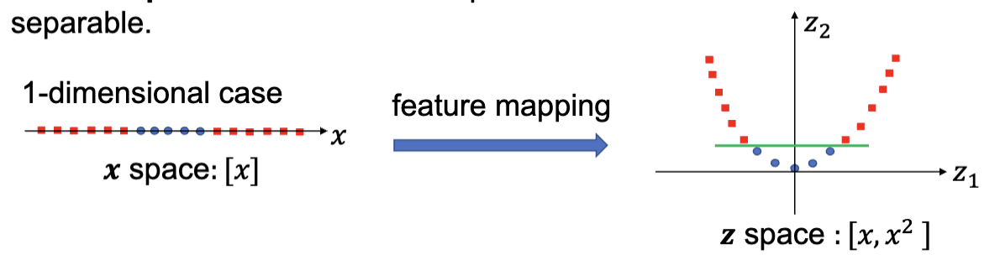

类似的，从二维映射到三维

#### 非线性的优化

回到我们熟悉的对偶优化问题：

$$
\begin{aligned}
  \min_a \quad &\frac{1}{2}\sum_{i=1}^n\sum_{j=1}^n a^i a^j y^i y^j (x^i \cdot x^j) - \sum_{i=1}^n a^i \\
  \text{s.t.} \quad & \sum_{i=1}^n a^i y^i = 0 \\
  & 0 \leq a^i \leq C \\
  & i = 1, \dots, n
\end{aligned}
$$

根据上面的思想，我们知道其实就是把输入套一层映射。具体而言，是这样：

$$
\begin{aligned}
  x^i & \rightarrow \Phi(x^i)\\
  x^j & \rightarrow \Phi(x^j)\\
  (x^i \cdot x^j) & \rightarrow  \Phi(x^i) \cdot \Phi(x^j)
\end{aligned}
$$

这里的 $\Phi$ 就是映射函数。比如说可以是这样的映射

$$
[x_1, x_2] \xrightarrow{,\Phi} [x_1^2, \sqrt{2}x_1x_2, x_2^2]
$$

所以这个优化问题就成了：

$$
\begin{aligned}
  \min_\alpha \quad &\frac{1}{2}\sum_{i=1}^n\sum_{j=1}^n a^i a^j y^i y^j (\Phi(x^i) \cdot \Phi(x^j)) - \sum_{i=1}^n a^i \\
  \text{s.t.} \quad & \sum_{i=1}^n a^i y^i = 0 \\
  & 0 \leq a^i \leq C \\
  & i = 1, \dots, n
\end{aligned}
$$

这样的计算的话，需要把每个数据点都经过一次 $\Phi$ 映射，计算量会非常大，然后每个 $\Phi(x^i) \cdot \Phi(x^j)$ 也需要计算，而输出空间的维度数目通常远大于输入空间，所以整个过程非常耗费时间和内存，显然需要优化。

上述方案的问题在于，显式的计算 $\Phi(x^i)$ 和 $\Phi(x^j)$ 以及它们的点积是非常低效的。可以使用核技巧 (kernel trick) 来避免显式地计算映射后的向量：

- 不显式定义 $\Phi$
- 不显式的计算点积
- 只需要定义核函数 $k(x^i, x^j)$

这里，核函数输入参数是两个数据点，输出内容是他们特征空间映射后的点积，也就是 $\Phi(x^i) \cdot \Phi(x^j)$。进而简化计算。比如说对于之前我们提到的映射，可以等效为:

$$
k(x^i, x^j) = (x^i \cdot x^j)^2 = (x^i_1 x^j_1 + x^i_2 x^j_2)^2
$$

#### 核函数

常用的核有:

- 线性核函数 (Linear Kernel):

  $$
  k(x,z) = x^T z
  $$

- 二次核函数 (Quadratic Kernel):

  $$
  k(x,z) = (x^T z)^2
  $$

- 多项式核函数 (Polynomial Kernel):

  $$
  \begin{aligned}
      & k(x,z) = (x^T z )^q\\
    \mathrm{or} \quad & k(x,z) = (x^T z + 1)^q
  \end{aligned}
  $$

- 径向基函数核 (Radial Basis Function, RBF Kernel)

  $$
  k(x,z) = \exp(-\gamma ||x-z||^2)
  $$

- 高斯核函数 (Gaussian Kernel):

  $$
  k(x,z) = \exp\left(-\frac{||x-z||^2}{2\sigma^2}\right)
  $$

那么突然收获了这么多看不懂的核函数，该怎么选择核函数进行训练呢？

- 首先，要基于问题的特性以及数据的规律来选择核函数
- 线性核函数更多的被用于文字分类问题，在较大的数据集上表现良好
- 高斯核函数在数据没有额外信息的情况下有较好的结果
- 不确定的话使用[交叉验证](./lecture8.md#交叉验证) (Cross Validation) 来选择核函数

---

交叉验证，之前提到过，就是先把数据集分成多个小块，每次用其中一块作为验证集，其他块作为训练集，训练模型，然后在验证集上测试模型的性能。重复这个过程多次，最后把所有的测试结果平均起来，得到一个更稳定的性能评估。

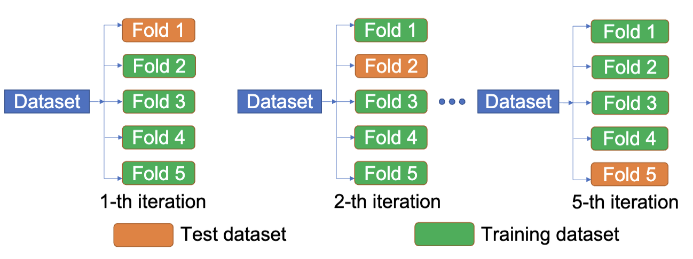

这里的方式类似，使用不同的核函数进行训练，然后在验证集上测试模型的性能。

常用的核函数主要是线性、高斯和 RBF，这三种，也就是选用这三种进行三次交叉训练。对于一个 K 折交叉验证，每个核函数得到了 $k$ 个预测准确率，计算均值，然后通过均值来选择核函数。

### 多类型 SVM

众所周知，SVM 是一个二分类的分类器，不原生支持多个种类的分类，但是有很多问题都是多分类问题，比如声音识别和手写数字识别等等。所以，需要在现有的 SVM 上搭建一些扩展来实现多分类的功能。

一种扩展的方法是把多分类问题拆分成多个二分类问题来解决。常用的方法有两种：

- 一对一 (One-vs-One)，找出分割一个种类和另一个种类的分类器。
- 一对多 (One-vs-Rest)，找出分割一个种类和其他所有种类的分类器。

#### 一对多

对于一个一共要划分 $N$ 个种类的问题，一对多的方法需要训练出 $N$ 个 SVM 分类器出来，分别对应区分是某个种类和不是某个种类。

对于一个新的样本的预测，先通过训练出来的 SVM 来进行分类，然后找到这个点在正类区域 (Positive Region)，也就是被认为是某个种类中的距离分类器最远的那个类别，作为最终的预测结果。

比如下图，数据点同时被认为可能是蓝色和绿色，但是因为距离蓝色的分类器更远，所以最终被预测为蓝色。红色因为是负类区域，所以不会被考虑。

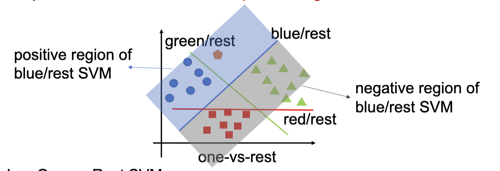

#### 一对一

对于一个一共要划分 $N$ 个种类的问题，一对一的方法需要训练出 $\frac{N(N-1)}{2}$ 个 SVM 分类器出来，分别对应区分某两个种类。很明显，需要训练的分类器数量可能会更多。

每个分类器的作用是区分某两个种类的数据点。

对于一个新的数据点的预测，首先先将点带入所有的分类器中，得到每个分类器的预测结果。之后，将这些分类器的结果进行投票，计算出得票数量最高的类别，作为最终的预测结果。

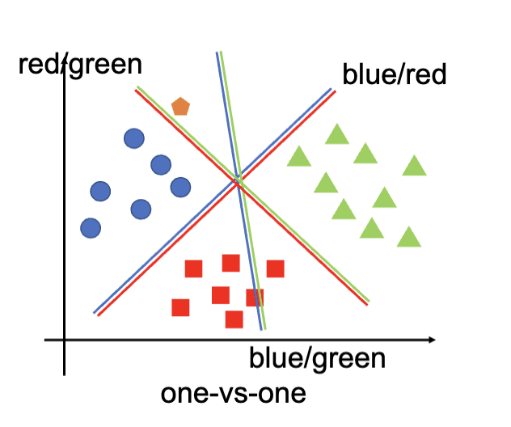

比如上图，三个分类器得出的结果分别是蓝色、绿色、蓝色，所以最终的预测结果是蓝色。

## Python 实现和案例

> 这里讲述的是使用 `sklearn.svm` 这个模块实现的 SVM 分类器，之后是基于 Iris 数据集的案例分析，包括硬间隔分类器和软间隔分类器的实现，以及非线性 SVM 的实现。
>
> 之后是两个 SVM 的自学案例分析，这里略过。
