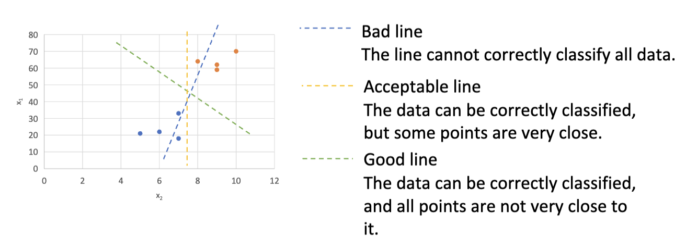

# 支持向量机 (Support Vector Machine, SVM)

## 基本概念

分类 (Classification) 是机器学习中的一个重要任务，旨在将数据点分配到预定义的类别中。比如这个图，一个模型有了不同的水果的图片和标签，然后训练出一个分类器，来区分苹果和橘子。

支持向量机 (SVM) 是一种强大的监督学习算法，广泛应用于分类和回归任务。SVM 的核心思想是找到一个最佳的超平面 (hyperplane)，将不同类别的数据点分开，同时最大化类别之间的间隔 (margin)。

图上是不同的划分两种类

## SVM 概览

## 线性 SVM

### 硬间隔分类器

### 软间隔分类器

## 非线性 SVM

## 多类型 SVM

## Python 实现和案例
