# 人工神经网络入门

## 基本概念

人工神经网络 (Artificial Neural Networks, ANN)，或者叫神经网络 (Neural Networks, NN / Neural Nets)，通常的结构是这样的：

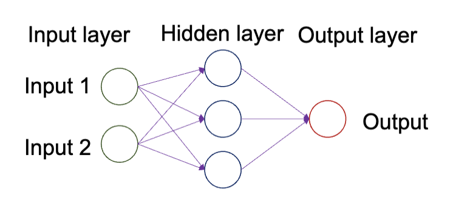

其分为输入层(Input Layer)、隐藏层(Hidden Layer)和输出层(Output Layer)。

在[之前的 SVM 章节](./lecture10.md)，我们如果让 $w^T x + b = 0$ 的 $b=0$，分类器就会变成 $w^T x = 0$，也就是一个没有偏置项的线性分类器。如果其是二维的向量，那么这个分类过程就如下图

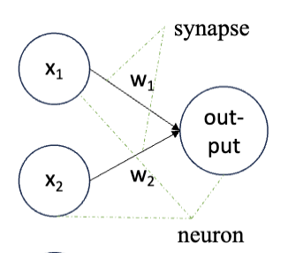

在这个基础上，我们可以重新加上偏置 $b$，之后在输出的值上加一个非线性函数来适配更复杂的数据，也可以加入更多的神经元。

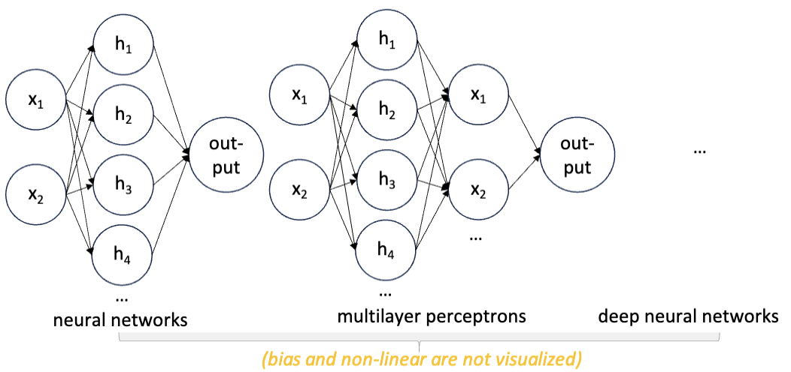

这就是人工神经网络的基本架构。它通常的用途是分类和回归，分别适配离散和连续的范围的任务。

也有一些更复杂的神经网络结构，适配更复杂的任务

- 卷积神经网络 (Convolutional Neural Nets, CNN)，适用于图片识别或者人脸识别
- 循环神经网络 (Recurrent Neural Nets, RNN)，适用于股市预测
- Transformer，适用于自然语言处理 (NLP)，如 ChatGPT

在这个课程中我们主要关注基础的神经网络，如多层感知机 (Multilayer Perceptron, MLP)。

多层感知记的结构如下图所示：

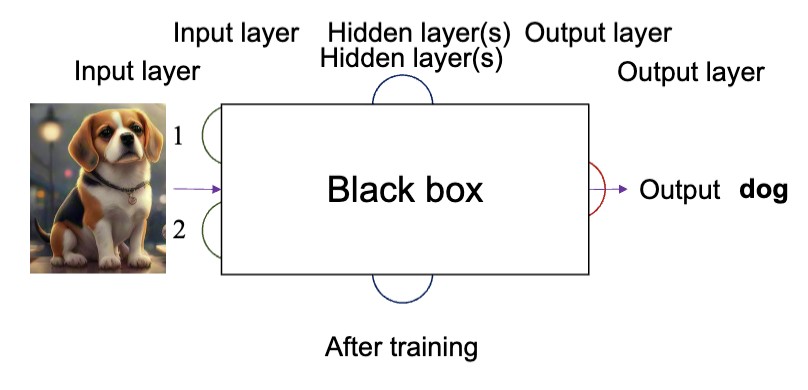

- 从输入层接入输入
- 把输入和提取到的特征传递到隐藏层
- 在输出层输出结果

图中是一个训练用来分类的 MLP，识别出了图片的内容是狗。

## 神经网络结构

神经网络的结构主要是这么几个要素：

- 输入层
- 隐藏层
- 输出层
- 层与层之间的连接

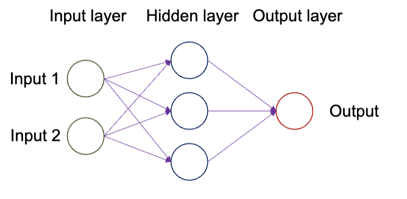

这几个要素决定了神经网络的结构和数据流向，输入数据根据结构在不同的神经元之间传递

---

每个神经元的结构是有三部分：

- 权重 (Weights)
- 偏置 (Bias)
- 激活函数 (Activation Function)

也就是说，计算后的结果会经过一个激活函数。激活函数的特性是 **非线性的**，常用的激活函数有：

- Sigmoid 函数：

  $$
  \sigma(x) = \frac{1}{1 + e^{-x}}
  $$

  

- 双曲正切函数 (Tanh)：

  $$
  \tanh(x) = \frac{e^x - e^{-x}}{e^x + e^{-x}}
  $$

  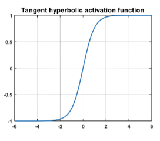

- ReLU 函数 (Rectified Linear Unit)：

  $$
  \text{ReLU}(x) = \max(0, x)
  $$

  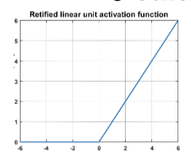

> 这些激活函数都是非线性的。非线性的必要性在于，如果神经网络的每一层都是线性的，那么无论有多少层，最终的输出仍然是输入的线性组合，无法捕捉复杂的模式和关系。通过引入非线性激活函数，神经网络能够学习和表示复杂的非线性关系，从而更好地适应各种任务。

数据在一个神经元中的计算过程实际上是:

$$
\mathrm{Output} = \text{Activation Function}(w^T x + b)
$$

## 模型训练

### 正向传播 (Forward Propagation)

正向传播过程指的是数据从输入层经过隐藏层传递到输出层的过程。在这个过程中，每个神经元会根据输入数据和其权重、偏置进行计算，并通过激活函数生成输出。

换句话说，正向传播过程是模型进行预测的过程。

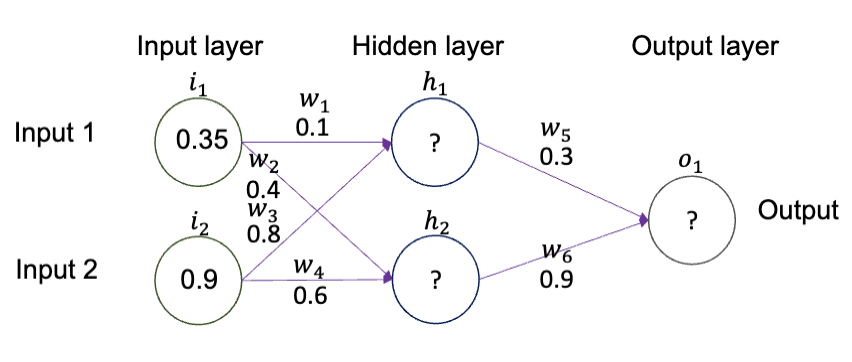

这里使用的非线性激活函数是 $sigmoid$ 函数，计算过程如下：

$$
\sigma(x) = \frac{1}{1 + e^{-x}}
$$

以隐藏层第一个神经元为例子，其值的大小为：

$$
\begin{aligned}
  h_1  & = (1+\exp(-0.35\times 0.1 - 0.9 \times 0.8))^{-1}  \\
  & = \frac{1}{1+ e^{-0.755}} \approx 0.68

\end{aligned}
$$

### 反向传播 (Backward Propagation)

#### 损失函数 (Loss Function)

为了模型训练，我们需要衡量现有神经元预测到结果是否正确。比如对于下图中的神经元，在这个输入下的期望值为 1，但是输出的值是 $o_1 = 0.579$，那么我们就需要调整神经元的权重和偏置，使得输出更接近期望值。

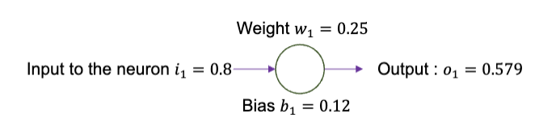

首先，需要量化输出值和期望值之间的差距。常用计算方法为:

- 均绝对误差 (Mean Absolute Error, MAE)：

  $$
  E = \frac{1}{n} \sum_{n} |o_i - t|
  $$

- 均方误差 (Mean Squared Error, MSE)：

  $$
  E = \frac{1}{n} \sum_{n} (o_i - t)^2
  $$

- 根均方误差 (Root Mean Squared Error, RMSE)：

  $$
  E = \sqrt{\frac{1}{n} \sum_{n} (o_i - t)^2}
  $$

计算得到的误差值，我们称之为损失 (Loss) 。得到损失的函数，称之为损失函数 (Loss Function) ，通常也叫做错误函数 (Error Function) 或者代价函数 (Cost Function) 。

---

接下来，回到我们之前的正向传播过程：

根据模型在输入下输出的结果和预期的结果的差异，我们计算出了模型的损失值。

> 这里把均方误差乘上了系数 $\frac{1}{2}$，是为了在后续计算梯度时，能够简化导数的表达式。

#### 梯度下降

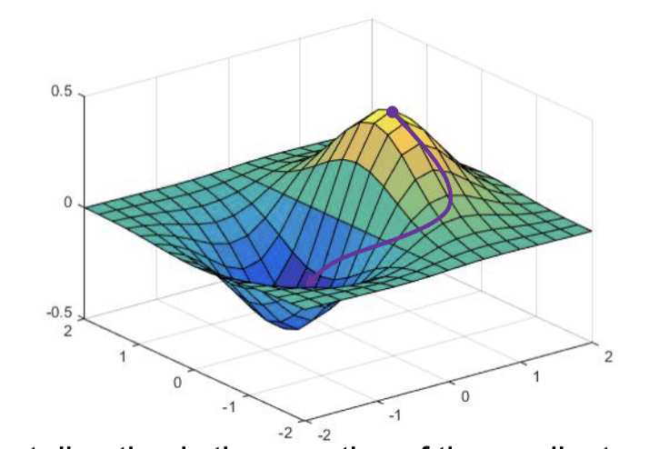

对于一个函数上的点，其向任意方向移动，其中函数值下降速度最快的方向一定是该点的梯度的反方向。借用这个原理，我们找到损失函数梯度的反方向，就能以最高的速度降低损失值。

通常，每一步对于决策变量的更新量需要手动确定，由参数学习率 (Learning Rate) 控制。学习率决定了每次更新的步长大小。步长大小的计算公式为：

$$
\Delta w = - \eta \frac{\partial E(w)}{\partial w}
$$

---

还是回到反向传播过程，我们已经得到了输出的损失值的大小，接下来需要更新输出层的参数，比如 $w_5$，首先要确定 $w_5$ 对损失值的影响程度，即计算损失函数对 $w_5$ 的偏导数：

$$
\frac{\partial E}{\partial w_5} = \frac{\partial E}{\partial o_1} \cdot \frac{\partial o_1}{\partial io_1} \cdot \frac{\partial io_1}{\partial w_5}
$$

这里的 $io_n$ 是第 $n$ 个输出到输出层的神经元的值。使用链式法则展开这个偏导数之后，每个部分都可以单独计算：

$$
\begin{aligned}
  \frac{\partial E}{\partial o_1} & = o_1 - \mathrm{target} \\
  \frac{\partial o_1}{\partial io_1} & = o_1(1-o_1)\\
  \frac{\partial io_1}{\partial w_5} & = h_1
\end{aligned}
$$

其中的参数都在正向传播过程中被运算过了，带入后计算出偏导数的值，之后就可以使用梯度下降法更新 $w_5$ 的值：

$$
w_5 = w_5 - \Delta w_t = w_5 - \eta \frac{\partial E}{\partial w_5}
$$

类似的，可以给每个权重参数 $w_n$ 都进行一次梯度下降运算，完成一次反向传播过程。其中，越接近输入层的权重参数，计算偏导数时需要经过更多的链式法则展开，比如 $w_1$ 的偏导数为：

$$
\frac{\partial E}{\partial w_1} = \frac{\partial E}{\partial o_1} \cdot \frac{\partial o_1}{\partial io_1} \cdot \frac{\partial io_1}{\partial h_1} \cdot \frac{\partial h_1}{\partial ih_1} \cdot \frac{\partial ih_1}{\partial w_1}
$$

这里的 $ih_n$ 是第 $n$ 个隐藏层神经元的输入值。可以发现，这里有些偏导数的中间值在更新更接近输出层的权重参数时已经计算过了，可以进行缓存以提高计算效率。

之后，更新所有参数，可以发现损失值下降，输出值更接近预测值。重复这个过程，直到损失值足够小，模型训练完成。

### 更多训练方法

#### 批次梯度下降 (Batch Gradient Descent)

通常，我们把一次训练中用来训练的样本数量称为批次大小 (Batch Size) 。根据批次大小的不同，训练方法可以分为以下几种：

- 单样本梯度下降 (Stochastic Gradient Descent, SGD)：每次只使用一个样本进行训练，更新参数。
- 小批次梯度下降 (Mini-batch Gradient Descent, MBGD)：每次使用一个小批次的样本进行训练，更新参数。
- 批量梯度下降 (Batch Gradient Descent, BGD)：每次使用所有样本进行训练，更新参数。

考虑到效率和效果的平衡，MBGD 是最常用的训练方法。

通常，MBGD 的批次大小 $M$ 是一个固定的数量，需要提前设定，是一个超参数 (Hyperparameter) 。当 $M=1$ 时，MBGD 退化为 SGD；当 $M=N$ （$N$ 为样本总数）时，MBGD 退化为 BGD。其在训练前需要慎重考虑，较大会类似于 BGD，训练时间较长，但收敛效果较好；较小则类似于 SGD，训练时间较短，但收敛效果不稳定。推荐的默认值是 $32$。

其训练过程为：

- 将数据集分为多个小批次
- 从训练集中的小批次中取出一个小批次
- 使用该小批次的数据进行正向传播，计算损失值
- 使用该小批次的数据进行反向传播，更新参数
- 重复上述过程，直到所有小批次都被使用过，完成一个训练周期 (epoch)

训练周期 (epoch) 指的是使用完整个训练集进行一次训练的过程。通常需要多个训练周期才能让模型收敛。

和 BGD, SGD 相比，MBGD 具有以下优点：

- 可以在一定程度上避免局部最小值
- 更节省内存占用
- 训练速度更快，收敛更快

#### 优化器 (Optimizer)

在 GD 的过程中，学习率是恒定且不变的，但是在实际过程中，单一的学习率可能无法适配所有的参数更新需求。参数远离最优解时，较大的学习率可以加快收敛速度；参数接近最优解时，较小的学习率可以避免震荡。因此，优化器 (Optimizer) 被引入来动态调整学习率。

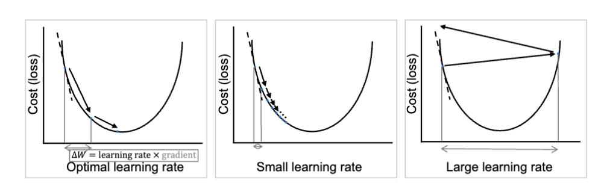

常用的有 Adam 优化器 (Adam Optimizer)，它通过梯度的一阶矩估计和二阶矩估计来动态调整学习率，从而提高训练效率和效果。成效显著。

## 模型训练的困难

### 梯度消失和梯度爆炸

当某一层距离输出层过于远的时候，可能会出现梯度消失 (Vanishing Gradient) ，也就是梯度值变得非常小，导致参数更新缓慢，训练过程变得非常困难。在训练的过程中，还可能会出现梯度值过大，导致参数更新过度，训练过程不稳定的情况，这被称为梯度爆炸 (Exploding Gradient) 。

解决这些问题的方法有：

- **权重初始化（Weight initialization）**：合理初始化权重可以避免初始梯度过小或过大，常用方法有 Xavier/Glorot 和 He 初始化。
- **梯度裁剪（Gradient clipping）**：当梯度过大导致梯度爆炸时，裁剪梯度可以限制更新步长，保持训练稳定。
- **激活函数（Activation function）**：选择合适的激活函数（如 ReLU、Leaky ReLU、ELU）有助于缓解梯度消失问题。
- **批量归一化（Batch normalization）**：对层输入做归一化可以加速收敛并减少内部协变量偏移。
- **跳跃连接（Skip / Residual connection）**：通过短路连接改善梯度传递，使深层网络更易训练（例如 ResNet）。
- **学习率与调度（Learning rate / Scheduler）**：合理设置学习率并采用学习率衰减或自适应优化器（如 Adam）能提高收敛稳定性。

### 欠拟合和过拟合

> 英国知名主播 Vedal 解释什么是过拟合.mp4:
>
> <https://www.bilibili.com/video/BV1xf4qeGE2f/?share_source=copy_web&vd_source=685d42481fb6e71212577a692ce02359>

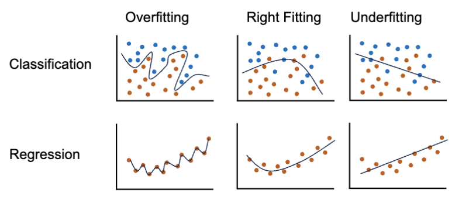

欠拟合 (Underfitting) 指的是模型没能成功的学习到训练集中的数据的模式，最终没能成功的在训练集上取得好的效果。过拟合 (Overfitting) 指的是模型过于专注于训练集中的微小模式，最终在训练集上取得了很好的效果，但是在测试集上表现很差。

在损失函数上，其表现为:

|            | 过拟合 | 拟合良好 | 欠拟合 |
| ---------- | ------ | -------- | ------ |
| 测试集损失 | 高     | 低       | 高     |
| 训练集损失 | 低     | 低       | 高     |

### 解决欠拟合

欠拟合通常是因为模型过于简单，无法捕捉数据中的复杂模式。导致欠拟合的原因可能是：

- 训练集多样性不足
  - 解决方法时增加训练数据量，更能反映大部分样本
- 特征稀缺或不相关
  - 解决方法是进行数据处理和特征选择，提取更多有用的特征
- 不合适的超参数设置
  - 解决方法是调整模型的超参数，如增加隐藏层数量、增加神经元数量、调整学习率等
- 训练迭代数不足
  - 解决方法是增加训练周期数，让模型有更多机会学习数据中的模式
- 模型复杂度不足
  - 解决方法是使用更复杂的模型结构，如增加隐藏层或神经元数量

### 解决过拟合

过拟合通常是因为：

- 训练集样本量不足
  - 解决方法是增加训练数据量，或者使用数据增强技术
- 不平衡的数据
  - 对不平衡的数据进行加权决策
- 数据泄露
  - 确保训练集和测试集之间没有数据泄露
- 不合理的超参数设置
  - 解决方法是调整模型的超参数，如减少隐藏层数量、减少神经元数量、调整学习率等
- 缺少正则化 (Regularization)
  - 解决方法是使用正则化技术，如 L1 正则化、L2 正则化、Dropout 等
- 模型复杂度过高
  - 解决方法是使用更简单的模型结构，或者减少隐藏层或神经元数量

#### 正则化方法

[正则化方法](./lecture9.md#嵌入法-embedded-methods) (Regularization Methods) 是一种防止过拟合的有效手段，指的是在惩罚函数中加入对模型复杂度的惩罚项，从而限制模型的复杂度，防止过拟合。

$$
\min_f \sum_i E(f(x_i), y_i) + \lambda R(f)
$$

其中，$E(f(x_i), y_i)$ 是损失函数，$R(f)$ 是正则化项，$\lambda$ 是正则化参数。

过拟合的原因是模型在训练过程中直接记住了训练数据的噪声和细节，而不是学习到数据的潜在模式。通过正则化，可以限制模型的复杂度，使其更关注数据的整体趋势，而不是个别样本的细节，从而提高模型的泛化能力。

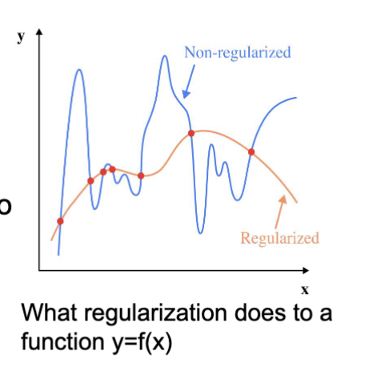

##### L1 正则化

L1 正则化 (L1 Regularization) 通过在损失函数中加入权重的绝对值之和作为惩罚项，鼓励模型产生稀疏的权重矩阵，从而减少过拟合。L1 正则化又称为 Lasso 回归 (Lasso Regression)。

对于 L1 正则化，惩罚项定义为：

$$
R(f) = \sum_{j} |\beta_j|
$$

这里的 $\beta_j$ 是模型的权重参数。

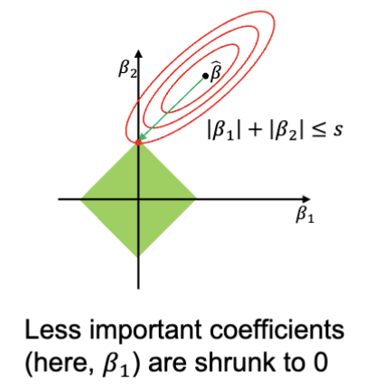

红色的线是损失函数的等高线，图中的 $\hat{\beta}$ 是没有正则化时的最优解，而绿色的菱形是 L1 约束的可行域。最终得到的最优解是登高下拟合绿色菱形的交点，此处落在了总坐标轴上，导致了系数 $\beta_1$ 直接变成了 0。这就是 L1 正则化导致稀疏解的原因。

##### L2 正则化

类似的，还有 L2 正则化 (L2 Regularization)，通过在损失函数中加入权重的平方和作为惩罚项，鼓励模型产生较小的权重值，从而减少过拟合。L2 正则化又称为 Ridge 回归 (Ridge Regression)。

$$
R(f) = \sum_{j} \beta_j^2
$$

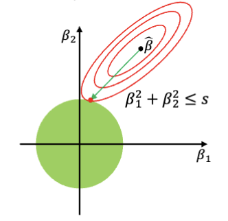

绿色的圆形是 L2 约束的可行域。最终得到的最优解是登高下拟合绿色圆形的交点，此处落在了圆形上。最终的效果是，L2 正则化会把 $\beta$ 均匀的向 0 压缩，进而最小化过拟合

#### 训练-验证-测试集划分

之前，对于数据集的划分，我们提到过训练集 (Training Set) 和测试集 (Test Set) 。实际上，通常还会划分出验证集 (Validation Set) 。

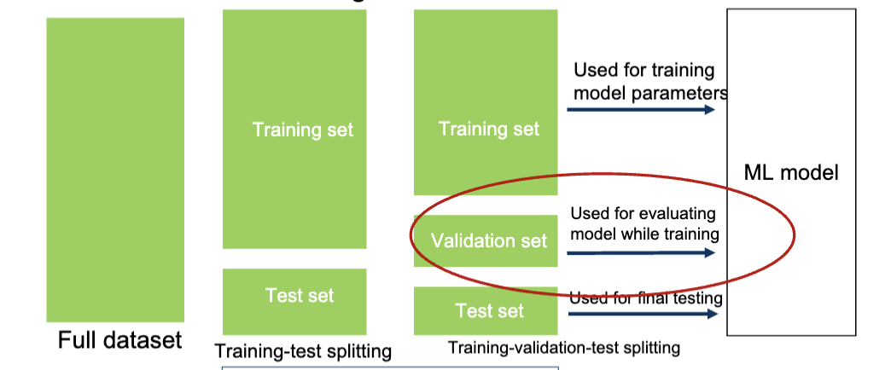

新的划分是按照随机取样的方式划分出训练集、验证集、测试集。训练集用于训练模型参数，验证集用于在训练的时候评估模型的表现，最终训练完成后，在测试集上评估模型的泛化能力。常见的划分比例有

- $8:1:1$
- $7:1.5:1.5$
- $6:2:2$
- $7:2:1$
- $\dots$

如果在训练过程中，验证的误差保持不变或者开始上升，那么说明模型开始过拟合了，可以停止训练。

##### 过拟合-训练曲线

图中的是训练误差和验证误差随训练周期变化的曲线。当训练误差和验证误差都较高时，说明模型欠拟合；当训练误差较低而验证误差较高时，说明模型过拟合。

可以发现，训练集的误差随着训练周期的增加而不断下降，而验证集的误差在开始时下降，之后开始上升。这是因为模型在训练集上学习到了更多的模式，而这些模式并不适用于验证集，导致验证误差上升。选择在验证误差最低时的模型参数，可以获得较好的泛化能力。

## 使用 Python 实现 ANN

> 竟然是用 `sklearn` 和 `tersorflow` 写，太学院派了
>
> 包含两个样例，一个是从飞机的一系列参数推算声压级，一个是糖尿病诊断预测，这里就不放了
