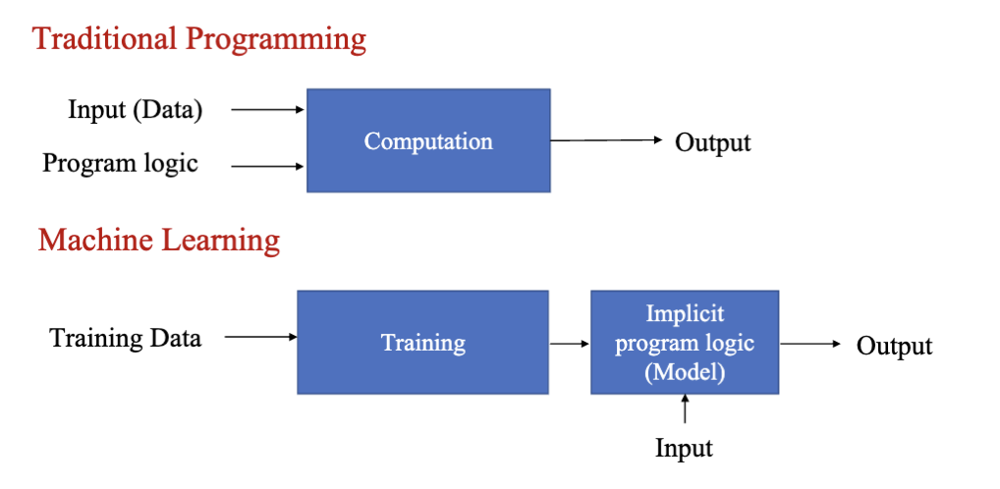
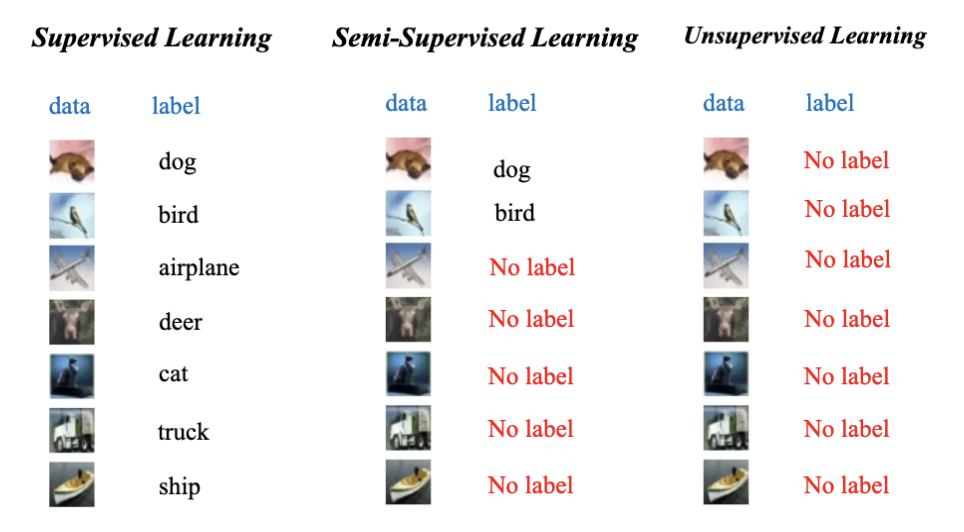
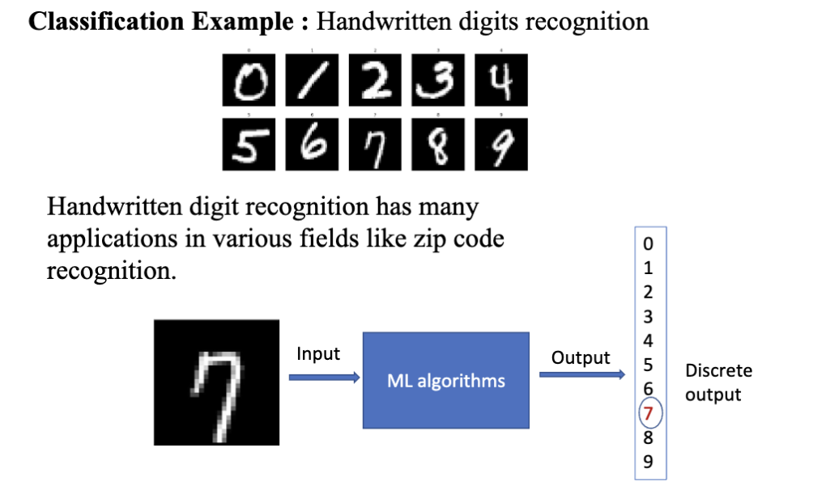
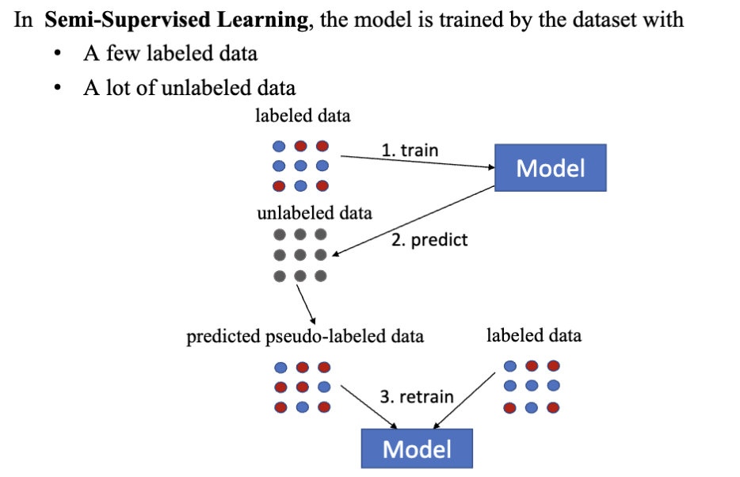
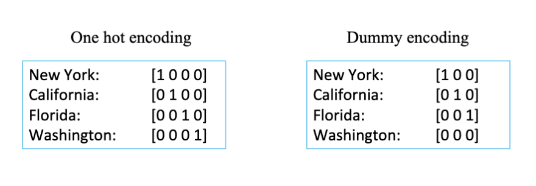
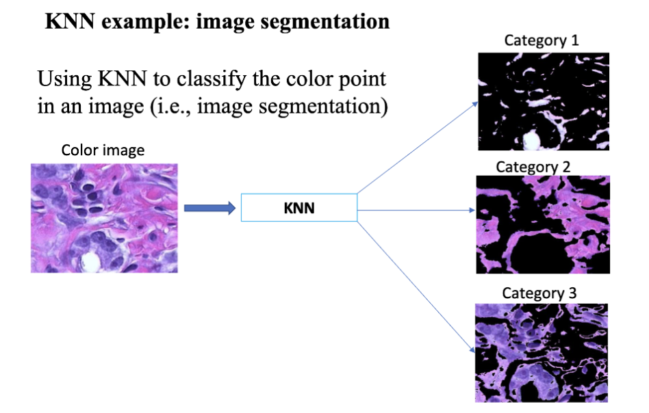

# 机器学习 (Machine Learning)

## 什么是机器学习

在传统方法下，如果需要实现一个目的，需要准备输入的数据，并且编写一个程序来处理这些数据，从而得到想要的输出结果。 但是在机器学习中，我们不需要编写程序，而是通过准备输入数据和对应的输出结果，让计算机自己去学习如何从输入映射到输出。这就是机器学习的核心思想。

对于机器学习，有3个主要的类型：

- 监督学习 (Supervised Learning)
  - 给定输入数据和对应的输出结果，让计算机学习如何从输入映射到输出。
- 无监督学习 (Unsupervised Learning)
  - 只给定输入数据，没有对应的输出结果，让计算机自己去发现数据中的模式和结构。
- 半监督学习 (Semi-Supervised Learning)
  - 给定部分输入数据和对应的输出结果，让计算机利用这些信息去学习如何从输入映射到输出。

这里的输入数据和输出结果指的是训练过程中需要的数据。数据的集合叫数据集(dataset)，数据集中的每一个数据叫样本(sample)。在监督学习中，每一个样本由输入数据和对应的输出结果组成。一个数据集可以表现为 $D = \{ d^1, d^2, \ldots, d^n \}$，其中 $N$ 是样本的数量。

用于训练的数据集被称为训练集 (training dataset)，用于评估模型的数据集被称为测试集 (test dataset)。在机器学习的整个过程中的数据集由这两个部分组成，通常训练集更多，测试集较少。

机器学习的结果我们称之为模型 (model)，模型指的是从数据中学习到的特定的映射关系。在经过训练之后，模型可以用于对新的输入数据进行预测，得到对应的输出结果。

数据中可以测量的特征叫做特征 (feature)，特征是用来描述数据的属性。每一个样本可以有多个特征，这些特征可以是数值型的，也可以是类别型的。特征是模型的输入。多个特征可以组成一个特征向量 (feature vector)，写作 $f = (f_1, f_2, \ldots, f_m)$，其中 $m$ 是特征的数量。

数据集中的输出部分叫标签 (label)，标签是用来描述数据的类别或结果。标签可以是离散的，也可以是连续的。标签是模型的输出。一个数据集可能没有标签（无监督学习），也可能有多个标签（多标签学习）。

## 机器学习的种类

### 监督学习

监督学习指的是训练过程中使用的数据集包含输入数据和对应的输出结果，即有标签的数据集。对于这种情况，数据集为 $D = \{ d^1, d^2, \ldots, d^N \}$，其中 $d^i = (x^i, y^i)$，$x^i$ 是输入数据，$y^i$ 是对应的输出结果。

训练过程指的是机器学习算法从数据集中学习映射关系的过程。训练的目标是找到一个函数 $f$，使得对于每一个输入数据 $x^i$，函数 $f(x^i)$ 的输出结果尽可能接近对应的输出结果 $y^i$。这个函数 $f$ 就是我们所说的模型。

测试过程指的是使用训练好的模型对新的输入数据进行预测的过程。测试的目标是评估模型在未见过的数据上的表现。对于一个新的输入数据 $x^{new}$，我们使用模型 $f$ 进行预测，得到输出结果 $y^{pred} = f(x^{new})$。

#### 监督学习：分类

一个典型的监督学习任务是分类 (classification)。分类任务的目标是将输入数据分配到预定义的类别中。分类任务可以是二分类 (binary classification)，也可以是多分类 (multi-class classification)。这种任务的特点是输出结果是离散的类别标签。

一个典型的例子是手写数字识别

#### 监督学习：回归  

回归 (regression) 是另一种典型的监督学习任务。回归任务的目标是预测一个连续的数值输出。回归任务的特点是输出结果是连续的数值。典型的应用是财务预测

### 半监督学习

半监督学习 (semi-supervised learning) 是介于监督学习和无监督学习之间的一种学习方法。它利用了大量的未标记数据和少量的标记数据来训练模型。半监督学习的目标是通过结合标记数据和未标记数据，提高模型的性能。他的训练过程是：

- 使用标记数据进行初步训练，得到一个初始模型。
- 使用初始模型对未标记数据进行预测，得到伪标签。
- 将伪标签与未标记数据结合，形成新的训练集。
- 使用新的训练集进行进一步训练，优化模型。

### 无监督学习

无监督学习 (unsupervised learning) 指的是训练过程中使用的数据集不包含输入数据的对应输出结果，即没有标签的数据集。对于这种情况，数据集为 $D = \{ d^1, d^2, \ldots, d^N \}$，其中 $d^i = x^i$，只有输入数据，没有对应的输出结果。通常，无监督学习更加困难，因为没有明确的目标来指导学习过程。

## 机器学习的过程

机器学习的过程通常有以下几个步骤：

- 数据表示：将原始数据转换为适合机器学习算法处理的形式。
- 选择模型：选择适合任务的机器学习算法和模型结构。
- 训练模型：使用训练集对模型进行训练，调整模型参数。
- 评估模型：使用测试集对模型进行评估，计算模型的性能。

### 数据表示

数据表示 (data representation) 是机器学习中的一个重要概念。数据表示指的是如何将原始数据转换为适合机器学习算法处理的形式。良好的数据表示可以提高模型的性能和泛化能力。这个表示的过程叫做数据编码 (data encoding)，数据编码的目标是将原始数据转换为数值形式，以便机器学习算法能够处理。

在机器学习中数据有多种形式：

#### 数值数据 (Numerical Data)

数值数据是最常见的数据形式，通常表示为实数或整数。数值数据可以直接用于机器学习算法。可以直接进行算术运算。

- 连续数据 (Continuous Data)
  - 连续数据是可以取任意值的数据，例如温度、身高、体重等。
- 离散数据 (Discrete Data)
  - 离散数据是只能取特定值的数据，例如人数、物品数量

#### 类别数据 (Categorical Data)

表示为名称或者标签的数据，通常表示为字符串或者整数。类别数据不能直接进行算术运算，需要进行编码处理。

- 二进制数据 (Binary Data)
  - 二进制数据是只有两个可能取值的数据，例如性别（男/女）、是否（是/否）等。
- 名义数据 (Nominal Data)
  - 名义数据是没有顺序关系的类别数据，例如颜色（红、绿、蓝）、城市（北京、上海、广州）等。
- 有序数据 (Ordinal Data)
  - 有序数据是有顺序关系的类别数据，例如评级（好、中、差）、教育水平（小学、初中、高中、大学）等。
  - 通常会按照顺序进行编码，例如小学=0，初中=1，高中=2，大学=3。编码通常从 0 开始。
- 单热编码 (One-Hot Encoding)
  - 将每个类别表示为一个独立的二进制特征。例如，颜色有红、绿、蓝三种类别，可以表示为三个二进制特征：红=(1,0,0)，绿=(0,1,0)，蓝=(0,0,1)。
  - 这种编码的特点是只有一个特征为1，其他特征为0。
  - 或者写作 $v = (v_1, v_2, \ldots, v_k)$，其中 $k$ 是类别的数量，并且有对于第 $d$ 个 $v_d = 1$，$v_j = 0$ 对于 $j \neq d$。
- 虚拟变量编码 (Dummy Encoding)
  - 类似于单热编码，但是少一个特征。例如，颜色有红、绿、蓝三种类别，可以表示为两个二进制特征：红=(1,0)，绿=(0,1)，蓝=(0,0)。
  - 这种编码的特点是可以节省一个特征，但是需要注意解释模型的结果时需要考虑缺失的类别。

### 模型选择

#### 参数化模型

参数化模型 (Parametric Model) 把模型简化成了一只形式的函数，这种函数定义了输入和输出之类的关系，比如线性回归、逻辑回归、神经网络等。

- 优点
  - 易于解释训练结果
  - 通常学习速度很快
  - 只需要少量的数据
- 缺点
  - 形式被给定的函数所限制
  - 更适合简单问题
  - 可能现有问题无法匹配底层映射函数

##### 线性回归

线性回归 (Linear Regression) 是一种用于回归任务的参数化模型。线性回归假设输入特征和输出结果之间存在线性关系。线性回归的目标是找到一组参数，使得对于每一个输入特征向量 $x^i$，线性函数 $f(x^i) = a x^i + b$ 的输出结果尽可能接近对应的输出结果 $y^i$。其中，$a$ 是权重向量，$b$ 是偏置项。

线性回归是一个从数值输入到数值输出的映射函数，适用于回归任务。比如财务预测。

- 优点
  - 在线性可分的情况下表现良好
  - 更易于实现，训练效率高
- 缺点
  - 只适用于线性可分的问题
  - 对异常值敏感

#### 非参数化模型

非参数化模型没有固定的函数形式，不对模型的形态进行强假设，而是通过数据来定义模型的结构，比如决策树、支持向量机、K近邻 (KNN)等。

- 优点
  - 更加灵活，可以适应复杂的模式
  - 可能有更高的性能
- 缺点
  - 在训练时通常需要更多数据和训练时间
  
##### K近邻 (KNN)

KNN 是一种用于分类和回归任务的非参数化模型。KNN 假设相似的输入特征对应相似的输出结果。KNN 的目标是通过计算输入特征向量 $x^{new}$ 与训练集中所有输入特征向量 $x^i$ 之间的距离，找到距离最近的 $k$ 个邻居，然后根据这些邻居的输出结果来预测新的输出结果 $y^{pred}$。

KNN 的特征是

- 惰性学习 (Lazy Learning)
  - KNN 在训练过程中不进行显式的学习，而是将训练数据存储起来，直到需要进行预测时才进行计算。
- 非参数化 (Non-Parametric)
  - KNN 不对数据的分布做任何假设，而是通过数据本身来定义模型的结构。

常用的应用场景有手写识别、人脸识别、文本分类等。

KNN 的过程是

- 选择 $K$ 的值
- 计算每个训练样本与新样本之间的距离
- 选择距离最近的 $K$ 个样本
  - 通常使用欧几里德距离进行计算，$d(p, q) = \sqrt{\sum_{i=1}^{n} (p_i - q_i)^2}$
- 根据邻居中最多的类别进行投票，确定新样本的类别

其中，$K$ 是一个超参数 (hyperparameter)，意思是在训练过程中需要手动设置的参数，而不是通过训练数据学习到的参数。选择合适的 $K$ 值对于 KNN 的性能有很大的影响。通常，较小的 $K$ 值会导致模型对噪声敏感，而较大的 $K$ 值会导致模型过于平滑，无法捕捉数据的细节。选择 $K$ 的大小有一些经验法则

1. K 不应该太小也不应该太大
   - 太小会导致模型对噪声敏感
   - 太大则会导致模型过于平滑
2. K 通常选择为奇数，避免投票时出现平局
3. 在决定 K 值时可以参考领域知识
4. 通常，把 K 设置为 $\sqrt{N}$，其中 $N$ 是训练样本的数量

### 模型评估

预测 (Prediction) 是机器学习中的一个重要概念。预测指的是使用训练好的模型对新的输入数据进行预测，得到对应的输出结果。预测的目标是评估模型在未见过的数据上的表现。预测的表现是通过预测误差 (Prediction Error)来评判的，其指的是预测结果与真实结果之间的差异。

## 使用 Python 和 MATLAB 的机器学习

> 包含使用 MATLAB 哈 Python 的机器学习的例子，见代码文件夹和原 PPT
