# 机器学习及数据预处理

## 模型的训练

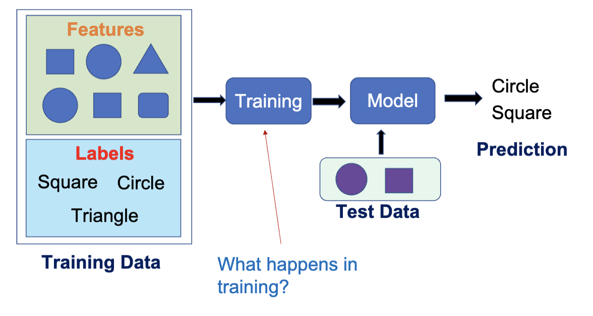

根据上节课的内容，我们知道了模型训练的过程。具体而言，模型训练指的是通过优化算法 (Optimization Algorithm) 来调整模型的参数，使得模型在训练数据上的预测结果尽可能接近真实结果。模型的参数分为两种：

- 超参数 (Hyperparameter)：在训练之前设置的参数
  - 比如 KNN 中的 K 值
- 模型参数 (Model Parameter)：通过训练数据学习得到的参数
  - 比如线性回归中的权重和偏置

### 损失函数

通常我们使用损失函数来衡量模型的预测结果与真实结果之间的差距。损失函数计算出来的值叫做损失 (loss)。有很多种损失函数的形式

- 均方误差 (Mean Squared Error, MSE)：用于回归任务，计算预测值与真实值之间的平方差的平均值。
  - $\mathrm{MSE} = \frac{1}{N} \sum_{i=1}^{N} (y_i - \hat{y}_i)^2$
  - MSE 总是凸函数并且可微，因此易于优化
  - 对异常值敏感，因为平方项会放大较大的误差
- 均绝对误差 (Mean Absolute Error, MAE)：用于回归任务，计算预测值与真实值之间的绝对差的平均值。
  - $\mathrm{MAE} = \frac{1}{N} \sum_{i=1}^N | y_i - \hat{y}_i |$
  - MAE 对异常值更不敏感，因为它使用绝对值而不是平方
  - MAE 在某些点不可微，可能会导致优化困难
- 交叉熵损失 (Cross-Entropy Loss)：用于分类任务，衡量预测的概率分布与真实类别之间的差异。
  - 二进制交叉熵 (Binary Cross Entropy)
    - $l = -\frac{1}{N}\sum_{i=1}^N (y_i\log\hat{y}_i + (1 - y_i)\log(1 - \hat{y}_i))$
    - 适用于二分类任务
  - 多类交叉熵 (Categorical Cross Entropy)
    - $l = -\sum_{i=1}^N \sum_{j=1}^K y_{i,j} \log(\hat{y}_{i,j})$
    - 可微，因此易于优化
    - 有多个局部极值，可能会导致优化困难

在模型训练的过程中，首先需要选择使用哪种损失函数，之后在训练过程中最小化损失函数的值，最终得到一套最优的模型参数。比如，对于线性模型 $y=ax+b$ ， $l(a,b) = \frac{1}{N}\sum\_{j=1}^N(y_j - ax_j - b)^2$ ，训练的目标则是选择合适的参数得到 $\min l(a,b)$ 。

可以发现此时 $l(a,b)$ 是一个连续、可微的凸函数，因此可以使用梯度下降法 (Gradient Descent) 来进行优化。

### 梯度下降

梯度下降法是一种通过一阶导数和迭代法来寻找函数的局部最小值的办法。它的迭代方程是

$$
x_{k+1} = x_k - a_k \nabla f(x_k)
$$

其中， $x_k$ 是第 $k$ 次迭代的参数， $a_k$ 是学习率 (Learning Rate)， $\nabla f(x_k)$ 是函数 $f$ 在 $x_k$ 处的梯度。

使用梯度下降法来优化时，通常会先确定一个初始点 $x_0$ ，然后计算该点的梯度 $\nabla f(x_0)$ ，接着根据学习率 $a_0$ 来更新参数，得到新的参数 $x_1$ 。重复这个过程，直到满足停止条件，比如达到最大迭代次数或者梯度足够小。

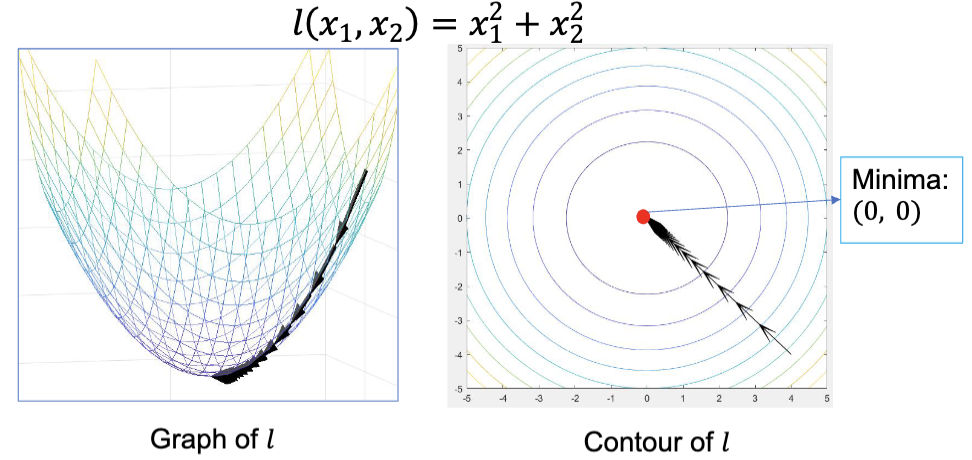

在梯度下降算法中，我们需要计算梯度。有这么几种方式：

- Batch Gradient Descent (BGD)
  - 每次使用所有训练数据来计算梯度，然后通过均值来更新参数
  - 优点：梯度计算准确，收敛稳定
  - 缺点：计算量大，内存消耗高
- Stochastic Gradient Descent (SGD)
  - 每次随机选择一个训练样本来计算梯度，然后更新参数
  - 优点：计算量小，内存消耗低
  - 缺点：梯度计算不准确，收敛不稳定，更多次的模型更新和更多的计算量
- Mini-Batch Gradient Descent
  - 每次随机选择一小批训练样本来计算梯度，然后更新参数
  - 优点：在计算效率和梯度准确性之间取得平衡
  - 缺点：需要选择合适的批量大小
    - 这也是一个超参数，更小的值会类似 SGD，更大的值会类似 BGD
    - 通常选择 32

## 模型的测试

在上节课提到，模型使用训练集进行训练，使用测试集进行测试。测试集是从原始数据集中划分出来的一部分数据。在测试集中，预测的值和实际的值之间的误差叫预测误差 (Prediction Error)。

$$
\mathrm{Err} = \mathrm{Bias}^2 + \mathrm{Var} + \mathrel{Noise}
$$

- Bias：偏差，指的是模型预测值的期望与真实值之间的差异。
  - 偏差反映了模型对训练数据的拟合程度。高偏差通常意味着模型过于简单，无法捕捉数据的复杂模式，导致欠拟合 (Underfitting)。
  - 其与模型自身和训练过程都有关。
- Var：方差，指的是模型预测值的变化程度。
  - 方差反映了模型对训练数据的敏感程度。
  - 高方差通常意味着模型过于复杂，容易受到训练数据中噪声的影响，导致过拟合 (Overfitting)。
  - 其主要和训练过程有关。
- Noise：噪声，指的是数据中不可预测的随机误差。
  - 噪声是数据本身固有的，无法通过模型来消除。

### 偏差 (Bias)

高偏差的模型会导致在训练集和测试集中都会出现的高预测误差。这会导致模型对训练数据有很强的假设，以及欠拟合。

欠拟合指的是模型既不能很好地拟合训练数据，也不能很好地泛化到测试数据。

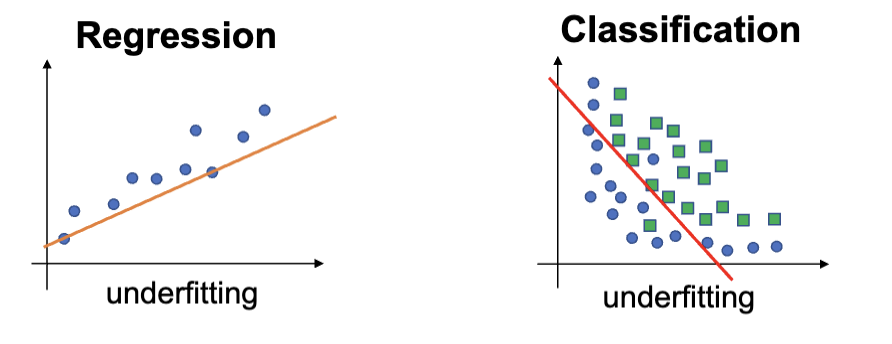

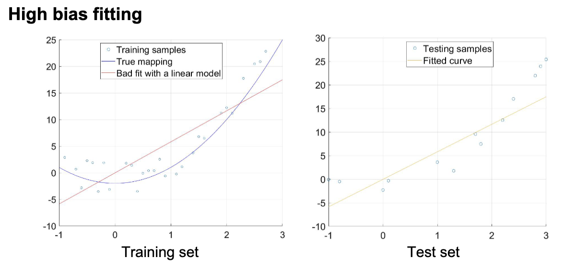

其典型特征是在训练集和测试集上市都有很差的表现，可以通过更换机器学习算法，以及提高训练时间来改善。

### 方差 (Variance)

方差指的是使用不同的训练数据，最终得到的模型预测结果的变化的量。高方差的模型会在测试集上出现很高的误差，通常是算法对于噪声过于敏感导致的，从而导致过拟合。过拟合指的是模型能够很好地拟合训练数据，但不能很好地泛化到测试数据。

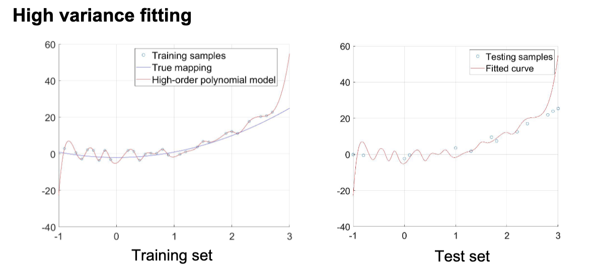

其典型特征是预测误差在训练集和测试集上差异很大，在训练集上表现更好。可以通过增加训练数据，减少不相关的特征以及提前停止训练来改善。

### 估计方差和偏差

K 折交叉验证 (K-Fold Cross Validation) 是一种用于评估机器学习模型性能的技术。其过程是将数据集划分为 K 个子集，然后进行 K 次训练和测试。在每次迭代中，选择一个子集作为测试集，剩余的 K-1 个子集作为训练集。最终的模型性能是 K 次测试结果的平均值。

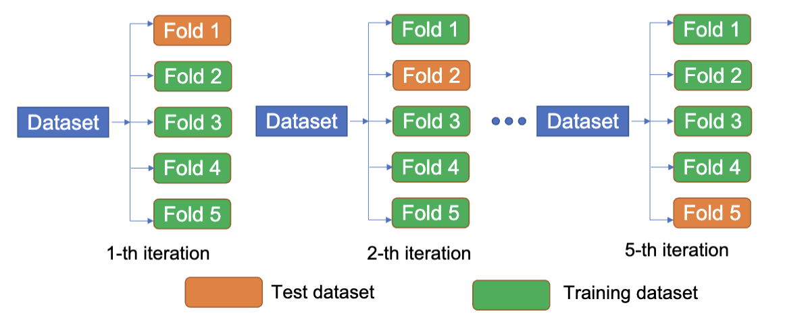

在 K 折交叉验证后，可以得到 k 个不同的预测误差 $e_1, e_2, \ldots, e_k$ ，得到 $\bar{e} = \frac{1}{k}\sum_{i=1}^k e_i$ ，以及标准差 $\sigma = \sqrt{\frac{1}{k}\sum_{i=1}^k(e_i - \bar{e})^2}$ 。得到的数据就是模型的偏差和方差的估计。

通常，偏差和方差是互相制约的。降低偏差通常会增加方差，反之亦然。这种权衡被称为偏差-方差权衡 (Bias-Variance Tradeoff)。在模型选择和调优过程中，需要在偏差和方差之间找到一个平衡点，以获得最佳的模型性能。

### 泛化 (Generalization)

泛化指的是模型将从训练集中学习到的内容应用到没有被学习过的数据上的能力。一个好的模型应该能够很好地泛化到新的数据，而不是仅仅记住训练数据。

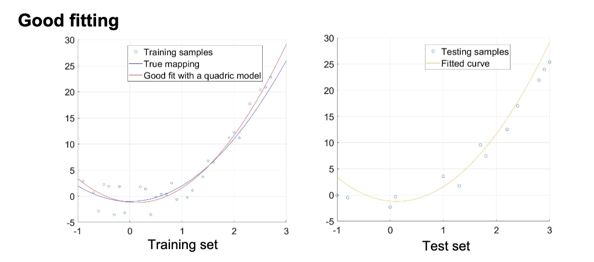

## 数据预处理

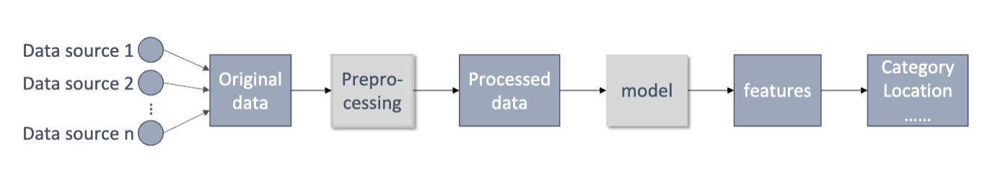

数据准备指的是没有结构的数据被转换成可以被机器学习算法使用的结构化数据的过程。数据准备通常包括

- 数据清理 (Data Cleaning)
  - 处理缺失值
  - 处理异常值
  - 处理重复数据
  - 处理不一致的数据

作用：

- 提高数据质量
  - 移除噪声、不一致性、错误
- 提高模型性能
  - 让模型更快的收敛，更准确
- 处理缺失数据
  - 使用插值或者删除防止模型产生偏差
- 减少过拟合
  - 特征选择和降维可以减小模型的复杂度
- 编码类别数据
  - 将类别数据转换为数值数据，便于模型处理
- 平衡类别分布
  - 解决不平衡数据集问题，防止模型偏向多数类
- 确认数据一致性
  - 对特征进行标准化，便于统一处理
- 节约计算资源
  - 预处理后的数据减少了计算量，提高效率

### 缺失值处理

缺失值有三种

- 完全随机缺失 (Missing Completely at Random, MCAR)
  - 缺失值的出现与数据的其他特征无关
  - 例子：问卷调查中，某些受访者随机跳过某些问题
  - 判断方式：Little's MCAR Test (使用统计检验来判断数据是否符合 MCAR 假设)
- 条件随机缺失 (Missing at Random, MAR)
  - 缺失值的出现与数据的其他特征有关，但与缺失值本身无关
  - 例子：在医疗数据中，某些患者的某些检查结果缺失，这可能与患者的年龄或性别有关
  - 判断方式：使用逻辑回归来预测缺失值的出现
- 非随机缺失 (Missing Not at Random, MNAR)
  - 缺失值的出现与缺失值本身有关
  - 例子：在收入调查中，收入较高的人可能更倾向于不报告他们的收入
  - 判断方式：通过领域知识和数据分析来识别

通常有两种处理方法：

- 数据移除
  - 当数据样本缺少某个数据时，删除样本
  - 损失值比例须小于 5%
  - 易于操作，但是可能会对 MAR 和 MNAR 的缺失引入偏差
- 值估计
  - 当数据样本缺少某个数据时，用估计值填充
  - 填充方法有：使用统计数据估计（如均值/中位数/众数），或者使用机器学习模型预测（如 KNN）
  - 可以充分利用数据，但是可能会产生错误的数据

### 极端值处理

极端值指的是在数据集中显著偏离其他数据点的值。通常，极端值的检测可以分为两种方法：

- 使用 Z 得分 (Z-Score)
  - 使用于高斯分布和近似高斯分布的数据
- 使用 四分位距 (Interquartile Range, IQR)
  - 使用于高斯和非高斯分布的数据

高斯分布指的就是正态分布 (Normal Distribution)。它的概率分布的特征是数据接近其均值，且数据在均值两侧对称分布。它的概率密度函数 (Probability Density Function, PDF) 是

$$
f(x) = \frac{1}{\sigma \sqrt{2\pi}} \exp(-\frac{(x - \mu)^2}{2\sigma^2})
$$

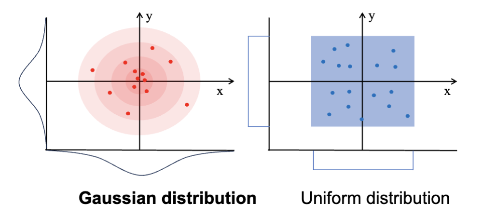

数据偏度 (Data Skewness) 指的是数据分布的非对称性。正偏态 (Right Skewed) 指的是数据分布的右侧尾巴较长，负偏态 (Left Skewed) 指的是数据分布的左侧尾巴较长。对称的分布没有偏态，而正态分布是对称的。

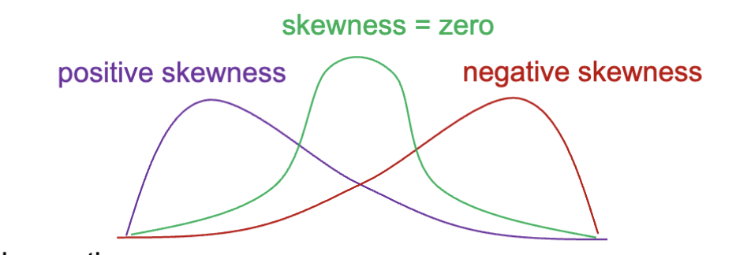

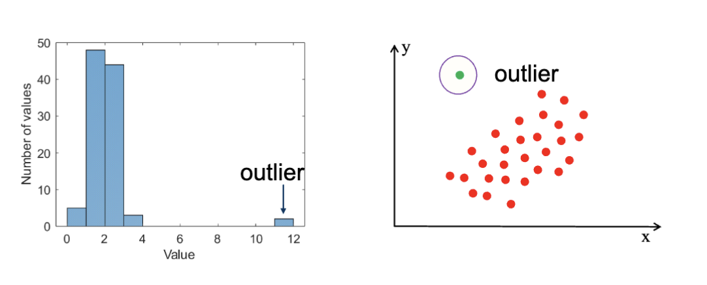

极端值可能是由于测量错误、数据输入错误或者真实的异常现象引起的。极端值可能会对模型的训练产生负面影响，因此需要进行处理。通常的处理方式是纠正极端值或者直接移除。数据预处理的一个重要任务就是鉴定极端值。

#### Z 得分法

Z 得分法是一种基于统计学的方法，用于检测数据集中的极端值。其基本思想是计算每个数据点的 Z 得分，然后根据设定的阈值来判断是否为极端值。Z 得分表示一个数据点与均值的偏离程度，计算公式为：

$$
z=\frac{x-\mu}{\sigma}
$$

其中， $x$ 是数据点的值， $\mu$ 是数据集的均值， $\sigma$ 是数据集的标准差。

z 得分描述了数据点与均值的偏离程度。计算出的 z 得分越大，则表示数据点越偏离均值，更容易被认为是极端值。

对于一个正态分布，有 99.7%的数据点位于区间 $[\mu - 3\sigma, \mu + 3\sigma]$ 之内。因此，通常将 z 得分的绝对值大于 3 的数据点视为极端值。

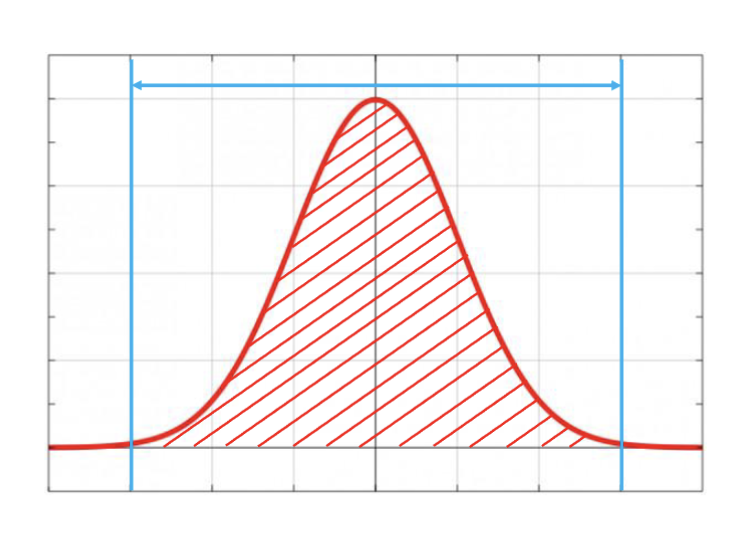

- 优点
  - 计算非常高效
  - 在大多数情况下，结果是正确的
- 缺点
  - 只适用于正态分布或者近似正态分布
  - 计算要求有足够多的数据点来准确估计均值和标准差

#### 四分位距法

四分位距法是一种基于统计学的方法，用于检测数据集中的极端值。其基本思想是计算数据集的四分位数，然后根据设定的阈值来判断是否为极端值。四分位数将数据集分为四个部分：

四分位距的计算方式是:

$$
\mathrm{IQR} = Q_3 - Q_1
$$

其中， $Q_1$ 是第一四分位数， $Q_3$ 是第三四分位数。我们认为在范围 $[Q_1 - 1.5 \times \mathrm{IQR}, Q_3 + 1.5 \times \mathrm{IQR}]$ 之外的数据点是极端值。

- 优点
  - 不要求数据符合正态分布，使用于各种分布类型
  - 对干扰有高度抗性，对极端值不敏感
- 缺点
  - 有些依赖于人类经验的参数（指 1.5 倍 IQR）
  - 对于高维数据无法使用

---

还有其他的基于机器学习的极端值检测方法，比如孤立森林 (Isolation Forest)、K-Means 聚类 (K-Means Clustering), DBSCAN 聚类，随机森林 (Random Forest) 等等。这些方法通常需要更多的计算资源和时间，但在某些情况下可能会提供更好的检测效果。

### 数据重复

数据重复指的是在数据集中存在多个相同的数据点的情况。

数据重复可能会破坏数据的平衡性，可能会导致数据集中在某些特定的类别或者一系列特定的特征，让训练出来的模型对这一部分数据更加敏感，而忽略其他的重要的部分。以及，重复的数据可能会导致重复的计算，去除重复数据可以减少计算量和内存占用。

### 数据不一致

数据不一致指的是在数据集中存在冲突或者矛盾的数据点的情况。

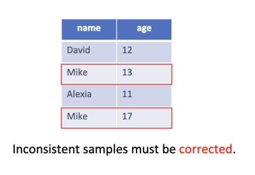

数据不一致通常有这么几个形式

- 不一致的格式
  - 如日期 "2023/01/01" 和 "01-Jan-2023"
- 不一致的单位
  - 如温度 "25°C" 和 "77°F"
- 不一致的命名
  - 如 "New York City" 和 "New York"
- 不一致的逻辑
  - 如年龄 "105" 和 "-5"
- 不一致的值
  - 如同一个人有不同的年龄记录

为了避免数据不一致对模型训练的影响，通常需要进行数据清理，确保每条记录都是唯一且一致的。可以通过以下方法来处理数据不一致：

- 消除噪声与错误：清理测量错误、录入错误或异常值，降低训练数据中的随机干扰，提高模型性能与稳定性。
- 避免冲突信息：统一重复或矛盾记录（如同一人有不同年龄），保证每条样本只反映一个一致事实，防止模型学习到错误关联。
- 统一计算标准：规范单位、刻度和计算方法（如货币、时间格式、归一化规则），确保特征间可直接比较和组合，减少偏差来源。
- 避免维度灾难：通过合并同类特征或去除无关冗余，防止高维稀疏或类别爆炸，降低模型复杂度和过拟合风险。
- 提升泛化能力：一致且高质量的数据让模型学习到普遍规律而非噪声，从而在未见样本上表现更好。
- 确保逻辑一致性：维护字段间的逻辑关系（如出生日期与年龄匹配、订单状态与时间顺序），避免引入违背常识的训练样本。

> 这页 PPT 到底讲的是人话吗，写的是 impact 实际是 method ？

### 数据变换

数据变换 (Data Transform) 指的是把数据转换成类正态分布或者其他的形式以便于模型处理的过程。常见的数据变换方法有：

- 数据标准化 (Data Standardization)
- 数据归一化 (Data Normalization)
- 幂变换 (Power Transformation)

#### 数据标准化/归一化

在机器学习中，不同的特征可能有完全不同的数据范围，如年龄和收入。在不进行标准化/归一化的情况下，模型训练会出现这样的现象：

- 梯度下降拟合过慢
  - 不同方向上的步长不一致，导致收敛速度变慢
- 偏离的距离/相似度计算
  - 距离计算中，范围较大的特征会主导距离的计算，导致模型无法正确捕捉数据的结构
- 模型权重不平衡
  - 范围较大的特征会导致模型权重过大，影响模型的稳定性和泛化能力

而对数据归一化，则是将数据缩放到一个固定的范围内，通常是 $[0, 1]$ 。

只有模型学习的数据是连续的数值时才有必要进行标准化。测试集的标准化需要用训练集的均值和标准差来进行以保证一致性。同时可以防止数据泄露。

而相对的，类型数据以及文本数据是不需要进行标准化/归一化的。类型需要用编码的方法来进行处理（之前提到的离散编码，如热编码，见[Lec7](./lecture7.md#类别数据-categorical-data)），文本另说。

##### Z 得分标准化

在数据分布是正态分布的情况下，一种可行的标准化方法是 Z 得分标准化 (Z-Score Standardization)：

$$
X_{norm} = \frac{X - \mu}{\sigma}
$$

其中， $X$ 是原始数据， $\mu$ 是数据的均值， $\sigma$ 是数据的标准差。

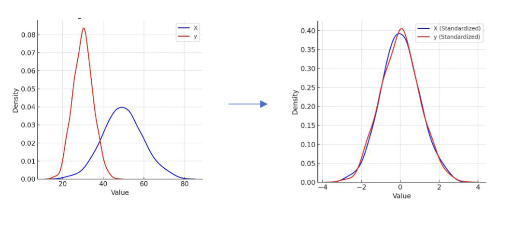

这样的变换可以让数据的分布变为一个均值为 0，标准差为 1 的标准正态分布。这是我们大多数情况下使用的方法。但是，虽然大部分（真的是绝大部分）的数据都落在了 $[-3, 3]$ 的范围内，但是数据并没有被缩放到一个固定的范围内。

##### 最小-最大归一化

在数据并不是正态分布的情况下，一种可行的归一化方法是最小-最大归一化 (Min-Max Normalization)：

$$
X_{norm} = \frac{X - X_{min}}{X_{max} - X_{min}}
$$

其中， $X$ 是原始数据， $X_{min}$ 是数据的最小值， $X_{max}$ 是数据的最大值。

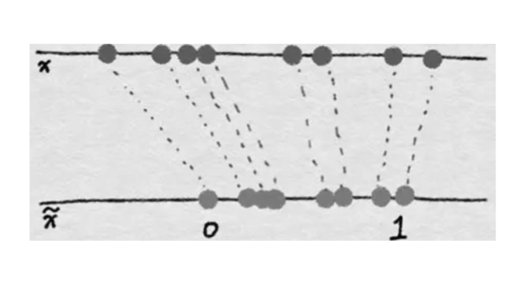

可以很明显的看出，这个算法世纪上是把数据线性的映射到了 $[0, 1]$ 的范围内。

这样做的好处是所有的数据都在一个固定的范围内，避免了上面提到的问题。但是只有在数据接近均匀分布的情况下才适合使用，否则会导致数据集中在某个小范围内，影响模型的训练效果。以及，这种算法对极端值很敏感，如果出现一个极端值，整个数据的范围就会被拉大，导致大部分数据都集中在一个很小的范围内。

##### Robust 标准化/归一化

Robust 标准化/归一化 (Robust Scaling) 是一种对极端值不敏感的数据变换方法。它使用中位数和四分位距来进行标准化/归一化。

$$
\begin{aligned}
 & X_{norm} = \frac{X - \mathrm{Median}}{\mathrm{IQR}} \\
 & \mathrm{IQR} = Q_3 - Q_1
\end{aligned}
$$

其中， $X$ 是原始数据， $\mathrm{Median}$ 是数据的中位数， $\mathrm{IQR}$ 是数据的四分位距。

它的优势是因为中位数和四分位距对极端值不敏感，因此这种方法对极端值有很好的稳定性。但是缺点在于在某些情况下计算相对复杂。

---

| Method               | Advantages         | Disadvantages                    |
| -------------------- | ------------------ | -------------------------------- |
| 最小-最大归一化      | 数据限定在特定范围 | 适用于近似均匀分布；对极端值敏感 |
| Z 得分标准化         | 适用于大多数情况   | 在正态分布下最佳；输出范围不固定 |
| Robust 标准化/归一化 | 对极端值不敏感     | 计算相对复杂                     |

#### 幂变换

幂变换是一系列的数据变换操作，通常使用的是单调的幂函数，如

$$
f(x) = a x^b
$$

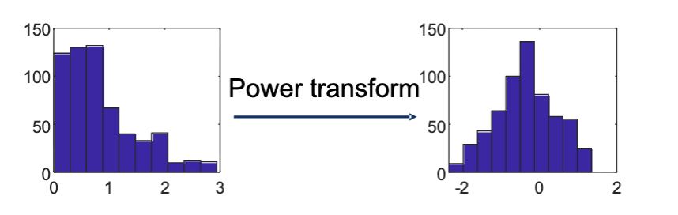

经过幂变换后，数据可以

- 稳定方差大小，移除数据偏度
  - 减少极端值的影响
  - 不同区间内的方差一致，而不是随着数值增大而增大
- 使数据更接近正态分布
  - 便于使用基于正态分布假设的模型

##### Box-Cox 变换

Box-Cox 变换是一种幂变换方法，适用于**正值数据**。其公式为：

其正变换为:

$$
y_i^{(\lambda)}= \begin{cases}
 \frac{y_o^\lambda-1}{\lambda}\quad \mathrm{if}\ \lambda \neq 0 \\
 \log(y_o) \quad \mathrm{if}\ \lambda = 0
\end{cases}
$$

而逆变换为:

$$
y_o^{(\lambda)}= \begin{cases}
 \sqrt[\lambda]{\lambda y_i + 1} \quad \mathrm{if}\ \lambda \neq 0 \\
 \exp(y_i) \quad \mathrm{if}\ \lambda = 0
\end{cases}
$$

其中， $\lambda$ 是变换参数，可以通过对数形式的最大似然估计 (Maximum Likelihood Estimation, MLE) 来确定。 $y_o$ 是原始数据， $y_i$ 是变换后的数据。

然后 Python 实现长这个样子，使用 `scipy.stats` ：

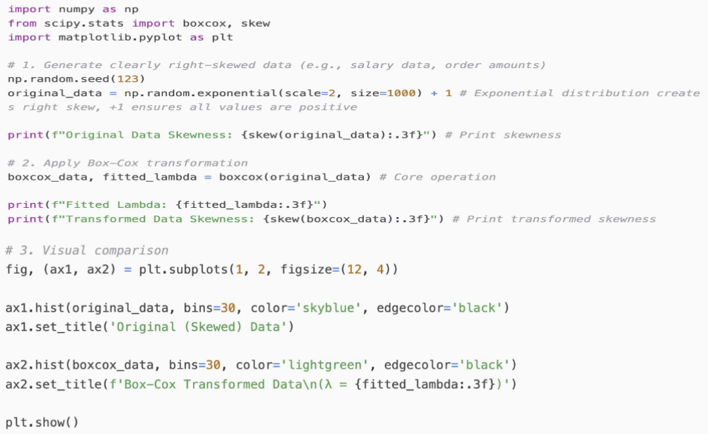

## 数据集构造

数据集构造通常有这样的几种方式

- 单次训练/测试集（Hold-out）：把数据一次性划分为训练集和测试集（如 70/30）。
- K 折交叉验证（K-fold CV）：将数据分成 K 份，轮流用 K-1 份训练、1 份验证，取平均性能（常用 K=5 或 10）。
- 留一法交叉验证（Leave-One-Out, LOOCV）：把每个样本单独作为一次验证集（等于 K=N）
- 考虑分层（Stratification）：在划分数据时保持类别（标签）比例一致，常用于类别不平衡时（如少数类很少）。

### 构造训练集和测试集

#### 简单划分

一个简单的划分方式是直接按比例随机划分原始数据集为两块：训练集和测试集。比如 80% 的数据作为训练集，20% 的数据作为测试集。之后用训练集来训练模型，用测试集来评估模型的性能。

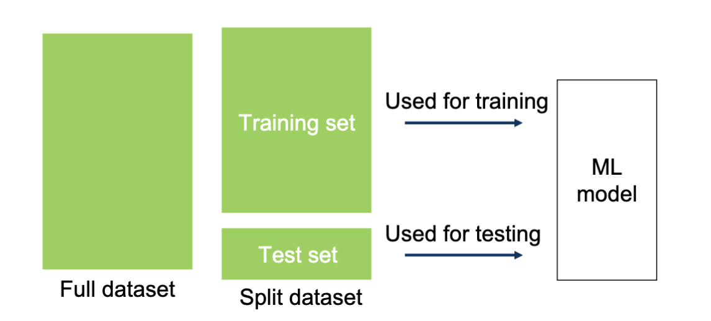

这种方式的优点是测试集是完全独立于训练集的，可以有效评估模型的泛化能力，避免模型过拟合。具体而言就是 `sklearn.model_selection.train_test_split` 。

#### 分层抽样

对于多种类型的数据，一种方案是分层抽样。也就是在划分数据集时，保持各类别（标签）在训练集和测试集中的比例一致。这样避免样本的偏差，降低模型的方差。

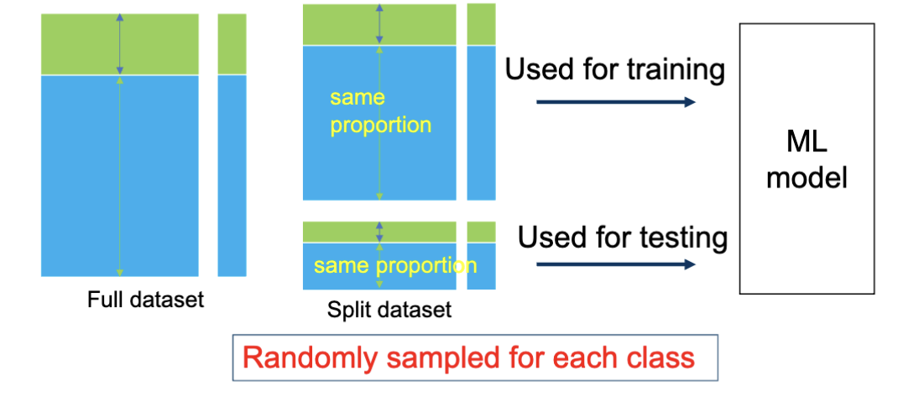

### 交叉验证

#### K 折交叉验证

K 折交叉验证 (K-Fold Cross Validation) 是一种用于评估机器学习模型性能的技术。其过程是将数据集划分为 K 个子集，然后进行 K 次训练和测试。在每次迭代中，选择一个子集作为测试集，剩余的 K-1 个子集作为训练集。最终的模型性能是 K 次测试结果的平均值。

这种方法的优点是

- 可以消除数据集划分的随机误差
- 对于性能评估更稳定可靠
- 可以最大化利用数据集，尤其适用于小数据集

但是，缺点是计算开销较大，因为需要训练 K 次模型，同时实现的复杂度也会上升。

对应的是 `sklearn.model_selection.cross_val_score` 。

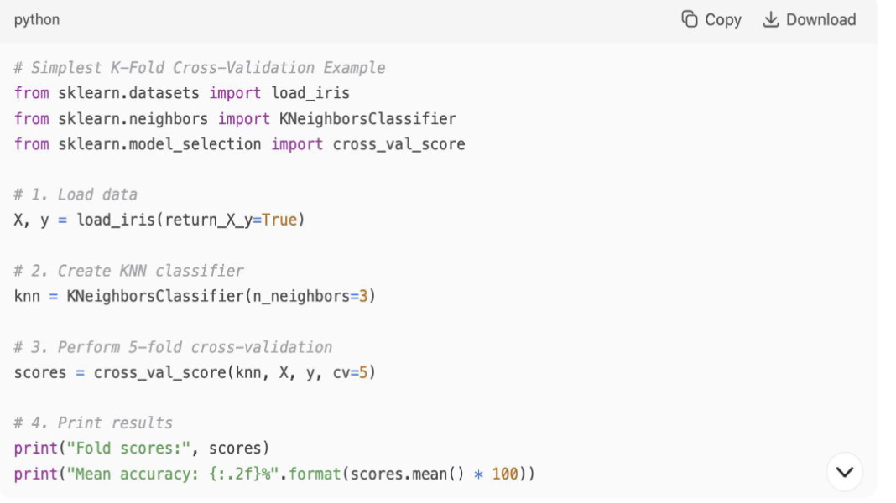

#### 留一法交叉验证

留一法交叉验证 (Leave-One-Out Cross Validation, LOOCV) 是 K 折交叉验证的一种特殊情况，其中 K 等于数据集的样本数量 N。也就是说，每次迭代中，选择一个样本作为测试集，剩余的 N-1 个样本作为训练集。这个过程重复 N 次，每个样本都被用作一次测试集。

对应的是 `sklearn.model_selection.LeaveOneOut` 。

