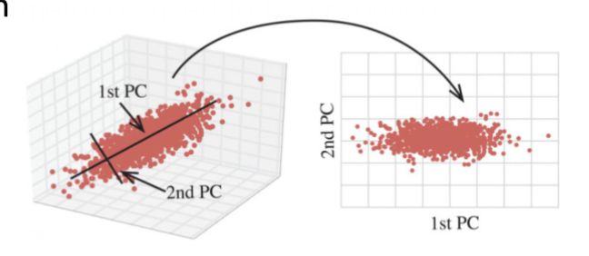
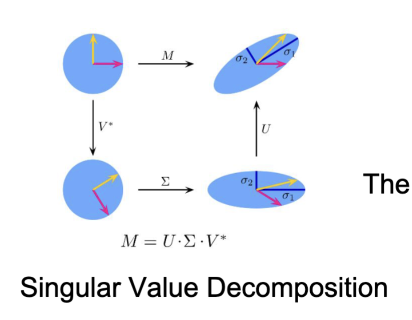
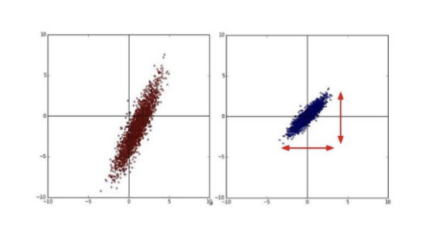
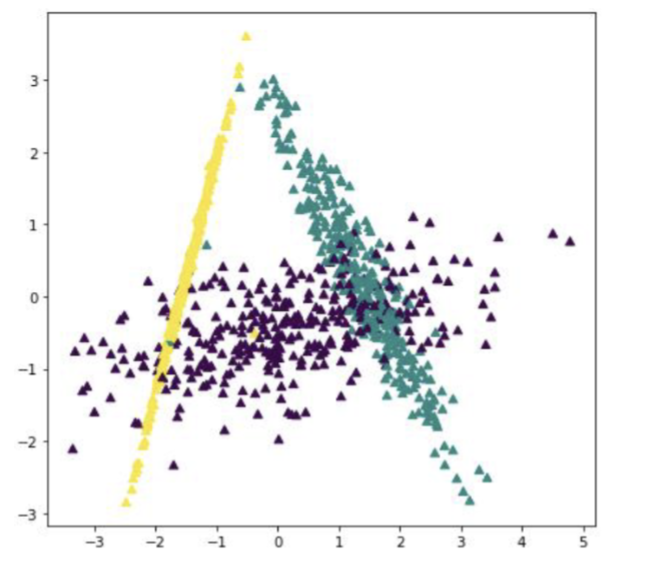
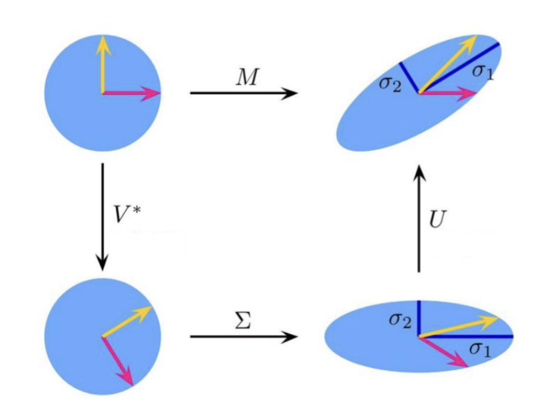
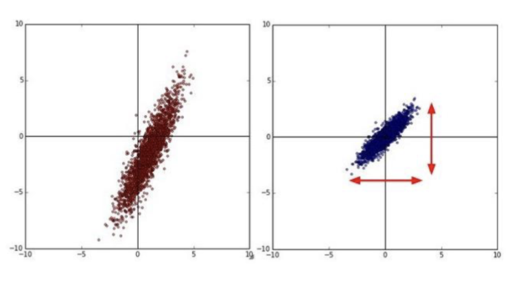
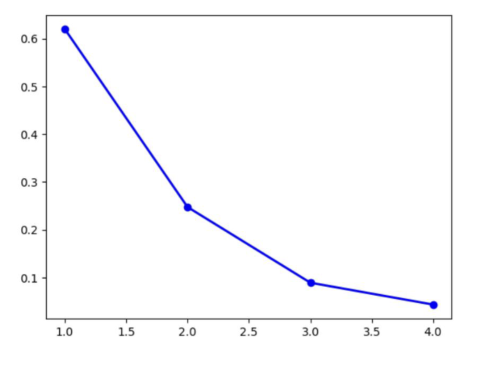

# 特征选择

## 更高阶的预处理和特征选择

特征选择指的是辨别和选择最相关、最有信息量的特征，以提升模型性能和减少计算复杂度的过程。在机器学习中，特征选择是一个关键步骤，因为它可以帮助我们去除冗余或无关的特征，从而提高模型的泛化能力。

优点

- 加速训练
  - 模型不需要区学习不相关的特征
- 减少过拟合
  - 避免模型从不相关的数据中学习到噪声
- 提高可解释性
  - 更少的特征使得模型更容易理解和解释

但是，特征选择也存在隐患

- 数据泄露 (Data Leakage)
  - 在特征选择过程中使用了测试集的信息，导致模型在测试集上表现异常好，但在实际应用中表现不佳。
- 多重共线性 (Multicollinearity)
  - 当两个或多个特征高度相关时，可能会导致模型不稳定，影响模型的性能和解释性。
- 目标泄漏 (Target Leakage)
  - 训练特征中包含了与目标变量直接相关的信息，导致模型在训练时表现过于理想，但在实际应用中效果不佳。
- 忽略特征关系
  - 某些特征可能单独看起来不重要，但与其他特征结合时可能具有重要意义。简单的特征选择方法可能会忽略这些复杂的关系。

常用的特征选择方法有

- 过滤法 (Filter Methods)
  - 基于统计指标（如相关系数、卡方检验等）来评估每个特征与目标变量的关系，选择得分最高的特征。
  - 快速且易于实现，但可能忽略特征之间的相互关系。
- 包装法 (Wrapper Methods)
  - 使用特定的机器学习算法作为评估标准，通过递归特征消除（RFE）等方法，选择最优特征子集。
  - 能够考虑特征之间的相互关系，但计算成本较高。
- 嵌入法 (Embedded Methods)
  - 在模型训练过程中进行特征选择，如 Lasso 回归中的 L1 正则化，可以自动选择重要特征。
  - 综合了过滤法和包装法的优点，效率较高。

## 过滤法 (Filter Methods)

常用的过滤法有

- 方差阈值法 (Variance Threshold)
  - 移除方差低于阈值的特征，他们被视为常数特征或近似常数特征
  - 数据首先需要标准化
- 单变量统计检验
  - 包括：卡方检验 (Chi-Squared Test)，F 检验 (F-test)
  - 可以做到模型无关
  - 易于计算，适用于高阶数据的初步过滤
  - 不能捕捉特征之间的相互作用，可能会丢失一些有用的信息
- 相互信息法 (Mutual Information)

### 卡方检验

卡方检验是一种用于评估两个分类变量之间关联强度的统计方法。在特征选择中，卡方检验可以用来评估每个分类特征与目标变量之间的关系，从而选择最相关的特征。

1. 确定零假设和备择假设

   - 零假设 (H0)：特征与目标变量之间没有关联
   - 备择假设 (H1)：特征与目标变量之间存在关联

2. 计算卡方统计量

    $$
    \chi^2 = \sum \frac{(O_{ij} - E_{ij})^2}{E_{ij}}
    $$

   - 其中， $O_{ij}$ 是观察频率， $E_{ij}$ 是期望频率

3. 更高的卡方值表示特征与目标变量之间的关联更强，根据给定的显著性水平 (如 0.05) 来决定是否拒绝零假设

在卡方检验中实现特征选择方法的步骤是：

- 连续变量分箱 (Binning)
  - 将连续变量转换为分类变量
  - 每个区间内的期望频率应足够大（通常至少为 5）
- 测试统计量计算
  - 计算每个特征与目标变量之间的卡方统计量
- 根据预设条件进行特征选择
  - 可以对测试统计量排序，选择前 k 个特征或根据显著性水平选择特征
  - 可以设置显著性水平 (如 0.05) 来决定是否保留特征

### F 检验

F 检验是一种用于比较多个组之间均值差异的统计方法。在特征选择中，F 检验可以用来评估每个数值特征与分类目标变量之间的关系，从而选择最相关的特征。

1. 确定零假设和备择假设

   - 零假设 (H0)：不同类别的均值相等
   - 备择假设 (H1)：至少有一个类别的均值不相等

2. 计算 F 统计量

    $$
    F = \frac{MSB}{MSW} = \frac{SSB/(k-1)}{SSW/(n-k)}
    $$

   - 其中， $MSB$ 是组间均方， $MSW$ 是组内均方
   - $MSB = \frac{SSB}{dfB} = \frac{SSB}{k-1}$ ， $MSW = \frac{SSW}{dfW} = \frac{SSW}{N-k}$
   - $k$ 是类别数， $N$ 是总样本数
   - $SSB = \sum n_i(\overline{X}_i - \overline{X})^2$ ， $SSW = \sum \sum (X_{ij} - \overline{X}_i)^2$
   - 其中， $n_i$ 是第 $i$ 类的样本数， $\overline{X}_i$ 是第 $i$ 类的均值， $\overline{X}$ 是总体均值

3. 根据给定的显著性水平确定检验的临界值，比较计算得到的 F 统计量与临界值，决定是否拒绝零假设

实现 F 检验方法的具体步骤是

- 连续数据分箱
  - 将连续变量转换为分类变量
  - 每个箱子的预期频率应足够大（通常至少为 5）
- 检验统计量计算
  - 计算每个特征与目标变量之间的 F 统计量
- 特征选择
  - 对检验统计量进行排序，选择前 k 个特征或根据显著性水平选择特征
  - 可以设置显著性水平 (如 0.05) 来决定是否保留特征

### 相互信息法

相互信息 (Mutual Information) 是一种衡量两个随机变量之间相互依赖关系的度量。在特征选择中，相互信息可以用来评估每个特征与目标变量之间的信息共享程度，从而选择最相关的特征。

$$
I(X; Y) = \sum_{x \in X} \sum_{y \in Y} p(x, y) \log \left( \frac{p(x, y)}{p(x)p(y)} \right)
$$

- 其中， $I(X; Y)$ 是特征 $X$ 与目标变量 $Y$ 之间的相互信息
- $p(x, y)$ 是 $X$ 和 $Y$ 的联合概率分布
- $p(x)$ 和 $p(y)$ 分别是 $X$ 和 $Y$ 的边际概率分布

在物理意义上，这个公式表示通过知道变量 $X$ 的值，我们可以减少对变量 $Y$ 不确定性的程度。相互信息越高，说明特征与目标变量之间的关系越强。

使用特征选择方法的步骤：

- 连续概率分箱
  - 同上
- 计算特征和目标之间的相互信息
- 根据相互信息值进行特征选择
  - 对相互信息值进行排序，选择前 k 个特征
  - 根据设定的阈值选择特征

## 包装法 (Wrapper Methods)

常用的包装方法有

- 前向选择 (Forward Selection)
- 后向消除 (Backward Elimination)
- 递归特征消除 (Recursive Feature Elimination, RFE)

包装法的优缺点为：

- 优点
  - 基于模型的性能进行特征选择，通常能获得更好的结果
  - 模型无关。方法只与模型的输出结果有关，可以应用于各种模型
- 缺点
  - 高算力需求
    - 需要多次训练模型，计算成本较高
  - 过拟合风险
    - 可能会选择在训练集上表现良好的特征，但在测试集上表现不佳

### 前向选择 (Forward Selection)

前向选择是一种递归特征选择方法，从一个空特征集开始，逐步添加特征，直到达到预定的停止条件。具体步骤如下：

- 初始化
  - 初始化一个空的集合 $S$ 来存储已选择的特征，一个未选择的特征集合 $F$ 包含所有特征，一个评估指标
- 在特征中迭代
  - 对于每个未选择的特征 $f$ 在集合 $F$ 中
    - 将特征 $f$ 添加到当前选择的特征集合 $S$ 中，形成新的特征集合 $S' = S \cup \{f\}$
    - 使用特征集合 $S'$ 训练模型，并评估模型性能，记录评估结果
- 选择最优特征
  - 根据训练结果，选择最佳的特征 $f^*$ ，即使得模型性能最优的特征
- 更新集合
  - 把最优特征添加到已选择的特征集合 $S$ 中，并从未选择的特征集合 $F$ 中移除
- 重复直到结束条件
  - 如特征集合达到预定大小，或模型性能不再显著提升（提升值小于某个阈值）
- 优点
  - 模型需要反复训练，计算量仍然比其他的方法小
- 缺点
  - 和贪心算法类似，忽略了特征之间的相关性，可能得到的特征集合不是最优的。

### 后向消除 (Backward Elimination)

后向消除是一种递归特征选择方法，从包含所有特征的集合开始，逐步移除不重要的特征，直到达到预定的停止条件。具体步骤如下：

- 初始化
  - 初始化一个选择的特征集合 $S$ 包含所有特征，一个评估指标
- 训练模型
  - 使用当前选定的特征集合来训练模型并获得评估结果
- 评估特征重要性
  - 使用特征集删去每个特征 $f$ ，形成新的特征集合 $S' = S \setminus \{f\}$ ，并使用 $S'$ 训练模型，评估模型性能，记录评估结果
- 更新选择特征集合
  - 找到移除后使模型性能提升或下降最小的特征 $f^*$ ，将其从选择的特征集合 $S$ 中移除
- 重复直到结束条件
  - 如特征集合达到预定大小，或模型性能不再显著下降

其优缺点为：

- 优点
  - 更好的找到了效率和效果之间的平衡，适用于高维数据
- 缺
  - 依赖模型能力，模型必须从给定数据中全面且正确的学习，否则可能会移除重要特征

### 递归特征消除 (Recursive Feature Elimination, RFE)

递归特征消除 (RFE) 是一种基于模型的特征选择方法，通过递归地训练模型并移除最不重要的特征，直到达到预定的特征数量。具体步骤如下：

- 初始化

  - 选择一个基模型（如线性回归、决策树等），设定目标特征数量 $k$
  - 初始化特征集合 $S$ 包含所有特征
  - 一个评估指标

- 训练基模型

  - 使用当前选择的特征集合 $S$ 训练基模型

- 评估特征重要性

  - 根据基模型的特征重要性评分，识别出最不重要的

- 更新特征集合

  - 移除最不重要的特征 $f^*$ ，更新特征集合 $S = S \setminus \{f^*\}$

- 重复直到达到终止条件

  - 直到特征集合 $S$ 的大小等于目标特征数量 $k$
  - 所有特征都被迭代过了

- 优点

  - 高效，只需要一个小型的基础模型，不用反复训练复杂模型。
  - 能够模型无关地捕获相关性

- 缺点

  - 依赖模型的可解释性，基础模型需要是可解释的，以便评估特征重要性

## 嵌入法 (Embedded Methods)

嵌入法是一种在模型训练过程中进行特征选择的方法。它将特征选择过程嵌入到模型训练过程中，通过正则化等技术来选择重要的特征。

常用的嵌入法有

- 线性回归：正则化方法
- 树模型：决策树特征重要性

因为嵌入法将特征选择过程与模型训练过程结合在一起，因此它通常比过滤法和包装法更高效。嵌入法能够自动选择重要的特征，同时考虑特征之间的相互关系，从而提高模型的性能和泛化能力。如

- 深度学习：注意力机制
- 优点
  - 高效率
    - 模型只用训练一次，因为选择过程和训练过程结合在一起
  - 更好的模型适应性
    - 特征选择依赖于特定算法，不同模型可能会有不同的特征子集
- 缺点
  - 缺少可解释性
    - 复杂模型的特征重要性结果难以解释
  - 难以检测错误
    - 特征的重要性并没有被显式地给出，只能通过模型表现判断特征是否被正确的使用。

### 线性回归：正则化方法

给定两个集合 $X_i = {x_1, x_2, \ldots, x_n}$ 和 $Y_i = {y_1, y_2, \ldots, y_n}$ ，线性回归的目标是找到一组参数，使得方程 $\hat{y}_k = \beta_0 \sum_{i=1}^n \beta_i x_i + \varepsilon$ 能够最好地拟合数据，即 $\min_\beta \frac{1}{2n} \sum_{k=1}^n (\hat{y}_k - y_k)^2$ 。

L1 正则化指的是在正则化中添加一个附加项，也就是 $\min_\beta \left[ \frac{1}{2n}\sum_{k=1}^n (\hat{y}_k - y_k)^2 + \lambda \sum_{j=1}^p |\beta_j| \right]$ ，其中 $\lambda$ 是正则化参数，在取 $0$ 时表示没有正则化。接下来的步骤是

- 将所有样本标准化，确定值范围的一致性
- 确定一个合适的正则化参数 $\lambda$ ，通过消融实验进行调整
- 使用新的优化目标来训练模型，系数不为 $0$ 的特征即为被选择的特征

正则化分析能实现特征选择的原因是，当原始目标的轮廓线和正则化项的轮廓线相切时，最优解往往出现在坐标轴上，从而导致某些系数变为零。

- 优点
  - 自动特征选择，不需要额外的特征选择步骤
  - 高计算效率，适用于高维数据
  - 提供了系数的可解释性
- 缺点
  - 对于高度相关的特征，可能只能随机选择一个
  - 需要对数据归一化
  - 只适用于线性模型

### 树模型：决策树特征重要性

决策树指的是一种基于树形结构进行决策的模型。它通过对数据进行递归划分，形成一个树状结构，每个节点表示一个特征，每个分支表示一个特征值的取值范围，叶子节点表示最终的预测结果。

1. 选择一个特征来分割数据
   有多种方法，比如 ID3，CART，MSE
2. 在满足预设条件时终止
   典型的条件是样本数量小于阈值，所有样本属于同一类别或者树达到了最大深度
3. （可选）剪枝
   通过移除一些不必要的节点来简化树结构，防止过拟合

特征重要性是指在决策树模型中，每个特征对模型预测结果的贡献程度。常用的计算方法有基尼重要性 (Gini Importance) 和信息增益 (Information Gain)。这里使用基尼不纯度 (Gini Impurity) 来计算特征重要性

$$
\mathrm{Gini}(D) = 1 - \sum_{i=1}^P p_i^2
$$

其中， $D$ 是数据集， $P$ 是类别数， $p_i$ 是类别 $i$ 在数据集 $D$ 中的比例。此时，特征重要性被定义为

$$
F = \frac{\sum_D \Delta_F \mathrm{Gini}(D)}{
 \sum_F \sum_D \Delta_F \mathrm{Gini}(D)
}
$$

其中， $\Delta_F \mathrm{Gini}(D)$ 是在节点 $D$ 上使用特征 $F$ 进行划分所带来的基尼不纯度的减少。如果一个特征没有被用于任何划分，则其重要性为 $0$ 。

此时，通过特征的重要性值来选择特征，通常选择重要性值较高的特征。或者选择前 k 个重要性值最高的特征。

- 优点
  - 自动捕捉非线性关系
  - 易于计算
- 缺点
  - 对相关性敏感
  - 倾向于高基数特征

## 降维 (Dimension Reduction)

降维指的是通过数学或者统计的方法把一个高维度的数据转换成低维度的表示方法。它的目的是尽可能的保留原始数据的关键信息，同时降低数据的复杂性，提高计算效率，提升模型性能。

特征选择方法也可以实现降维，但那是通过直接抛弃特征实现的。如果所有的原始特征都很重要，特征选择方法会导致显著的性能下降。这时，降维方法就派上用场了。

降维方法的作用有

1. 缓解“维度灾难” (Curse of Dimensionality)
   - 高维数据的特征是距离计算失效、样本稀疏，易过拟合
   - 降维可以让数据更加密集，提升泛化能力
2. 提高计算效率
   - 低维的数据计算量显著减少
   - 优化算法在低维空间更高效
3. 去除噪声和荣誉
   - 去除无关特征并合并相关特征
4. 提高可视化能力
   - 三维以上的数据无法直接可视化
   - 降维到二维或三维，便于可视化分析
5. 增强模型可解释性
   - 低维特征更容易理解

### 维度灾难

如果把每一个特征都看作一个维度，随着维度数目的增加，不同的样本之间更容易区分开来。

但是，如果样本数量不跟着增加，维度越高则样本越稀疏，训练出来的模型越容易过拟合。

引入过多的特征会导致过拟合，这就是“维度灾难” (Curse of Dimensionality)。

### 降维的基本概念

> 不禁令人反思……我真的上过线代吗？

对于一个实对称矩阵 $A$ （ $A = A^T$ ），存在正交特征分解 (eigen-decomposition)：

$$
A = Q \Lambda Q^T
$$

其中 $Q$ 为正交矩阵（ $Q^T Q = I$ ），列向量为 $A$ 的特征向量； $\Lambda = \mathrm{diag}(\lambda_1, \lambda_2, \ldots, \lambda_n)$ 为对角矩阵，对角元为 $A$ 的特征值。若 $A$ 为正定，则所有 $\lambda_i > 0$ 。

> 注意：特征值分解要求 $A$ 为方阵；若 $A$ 不对称则一般不能用正交矩阵对角化。

计算特征值的方法是求解特征方程：

$$
\det(\Sigma - \lambda I) = 0
$$

其中 $I$ 为单位矩阵。最终得到的 $\lambda$ 值即为特征值，对应的特征向量 $v_i$ 满足 $(A - \lambda_i I)v_i = 0$ 。

---

对于一个 $m \times n$ 的矩阵 $A$ ，存在奇异值分解 (Singular Value Decomposition, SVD)：

$$
A = U \Sigma V^T
$$

其中 $U$ 为 $m\times m$ 的正交矩阵，列向量为 $A A^T$ 的特征向量； $V$ 为 $n\times n$ 的正交矩阵，列向量为 $A^T A$ 的特征向量。 $\Sigma$ 为 $m\times n$ 的“对角”矩阵，主对角线上为非负奇异值 $\sigma_1\ge\sigma_2\ge\cdots\ge 0$ （数量 ≤ min(m,n)）。奇异值满足 $\sigma_i^2 = \lambda_i(A^T A)$ ，即 $\sigma_i$ 为 $A^T A$ 的特征值的平方根。SVD 对任意实矩阵都存在，可用于低秩近似、伪逆等。

---

对于一个随机变量 $X=(x_1, x_2, \ldots, x_n)^T$ ，其协方差矩阵定义为

$$
\mathrm{Cov}(X) = E[(X - E[X])(X - E[X])^T]
$$

写成矩阵形式为:

$$
\left[ \begin{matrix}
 \sigma(x_1, x_1) & \sigma(x_1, x_2) & \cdots & \sigma(x_1,x_n) \\
 \sigma(x_2,x_1) & \sigma(x_2,x_2) & \cdots & \sigma(x_2,x_n) \\
 \vdots & \vdots & \ddots & \vdots \\
 \sigma(x_n,x_1) & \sigma(x_n,x_2) & \cdots & \sigma(x_n,x_n)
\end{matrix} \right]
$$

这里， $\sigma(x_i,x_j)$ 表示 $x_i$ 和 $x_j$ 的协方差，衡量它们的线性相关性。协方差矩阵是对称的，且正定（若变量线性无关）。

### 降维评估

降维评估指的是在降维过程中，评估降维效果的好坏。常用的评估指标有:

- 保留方差比例 (Retained Variance Ratio)

  - 衡量降维后数据中保留的原始数据方差比例

  $$
  \frac{Var(X)}{Var(X_r)}
  $$

  - 其中， $X$ 是原始数据， $X_r$ 是降维后的数据

- 重构误差 (Reconstruction Error)

  - 衡量降维后数据重构回原始数据时的误差

  $$
  \begin{aligned}
   & Z = \mathrm{Encoder}(X) \\
   & \hat{X} = \mathrm{Decoder}(Z) \\
   & \mathrm{Error}(X, \hat{X})
  \end{aligned}
  $$

  - 其中， $X$ 是原始数据， $\hat{X}$ 是重构后的数据, $\mathrm{Error}$ 是误差函数（如均方误差 MSE, 平均绝对误差 MAE 等）

- 下游任务性能

  - 评估依赖于降维数据的下游任务（如分类、回归等）的性能相比于原数据的降低幅度

> 降维一定会提升模型性能吗？
>
> - 不一定，降维也会导致准确率下降，只提高计算效率
>
> 降维后保留的主成分可以直接解释吗？
>
> - 降维保留的特征可能也无法直接解释

### 线性与非线性降维

线性降维 (Linear Dimensionality Reduction) 指的是通过找到原始特征空间的线性变换方法来将数据映射到低维度的子空间。如主成分分析法 (PCA)，线性判别分析 (LDA)，奇异值分解 (SVD) 等。

非线性降维 (Non-linear Dimensionality Reduction) 指的是使用非线性变换对数据进行建模或映射，从而实现低维度空间的数据表示。如 核 PCA，局部线性嵌入 (LLE)，t 分布随机邻域嵌入 (t-SNE)，变分自编码器 (VAE) 等。

### 线性降维

#### 主成分分析 (PCA)

主成分分析 (Principal Component Analysis, PCA) 是一种常用的线性降维方法，通过线性变换将高维数据映射到低维空间，同时最大化保留数据的方差。其基本思想是找到数据中方差最大的方向作为新的坐标轴，从而实现降维。

其大致过程为：

- 计算出数据在各个维度上的方差大小
- 按照方差大小对维度进行排序
- 方差越小对维度，通常数据范围越小，提供了更少的特征
- 选择最大的 k 个特征作为新的特征子空间，移除方差较小的特征

---

具体的操作步骤如下：

1. **归一化**

    原本的数据 $X$ 是一个 $n\times p$ 的矩阵，有 $n$ 个样本和 $p$ 个特征。其均值为 $\mu = \frac{1}{n} \sum_{i=1}^n X_i$ 。

    $$
    X_{centered} = X - \mu
    $$

    

    目的是消除不同特征维度和偏差的影响，使 PCA 能够真正捕捉方差而非均值

2. **计算协方差矩阵**

    $$
    \Sigma = \frac{1}{n-1} X_{centered}^T X_{centered}
    $$

    协方差矩阵是一个 $p \times p$ 的矩阵，其对角线元素是各个特征的方差，非对角线元素是特征之间的协方差。

    因为标准化过程中已经把所有的数据都中心化了，所以协方差矩阵可以简化为上面的形式。

3. **特征值分解**

    对协方差矩阵进行特征值分解

    $$
    \Sigma = Q \Lambda Q^T
    $$

    > 背到这里的时候表情 be like: $Q \Lambda Q^T$

    Q 是一个 $p \times p$ 的正交矩阵，列向量为协方差矩阵的特征向量； $\Lambda$ 是一个对角矩阵，对角线元素为协方差矩阵的特征值，按从大到小排序。特征向量和特征值是一一对应的。

4. **选择主成分**

    降所有的特征值以及对应的特征向量进行排序。特征值表示该特征向量方向上的方差大小。计算每个成分的解释方差比 (Explained Variance Ratio, EVR)：

    $$
    \mathrm{EVR}_j = \frac{\lambda_j}{\sum_{i=1}^p \lambda_i}
    $$

    选择前 $k$ 个特征值对应的特征向量作为主成分，构成降维后的特征子空间。

    - 如果需要固定输出维度数，则选择纬度数个特征值对应的特征向量。
    - 如果指定原始方差保留比例，则选择前 $k$ 个特征值，使得 $\sum_{j=1}^k \mathrm{EVR}_j \geq \text{指定比例}$ 。
    - 也可以选择画一个折线图，选择拐点处的特征值个数

5. **映射数据**

    使用选定的特征向量构造一个映射矩阵 $W_k$ ，形状为 $p\times k$ :

    $$
    Z = X_{centered} W_k
    $$

    最后得到的 $Z$ 是一个 $n\times k$ 的矩阵，表示降维后的数据。

---

这种方法的优势在于

- 降噪：较少的主成分通常和噪声有关，通过去除这部分特征可以提高信噪比
- 避免冗余：所有主成分方向互相垂直，新的特征完全无关

但是，PCA 也有一些局限性

- 降低可解释性：主成分是原始特征的线性组合，物理意义不明确
- 依赖方差：倾向于保留方差较大的特征，可能忽略对任务重要但方差较小的特征

#### 线性判别分析 (LDA)

线性判别分析 (Linear Discriminant Analysis, LDA) 指的是寻找一条线，满足

- 最大化类间分离：不同类别的样本在该线上的投影距离尽可能大
- 最小化类内散布：同一类别的样本在该线上的投影距离尽可能小

用这种方法来最大化不同类别数据的区分度

---

具体的操作步骤如下：

1. **计算均值**

    和 PCA 类似， $X$ 是一个 $n\times p$ 的矩阵，有 $n$ 个样本和 $p$ 个特征。其总体均值为 $m = \frac{1}{n} \sum_{i=1}^n X_i$ ，每个类别的均值为 $m_i$ 。

2. **计算散布矩阵 (Scatter Matrices)**

    计算两种散布矩阵。对于同一类型，计算类内散布矩阵 (Within-class Scatter Matrix)：

    $$
    S_W = \sum_{i=1}^c S_i = \sum_{i=1}^c \sum_{x \in D_i} (x - m_i)(x-m_i)^T
    $$

    对于不同类型，计算类间散布矩阵 (Between-class Scatter Matrix)：

    $$
    S_B = \sum_{i=1}^c N_i (m_i - m)(m_i - m)^T
    $$

    其中， $c$ 是类别数， $D_i$ 是第 $i$ 类的样本集合， $N_i$ 是第 $i$ 类的样本数量。

3. **计算目标函数**

    $$
    S = S_W^{-1} S_B
    $$

    得到的 $S$ 是一个 $p \times p$ 的矩阵，用于衡量类间分离和类内散布的比值。

4. **特征值分解**

    在矩阵 $S$ 上进行特征值分解：

    $$
    S = Q \Lambda Q^T
    $$

    得到一系列的特征值 $\lambda_i$ 和对应的特征向量 $q_i$ 。

5. **选择投影方向**

    将特征值以大小降序排列，选择前 $k$ 个特征值对应的特征向量作为投影方向，构成投影矩阵 $W_k$ 。这里 $k \leq c-1$ ，因为 LDA 最多只能找到 $c-1$ 个有意义的投影方向，类间散布矩阵的秩最大为 $c-1$ 。

6. **映射数据**

    $$
    Z = X W_k
    $$

    最后得到的 $Z$ 是一个 $n\times k$ 的矩阵，表示降维后的数据。

7. _(可选) 基于新数据分类_

    一种电信的方法是计算每种类别的投影中心点 $m_i'$ ，然后对于新的样本 $x_{new}$ ，先计算它的投影 $z_{new} = x_{new}^T W_k$ ，然后用分类器（如最近中心分类器）来预测类别：

    $$
    \argmin_i || z_{new} - m_i' ||^2
    $$

---

这种方法的优势在于

- 监督信息：利用类别标签信息，通常比无监督方法有更好的降维效果
- 可解释性：特征向量代表了最具区分度的特征组合

LDA 的局限性在于

- 高斯分布：假定数据服从高斯分布，可能不适用于非高斯数据
- 对异常值敏感：均值和散布矩阵受异常值影响较大

---

对比一下 PCA 和 LDA 的优势和差异，可以得到这样的总结：

| **角度** | **PCA**                      | **LDA**                          |
| -------- | ---------------------------- | -------------------------------- |
| 学习类型 | 无监督学习                   | 监督学习（有标签）               |
| 优化目标 | 最大化数据方差，保留最多信息 | 最大化类间区分度                 |
| 降维限制 | 可以降维到任意维度           | 降维到 $c-1$ 维度， $c$ 是类别数 |
| 应用重点 | 通用降维、去噪、可视化       | 分类任务的特征提取、降维         |
| 效果     | 数据全局结构更清晰           | 类别分离性增强                   |

#### 奇异值分解 (SVD)

任何矩阵都可以提供一种特定的数据视角，而奇异值分解 (Singular Value Decomposition, SVD) 则是一种强大的矩阵分解技术，目标是找到一组更本质的正交基，来重新描述数据，发现其内部结构。

---

具体的操作步骤如下：

1. **归一化**

    $X$ 是一个 $n \times p$ 的矩阵，有 $n$ 个样本和 $p$ 个特征。其均值为 $\mu = \frac{1}{n} \sum_{i=1}^n X_i$ 。

    $$
    A = X - \mu
    $$

    

    和 PCA 类似，目标是消除不同特征维度和偏差的影响，使 SVD 能够真正捕捉数据的方差而非均值

2. **奇异值分解**

    $$
    A = U \Sigma V^T
    $$

    其中， $U$ 是一个 $n \times n$ 的正交矩阵，列向量为 $A A^T$ 的特征向量； $\Sigma$ 是一个 $n \times p$ 的“对角”矩阵，主对角线上为奇异值。

    构造 $U$ 和 $V$ 的方法是对 $A A^T$ 和 $A^T A$ 分别进行特征值分解，得到它们的特征向量。而奇异值就是得到的特征值的平方根。

3. **选择目标维度数量**

    计算奇异值的平方和与总平方和的比值。奇异值 $\sigma_i$ 的平房就是矩阵 $A^T A$ 的特征值，表示了方差的大小。

    $$
    \mathrm{EVR}_j = \frac{\sigma_j^2}{\sum_{i=1}^{\min(n,p)} \sigma_i^2}
    $$

    通常 $k$ 的选择方法是选择累加的解释方差比达到某个阈值（如 95%）时的 $k$ 值大小，如 95% 和 99%。

    另一种方法是使用折线图，选择拐点处的特征值个数

    

4. **映射数据**

    有两种方法可以达成映射数据的目的：

    1. 使用右侧的奇异矩阵进行投影（在特征空间降维）

        $$
        Z = A V_k = (U_k \Sigma_k V_k^T) V_k = U_k \Sigma_k
        $$

        这里， $V_k$ 是前 $k$ 列的奇异向量， $\Sigma_k$ 是前 $k$ 个奇异值构成的对角矩阵。

        Z 的每一行是一个样本在新 k 维特征空间中的坐标。新特征通常是原始特征的线性组合。

        这是最常用的方法。

    2. 直接使用左侧的奇异矩阵以及奇异值

        $$
        Z = U_k \Sigma_k
        $$

        这里， $U_k$ 是前 $k$ 列的奇异向量, $\Sigma_k$ 是前 $k$ 个奇异值构成的对角矩阵。

        最终得到的结果和方法 1 是完全一样的。

---

奇异值分解的优势在于

- 数值稳定性：这是解决线性代数问题的最稳定可靠的方法
- 强通用性：适用于任何矩阵，不要求方阵或对称矩阵，不要求满秩
- 最佳逼近：Eckart-Yong-Mirsky 定理表明了截断 SVD 在 Frobenius 范数下提供了最佳低秩近似

  > ……这句话是人话吗？

其劣势在于

- 高计算成本：大型矩阵的完整奇异值分解计算成本高，但是存在计算截断 SVD 的高效随机算法
- 低可解释性：新的特征通常是原始特征的线性组合，物理意义不直观
- 线性假设：只能捕捉数据的线性结构，无法处理复杂的非线性关系

#### SVD 和 PCA 的差异

以这个数据为例子：一个二维的样本，共有三个样本两个特征：

$$
X = \left[\begin{matrix}
 10 & 0 \\
 10 & 1 \\
 10 & -1 \\
\end{matrix} \right]
$$

其样本主要落在了 $(10, 0)$ 附近，特征一有较大的均值，特征二有较大的方差。

如果对未中心化的数据进行 SVD 分解：

$$
X^T X = \left[\begin{matrix}
 300 & 0 \\
 0 & 2 \\
\end{matrix} \right]
$$

最大的特征值为 $300$ ，特征向量为 $[1, 0]$ ,第一个右奇异向量指向了特征一的方向。这是因为 SVD 分解的是未中心化的数据矩阵，特征一的均值较大，导致其在协方差矩阵中占主导地位。

也就是说，SVD 更关注的是第一列的数值大小，将其视为了主要方向。

---

同样的数据，如果先对数据进行中心化处理，之后进行分解：

$$
X_c = X - \mu = \left[\begin{matrix}
 0 & 0 \\
 0 & 1 \\
 0 & -1 \\
\end{matrix} \right]
$$

然后协方差矩阵为：

$$
C = \frac{1}{n-1}X^T_c X_c = \left[\begin{matrix}
 0 & 0 \\
 0 & 1 \\
\end{matrix} \right]
$$

主特征向量是 $[0, 1]$ ，指向了特征二的方向。这是因为 PCA 分解的是中心化后的数据矩阵，特征二的方差较大，导致其在协方差矩阵中占主导地位。

也就是说，PCA 更关注的是数据的方差大小，将其视为了主要方向。

---

总结一下，在数据已经中心化的情况下，对矩阵 $A$ 进行 SVD 操作，右侧的奇异值矩阵 $V$ 等价于 PCA 操作中的特征向量矩阵，其降维数据 $Z = A V_k$ 也等价于 PCA 降维数据。

它们主要的区别在于，SVD 可以适用于任何矩阵，而 PCA 只适用于协方差矩阵。
